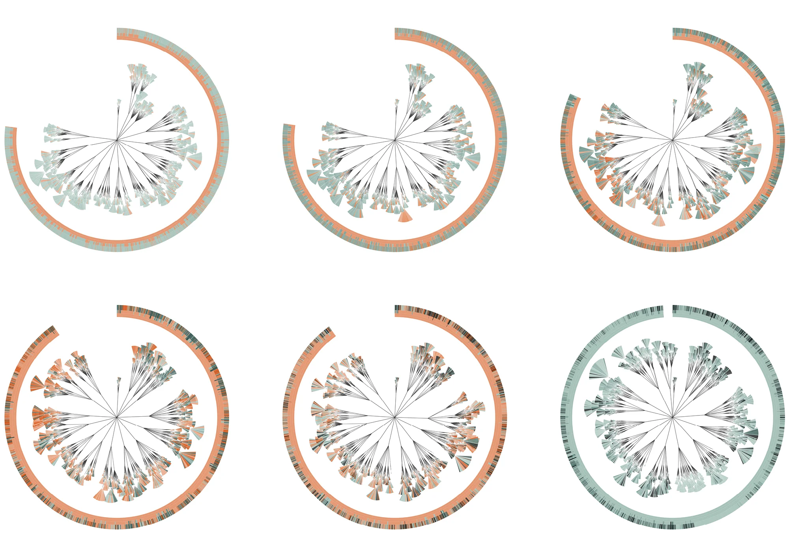
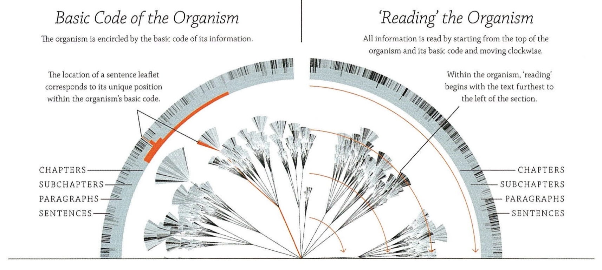
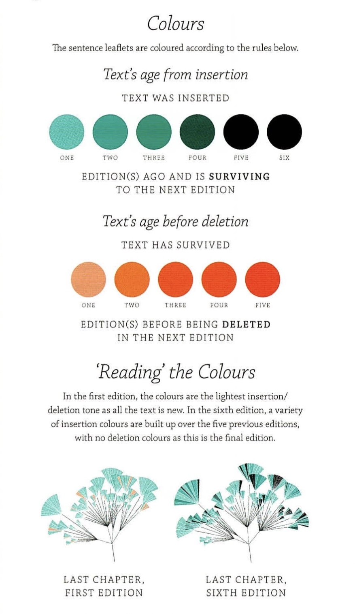
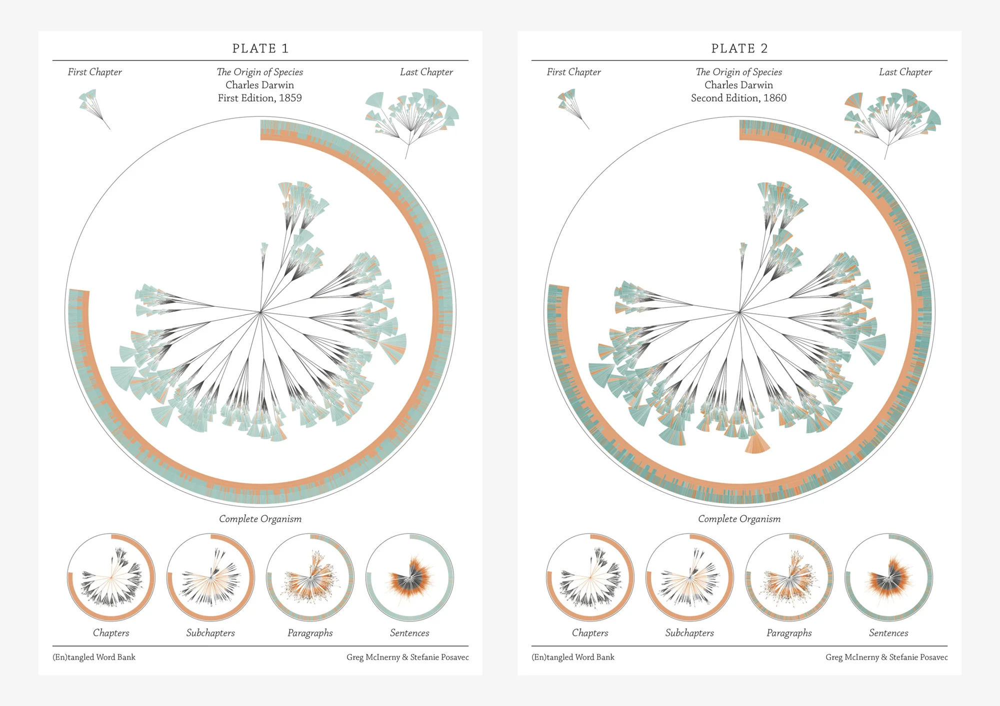
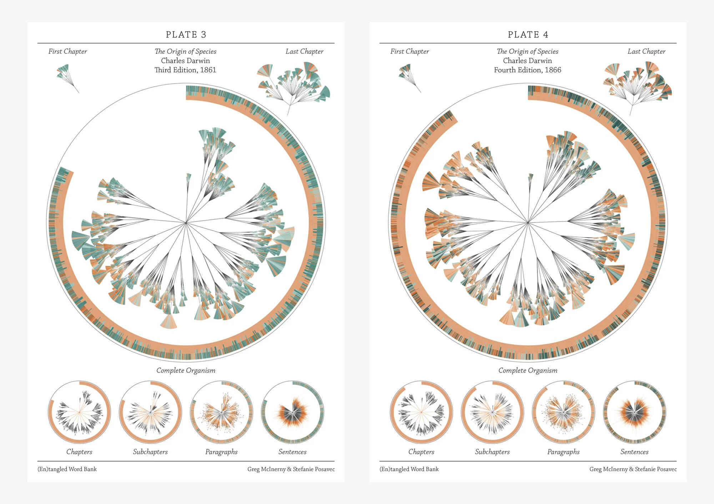
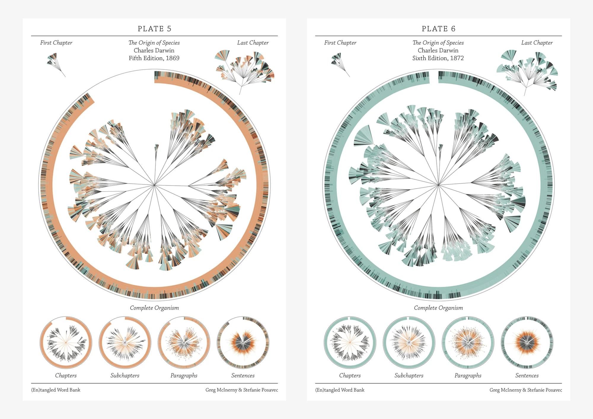

+++
author = "Yuichi Yazaki"
title = " ダーウィン「種の起源」をめぐるテキストの進化を可視化する"
slug = "entangled-word-bank"
date = "2025-10-02"
description = ""
categories = [
    "consume"
]
tags = [
    "",
]
image = "images/cover-entangled-word-bank.jpeg"
+++

「(En)tangled Word Bank」 は、チャールズ・ダーウィンの『種の起源（On the Origin of Species）』が初版（1859年）から第6版（1872年）に至るまで、どのように加筆・修正されていったかを可視化した作品です。制作者は Stefanie Posavec（デザイナー）と Greg McInerny（当時 Microsoft Research 所属の研究者）で、両者の共同制作として発表されました。

このプロジェクトは ケンブリッジ大学のダーウィン生誕記念フェスティバルで大型バナーとして展示されたほか **ニューヨーク近代美術館（MoMA）の展覧会「Talk to Me」** にも収蔵・展示されています。

<!--more-->

## 「文学的有機体」としての構造

この作品では、ダーウィンの『種の起源』のテキスト構造を 「文学的な生物（literary organism）」 に見立てています。図の中心から外側に向かって、文章の階層が植物の枝葉のように広がっていきます。

- **1. 中心（根元）** ：本の最も大きな単位である「章（chapter）」が出発点です。
- **2. 第一層の枝** ：章が「節（subchapter）」へと分かれます。
- **3. 第二層の枝** ：節がさらに「段落（paragraph）」に分かれます。
- **4. 末端の葉** ：段落が「文（sentence）」に分かれ、ここが最小単位です。文は「小さな葉（leaflet）」として描かれます。

このようにして、本全体の構造が「幹 → 枝 → 葉」に対応し、自然の有機体のような姿になります。

### 「基本コードの帯（basic code）」とは？

図の外周には、細かい線が並んだ 帯（コード状の外環） が描かれています。これは各文の「位置情報」を示す索引のようなものです。
- 章、節、段落、文といった階層ごとに区切られており、外側の帯を見るだけで「どの位置にどんな文が属しているか」がわかります。
- つまり、内側の樹状図（植物のような構造）と、外側の帯（基本コード）は 対応関係 にあり、「この文は本のどの場所にあったのか」をダブルで確認できる仕組みです。

### 読み方（Reading the Organism）

画像右側に示されている通り、読み進め方は時計回りです。
- 上部（12時の位置）から始まり、外周の「基本コードの帯」をたどりながら右回りに進みます。
- 内側の構造（章 → 節 → 段落 → 文）は、帯に対応して配置されており、左端から右へ、枝が細かく分かれて文に至るという順序で読むことができます。
- たとえば、ある章の左端に位置する文から読み始めると、そこから節や段落を経て、最後の文まで自然に追いかけられるように設計されています。

イメージとして
- **外周の帯** ：本全体の「索引」や「年輪」のようなもの。
- **内側の枝葉** ：その索引に対応する「文章の実体」。
- **読み方** ：時計回りに「成長の輪」をたどるように読む。

つまりこの構造は、本のテキストを「生きた植物の姿に変換した地図のようなもの」なのです。

## 色が語る「テキストの寿命」

本作では、各「文」の寿命を 色の変化 で表しています。色は「その文がいつ加えられ、いつまで残り続けたか」を一目でわかるようにデザインされています。

### 青緑〜黒（テキストが“生き残っている”場合）

- 青緑の文は「最近の版で新しく加えられた文」を意味します。
- そこから版を重ねても削除されずに生き残ると、色がだんだん濃く変化していきます。
- つまり、色が淡いほど“新入りの文”、濃くなるほど“長く生き残っている古参の文” だと理解できます。
- 最も濃い黒に近い色は「第1版から最後の第6版までずっと残り続けた文」です。

### オレンジ系（テキストが“削除された”場合）

- 薄いオレンジは「加えられた直後に次の版で削除された文」を示します。
- 濃いオレンジになるほど「複数の版にわたってしばらく存在したが、その後で削除された文」であることを意味します。
- たとえば鮮やかなオレンジなら「3〜4版分は生き残ったが、結局は削除された文」です。

こうして見ると、

- **青緑〜黒** は「その時点でまだ残っている現役の文」
- **オレンジ** は「すでに削除され、そこで役割を終えた文」

を表していることになります。ひとつの文が同時に青緑（生存中）とオレンジ（削除済み）で表示されることはありません。

流れとしては、

- 1. 文が追加される → 青緑で登場
- 2. 版を重ねて残れば → 色が濃くなり黒に近づく
- 3. ある版で削除される → その時点で最後に「オレンジ」で表示され、以降は図に現れなくなる

という仕組みです。

このルールを理解すると、円形の図から「どの文がどの時点で登場し、どれだけ生き延び、どの時点で姿を消したか」が一目で読み取れるようになります。

## 読み方と展開

- 各版のテキストは 時計回りに配置され、第1版から始まり、第6版で円が完全に埋まるように展開します。
- 初版はすべてが新規テキストなので、色はもっとも淡い「挿入色」で統一されます。
- 最終版（第6版）には削除の色は存在せず、積み重なった挿入色が「最終形」として残ります。

こうして、ダーウィンの言葉がどのように加筆・削除されながら進化したかを、まるで「生物の成長」を見るかのように辿ることができます。

## デザインと展示

- 各版ごとの可視化は「植物標本の図譜（botanical plate）」のようにデザインされ、博物学的な雰囲気を意識しています。
- 実際の展示では、高さ2.5mに及ぶ大判バナーとして出力され、文字通り「生命体の成長記録」のように観察できる規模で公開されました。
- MoMA の解説では、この作品は「ダーウィンの思考の変化や修正の履歴を、文単位で追えるデータアート」として評価されています。

## データと技術

- データソース：ダーウィン電子テキスト・アーカイブ（darwin-online.org.uk）から入手。
- 技術：C++、R、Processing、Illustrator などを用いてプログラミング・データ処理・可視化を行いました。
- 役割分担：McInerny がデータ収集とプログラミングを担当し、Posavec と共にビジュアルデザインを設計。

## まとめ

「(En)tangled Word Bank」 は、ダーウィンの代表作『種の起源』の改訂史を「文の生存と死」を軸にとらえ直し、テキストをまるで「進化する生物」のように見せる革新的な可視化作品です。

ここには、

- 科学史における重要な書物の「編集の軌跡」
- 文学的・生物学的なメタファーをかけ合わせたデザイン
- データ処理・プログラミング・グラフィックデザインの融合

が凝縮されています。

ダーウィンが生命の進化を描いたその書物自体が、版を重ねる中で「進化」していく様子を、視覚的かつ詩的に示す作品といえるでしょう。

## 参考・出典

- [Stefanie Posavec 公式サイト: (En)tangled Word Bank](https://www.stefanieposavec.com/archive/entangled-word-bank)
- [MoMA 展覧会ページ: Talk to Me (En)tangled Word Bank](https://www.moma.org/interactives/exhibitions/2011/talktome/objects/145525/)

