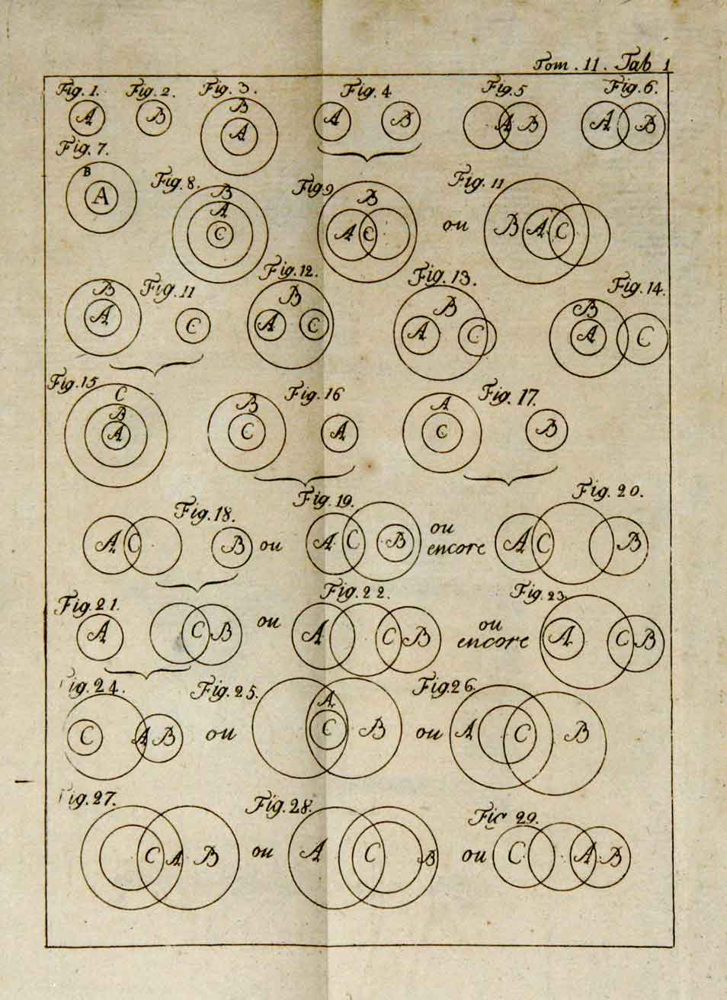
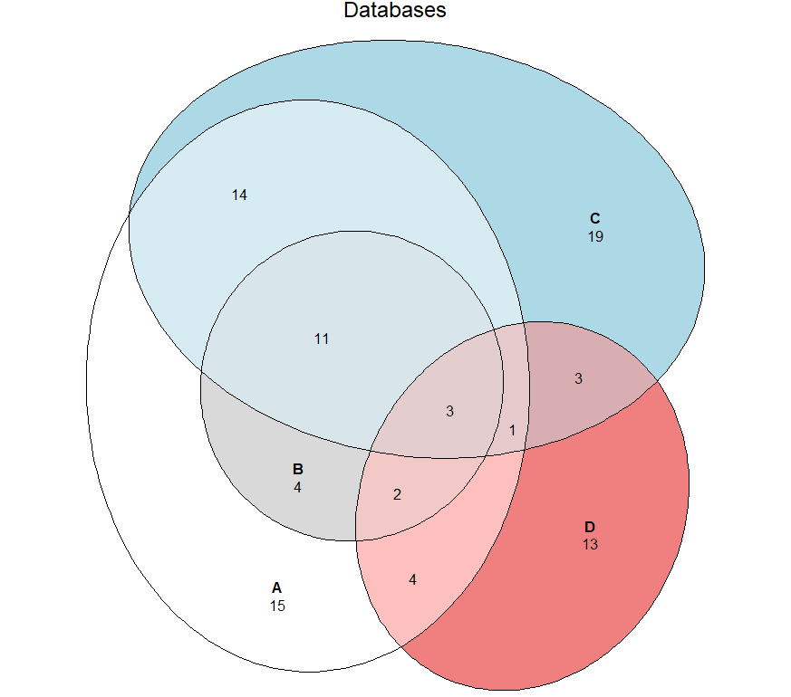

+++
author = "Yuichi Yazaki"
title = "Euler Diagram"
slug = "euler-diagram"
date = "2025-10-08"
description = ""
categories = [
    "chart"
]
tags = [
    ""
]
image = "images/cover.png"
+++

An **Euler diagram** visualizes inclusion and overlap among sets. Unlike a Venn diagram, which draws every logical combination, an Euler diagram shows only the relationships that actually exist. This makes it useful for explaining real categories, concepts, and classifications clearly.

<!--more-->

## Historical Background

Euler diagrams are named after the eighteenth-century Swiss mathematician **Leonhard Euler**, who used circles to explain logical relationships and syllogisms. Later, John Venn extended this tradition into diagrams that include all logical possibilities, producing what we now call Venn diagrams.

Euler diagrams remain more concise when the goal is to communicate actual relationships rather than theoretical completeness.

This image is an example of Eulerian circles associated with Euler's *Lettres a une princesse d'Allemagne*. The circles visually express logical relationships: intersection means shared members, containment means "all A are B," and separation means no overlap.

## Data Structure

| Element | Description |
|---|---|
| Set | A group represented by a circle or closed curve |
| Element | A data point belonging to a set |
| Intersection | Elements shared by two or more sets |
| Complement | Elements outside a given set |

An Euler diagram omits empty intersections when they do not exist in the data.

## Purpose

The main purpose is to show real set relationships simply. By leaving out impossible or empty regions, Euler diagrams can be easier to read than Venn diagrams for practical classification and presentation.

## Use Cases

- explaining conceptual or category relationships
- showing overlap between tags or labels
- teaching set inclusion and subset relationships
- visualizing target groups in UX or marketing
- comparing product features or audience segments

## How to Read It

1. Each circle or closed curve represents a set.
2. Overlap indicates shared elements.
3. Containment indicates a subset relationship, such as `A ⊆ B`.
4. Missing intersections may simply mean that no such relationship exists.

## Design Notes

- Keep the number of sets small, ideally three or four.
- Use transparent colors if regions overlap.
- Place labels inside or near the relevant region.
- Avoid shapes that make containment or intersection ambiguous.

## Alternatives

| Method | Feature | Use case |
|---|---|---|
| Venn diagram | Shows all combinations | Logic and education |
| Network diagram | Nodes and links | Complex relationships |
| Treemap | Hierarchical area | Category proportions |
| Matrix | Tabular intersections | Many combinations |

## Euler Diagram vs. Venn Diagram

- **Venn diagram**: shows all `2^n` logical combinations, including empty regions.
- **Euler diagram**: shows only relationships that actually occur.

This makes Euler diagrams especially useful for realistic classification, such as showing that cats are mammals and mammals are animals.

## Summary

Euler diagrams are practical tools for showing real-world relationships among sets. They give up the theoretical completeness of Venn diagrams in exchange for clarity and economy.

## References

- [Euler diagram — Wikipedia](https://en.wikipedia.org/wiki/Euler_diagram)
- [Venn diagram — Wikipedia](https://en.wikipedia.org/wiki/Venn_diagram)
- [Leonhard Euler — MacTutor History of Mathematics](https://mathshistory.st-andrews.ac.uk/Biographies/Euler/)
- [Lucidchart: Euler vs Venn diagrams](https://www.lucidchart.com/blog/euler-diagram-vs-venn-diagram)
