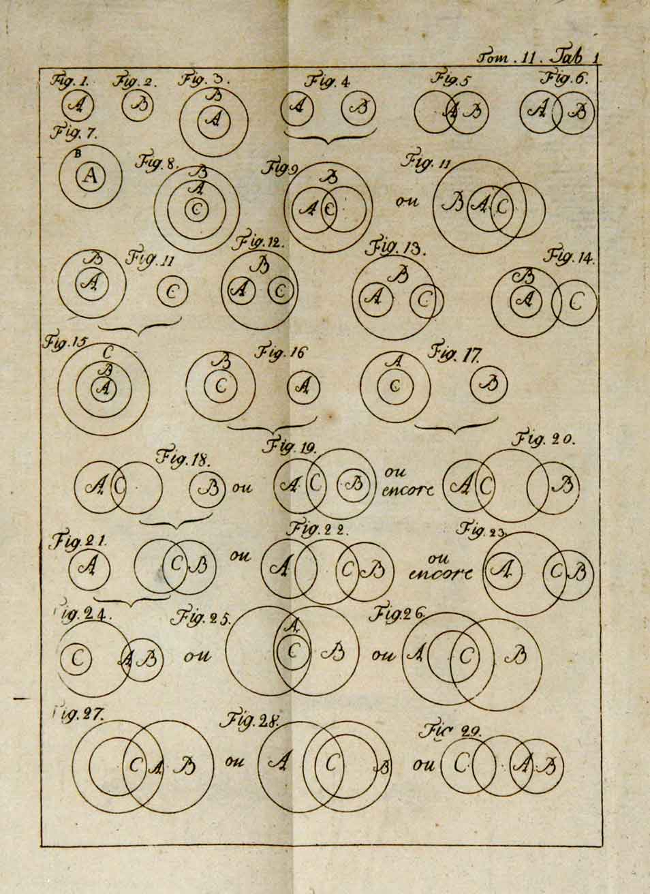
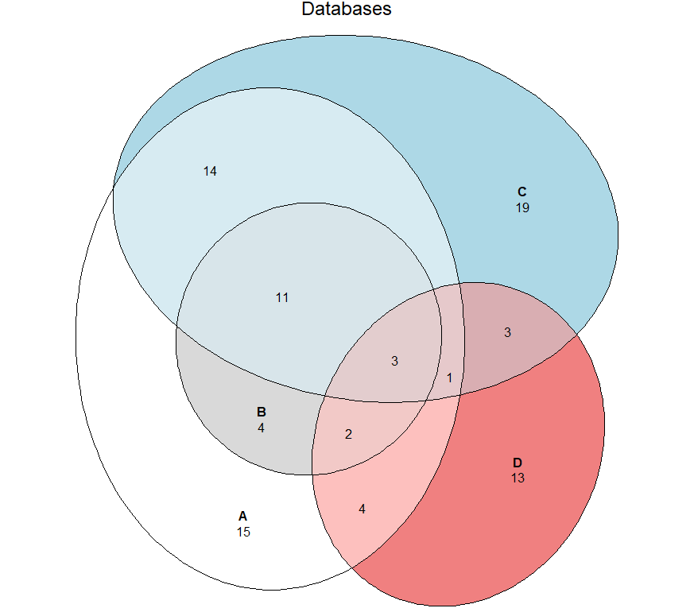

+++
author = "Yuichi Yazaki"
title = "オイラー図（Euler Diagram）とは"
slug = "euler-diagram"
date = "2025-10-08"
description = ""
categories = [
    "chart"
]
tags = [
    ""
]
image = "images/cover.png"
+++

オイラー図は、集合や命題の関係を直感的に表すための図解です。円や楕円などの閉じた曲線を用い、それぞれの領域が特定の集合を表します。曲線が重なる部分は集合の共通部分を示し、重ならない場合は互いに独立した関係を示します。

<!--more-->

オイラー図は、18世紀の数学者レオンハルト・オイラー（Leonhard Euler）によって提案されたもので、後にジョン・ベン（John Venn）がその手法を拡張し、すべての可能な交差関係を描くベン図を考案しました。オイラー図は、ベン図に比べて「実際に存在する関係だけ」を描く点で、より簡潔で実用的です。

この図版は、18世紀に刊行されたレオンハルト・オイラーの著作『Lettres à une princesse d’Allemagne（ドイツの王女への手紙）』に掲載されたとされる、いわゆる オイラー円図（Eulerian circles） の一例です。

オイラーはこの書簡集の中で、論理や三段論法の説明を行う際に、円の包含や重なりを用いて命題の関係を視覚的に示しました。円の交わりは「共通部分」、包含は「すべての A は B である」、分離は「A と B は無関係である」といった関係を意味します。

この図版は、原典の中の具体的なページではなく、当時の印刷版に基づく実物ページの撮影です。オイラーが提案した論理の可視化手法を忠実に再現しており、近代的な「オイラー図」や「ベン図」の祖型といえる貴重な歴史的資料です。

## 図解の見方

1. **各円または曲線が集合を表す**  
　例：A、B、Cという集合があれば、それぞれが異なる円で示されます。

2. **重なりは共通部分を表す**  
　AとBの円が交わっている部分は「AかつB」の集合を示します。  
　重ならない場合は「AとBには共通の要素がない」ことを意味します。

3. **包含関係の表現**  
　一方の円が完全にもう一方の内部にある場合、「A ⊆ B（AはBに含まれる）」という関係を表します。

4. **存在しない関係は省略可能**  
　オイラー図では、要素が存在しない交差部分を描かなくても構いません。これにより、図がシンプルで読みやすくなります。

## ベン図との違い

オイラー図とベン図は混同されがちですが、根本的な違いは「全ての論理的関係を描くかどうか」にあります。

- **ベン図**：すべての組み合わせ（2ⁿ通り）を描く。空集合の領域も明示的に存在する。  
- **オイラー図**：実際に存在する関係のみを描く。不要な領域は省略する。

そのため、オイラー図は現実的な分類や関係性を視覚的に表す際に適しています。たとえば「猫」「哺乳類」「動物」のような包含関係を簡潔に描くことができます。

## 応用例

- **論理・集合論教育**：  
　命題「すべてのAはBである」「一部のAはBである」などを可視化して論理関係を理解しやすくします。

- **情報デザイン・概念整理**：  
　ビジネスの関係性や研究分野の分類、概念マッピングなどで広く利用されています。

## 利点

- 不要な関係を省くことで見やすく簡潔  
- 包含・排他関係を直感的に理解可能  
- 教育やプレゼン資料に適している

## 制約と注意点

- 曲線の数が多くなると、図が複雑化して理解しづらくなります。  
- すべての集合関係を「単純な閉曲線」で表現できるとは限りません。  
- レイアウト設計に注意しないと、ゾーンが分断されて可読性が下がります。

可視化研究の分野では、「well-formedness（適正性）」と呼ばれる条件が研究されており、図が論理的かつ視覚的に正しくなるよう設計指針が提案されています。

## まとめ

オイラー図は、集合関係を「現実的な関係だけを残して描く」図解手法です。  
ベン図よりも柔軟かつ実践的であり、論理や概念構造を整理・可視化するのに最適です。  
教育から情報デザインまで、理解の助けとなる普遍的なツールといえるでしょう。

## 参考・出典

- [Euler diagram - Wikipedia](https://en.wikipedia.org/wiki/Euler_diagram)
- [Venn diagram - Wikipedia](https://en.wikipedia.org/wiki/Venn_diagram)
- [Lucidchart: Euler vs Venn diagrams](https://www.lucidchart.com/blog/euler-diagram-vs-venn-diagram)
- [Math LibreTexts: Arguments with Euler Diagrams](https://math.libretexts.org/Courses/Fullerton_College/Math_100%3A_Liberal_Arts_Math_%28Claassen_and_Ikeda%29/05%3A_Logic/5.06%3A_Arguments_with_Euler_Diagrams)
- [BRCommunity: The Use of Euler Diagrams](https://www.brcommunity.com/articles.php?id=c021)