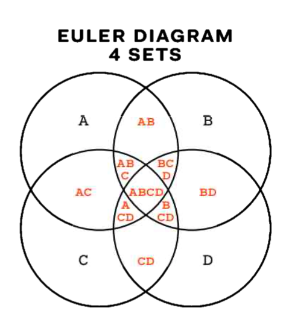

+++
author = "Yuichi Yazaki"
title = "オイラー図（Euler Diagram）"
slug = "euler-diagram"
date = "2025-10-08"
description = ""
categories = [
    "chart"
]
tags = [
    ""
]
image = "images/cover.png"
+++

オイラー図（Euler Diagram）は、集合の包含関係や重なり合いを図示するためのグラフです。似た図として知られるベン図（Venn Diagram）は、すべての論理的な組み合わせを描くのに対し、オイラー図は実際に存在する関係だけを描く点で異なります。複数の集合がどのように共通部分を持ち、どの部分が排他的であるかを直感的に理解できるようにするための可視化手法です。

<!--more-->

## 歴史的経緯

オイラー図は、18世紀スイスの数学者レオンハルト・オイラー（Leonhard Euler）が集合論的な関係を説明するために考案しました。

彼の研究は論理学や哲学的議論の可視化に活用され、のちに19世紀イギリスの論理学者ジョン・ヴェン（John Venn）が「すべての集合の組み合わせを包含する図」として改良し、現在のベン図に発展しました。したがって、オイラー図はベン図の先駆的な形として位置づけられます。

オイラー図は、ベン図に比べて「実際に存在する関係だけ」を描く点で、より簡潔で実用的です。

この図版は、18世紀に刊行されたレオンハルト・オイラーの著作『Lettres à une princesse d’Allemagne（ドイツの王女への手紙）』に掲載されたとされる、いわゆる オイラー円図（Eulerian circles） の一例です。

オイラーはこの書簡集の中で、論理や三段論法の説明を行う際に、円の包含や重なりを用いて命題の関係を視覚的に示しました。円の交わりは「共通部分」、包含は「すべての A は B である」、分離は「A と B は無関係である」といった関係を意味します。

この図版は、原典の中の具体的なページではなく、当時の印刷版に基づく実物ページの撮影です。オイラーが提案した論理の可視化手法を忠実に再現しており、近代的な「オイラー図」や「ベン図」の祖型といえる貴重な歴史的資料です。

## データ構造

オイラー図で扱うデータは、複数の「集合」とそれぞれの「要素」から構成されます。主な構造は次の通りです。

| 要素 | 説明 |
|------|------|
| 集合（Set） | 対象となるグループ。円や閉曲線で表す。 |
| 要素（Element） | 各集合に属するデータ点。 |
| 共通部分（Intersection） | 2つ以上の集合が共有する要素群。 |
| 補集合（Complement） | 他の集合に属さない要素群。 |

ベン図ではすべての交差領域が描かれるのに対し、オイラー図では実際に存在する関係のみを表現します。

## 目的

オイラー図の主な目的は、**実際に存在する集合間の関係を簡潔に表すこと**です。重なりを省略することで、無関係な組み合わせを省き、現実の構造をよりわかりやすく伝えることができます。したがって、論理学・データ分類・概念整理・プレゼンテーション資料などで頻繁に用いられます。

## ユースケース

- 概念やカテゴリの関係性を説明する図（例：製品ラインの重複市場）
- タグやラベルの関係を示すデータ分析（例：ユーザーの興味分野の重なり）
- 教育や論理学の教材（集合・部分集合の理解支援）
- UXデザインにおけるターゲット群の可視化（例：「初心者」×「モバイルユーザー」）

## 特徴

- **存在する関係のみ**を描くため、ベン図よりシンプルで現実的。
- 図形は必ずしも円である必要がなく、滑らかな閉曲線で表現されることも多い。
- データ構造が単純な場合ほど視覚的に理解しやすい。
- データ数や集合が多くなると、可読性が急速に低下する。

## チャートの見方

各曲線は集合を、曲線の重なりは共通する要素を表します。重ならない部分は排他的な要素を意味します。オイラー図は **現実のデータ分布を反映する** ため、ある集合が他を完全に包含している場合には、そのまま入れ子構造として表現されます。

1. **各円または曲線が集合を表す**  
　例：A、B、Cという集合があれば、それぞれが異なる円で示されます。

2. **重なりは共通部分を表す**  
　AとBの円が交わっている部分は「AかつB」の集合を示します。  
　重ならない場合は「AとBには共通の要素がない」ことを意味します。

3. **包含関係の表現**  
　一方の円が完全にもう一方の内部にある場合、「A ⊆ B（AはBに含まれる）」という関係を表します。

4. **存在しない関係は省略可能**  
　オイラー図では、要素が存在しない交差部分を描かなくても構いません。これにより、図がシンプルで読みやすくなります。

## デザイン上の注意点

- 曲線や領域の数が増えると判別しにくくなるため、**3〜4集合以内が望ましい**。
- 領域を色分けする場合は、**透過色（alpha値）を用いて重なりを明示**する。
- 線の太さや曲線形状を調整し、交差部分がわかりやすいように配置する。
- ラベル（集合名）は、曲線内部または近接する位置に明確に配置する。

可視化研究の分野では、「well-formedness（適正性）」と呼ばれる条件が研究されており、図が論理的かつ視覚的に正しくなるよう設計指針が提案されています。

## 応用例

- データサイエンスでのクラスタ間関係の可視化
- 生物分類（例：哺乳類・海洋生物・飛行動物などの関係）
- 社会学における属性の重複関係
- 機能比較図（例：「A製品」「B製品」「C製品」に共通する機能）

## 代替例

| 図法 | 特徴 | 適用例 |
|------|------|--------|
| ベン図 | すべての組み合わせを網羅 | 論理演算の学習・数学教育 |
| ネットワーク図 | 項目間の関係をノードとリンクで表す | 複雑な関係分析 |
| ツリーマップ | 階層的構造を面積で表す | 構造比較やカテゴリ比率の表示 |
| マトリクス図 | 交差関係を表形式で整理 | 多集合の組み合わせ分析 |

### ベン図との違い

オイラー図とベン図は混同されがちですが、根本的な違いは「全ての論理的関係を描くかどうか」にあります。

- **ベン図**：すべての組み合わせ（2ⁿ通り）を描く。空集合の領域も明示的に存在する。  
- **オイラー図**：実際に存在する関係のみを描く。不要な領域は省略する。

そのため、オイラー図は現実的な分類や関係性を視覚的に表す際に適しています。たとえば「猫」「哺乳類」「動物」のような包含関係を簡潔に描くことができます。

## まとめ

オイラー図は、ベン図のように理論的な全組み合わせを描くのではなく、**実際に存在する関係性のみを可視化する**点で、情報整理やデータ分析の現場で有効なツールです。単純な概念整理から複雑な関係性の把握まで、適切な粒度で設計することで、視覚的に理解しやすい図を作ることができます。

## 参考・出典

- [Euler diagram - Wikipedia](https://en.wikipedia.org/wiki/Euler_diagram)
- [Venn diagram - Wikipedia](https://en.wikipedia.org/wiki/Venn_diagram)
- [Leonhard Euler — MacTutor History of Mathematics](https://mathshistory.st-andrews.ac.uk/Biographies/Euler/)
- [Lucidchart: Euler vs Venn diagrams](https://www.lucidchart.com/blog/euler-diagram-vs-venn-diagram)
- [Math LibreTexts: Arguments with Euler Diagrams](https://math.libretexts.org/Courses/Fullerton_College/Math_100%3A_Liberal_Arts_Math_%28Claassen_and_Ikeda%29/05%3A_Logic/5.06%3A_Arguments_with_Euler_Diagrams)
- [BRCommunity: The Use of Euler Diagrams](https://www.brcommunity.com/articles.php?id=c021)