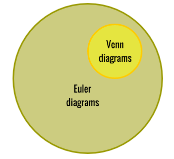
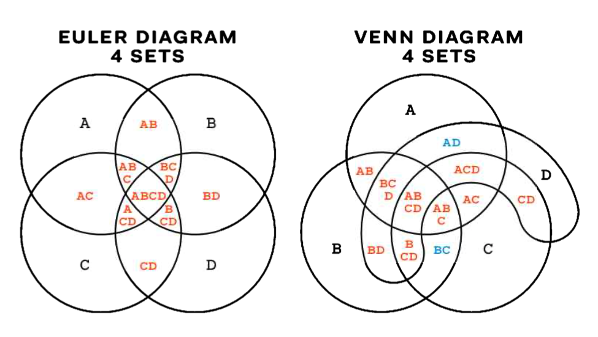
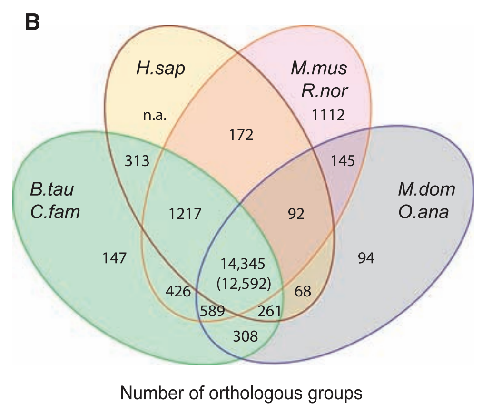
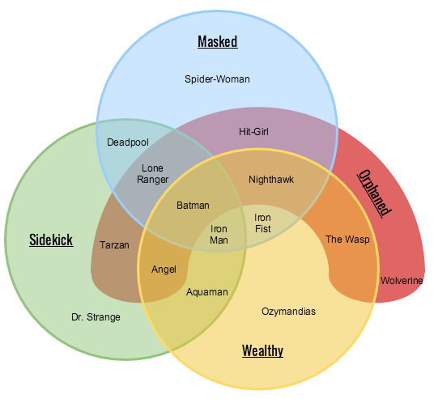
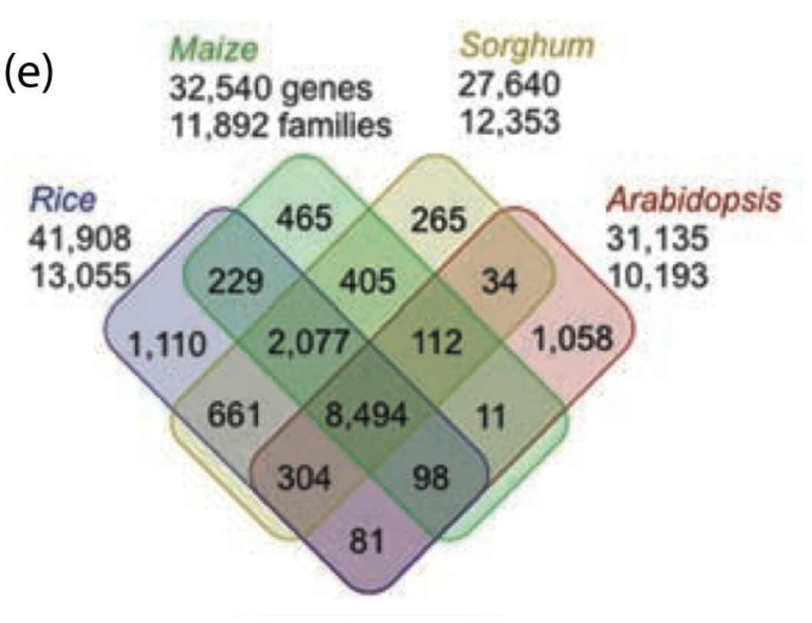
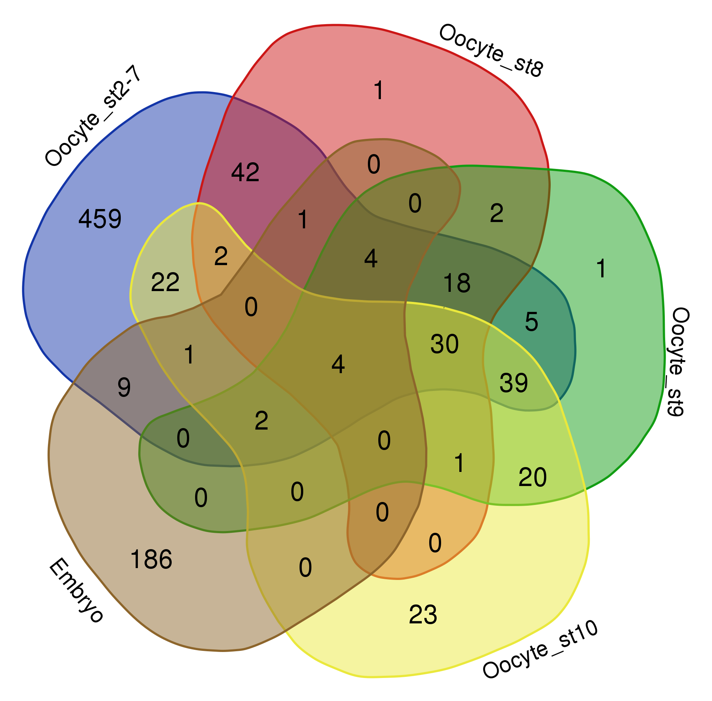
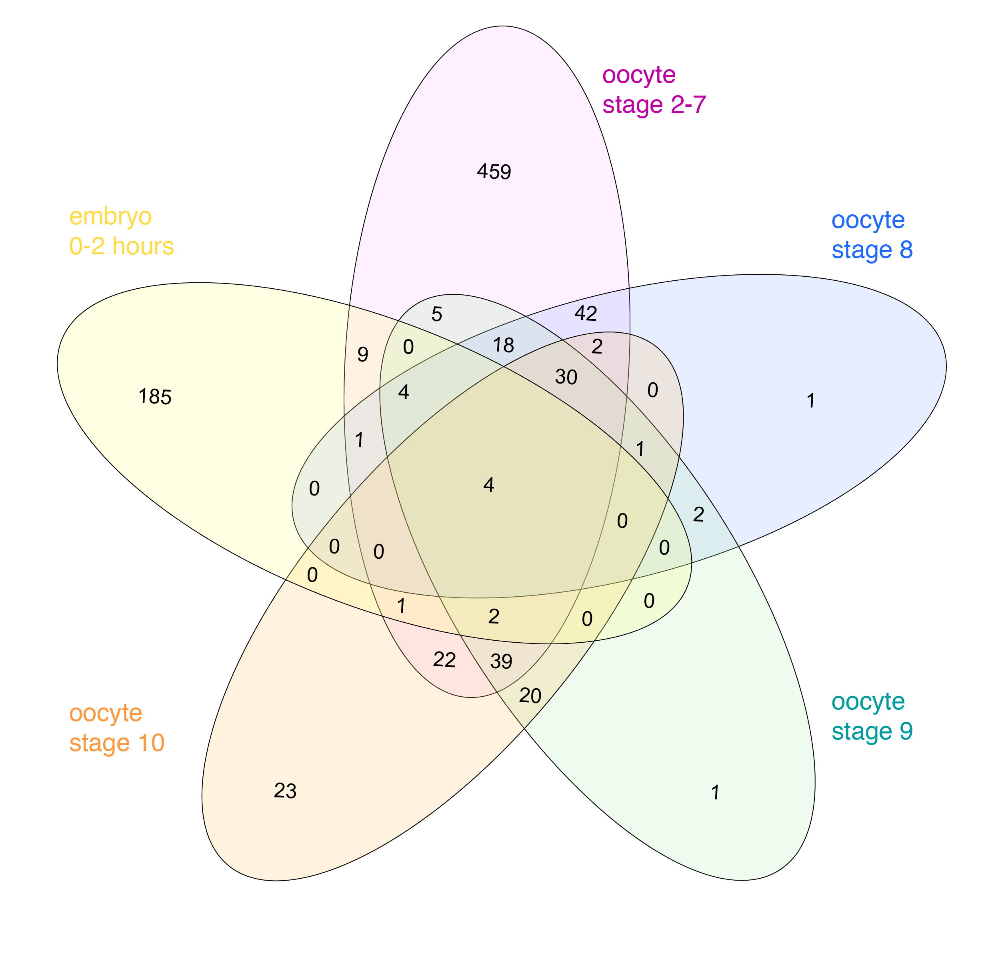
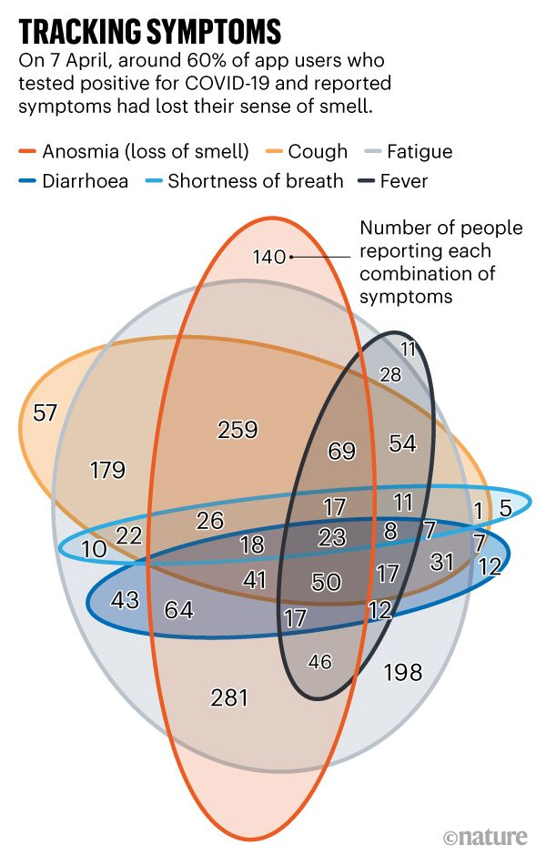
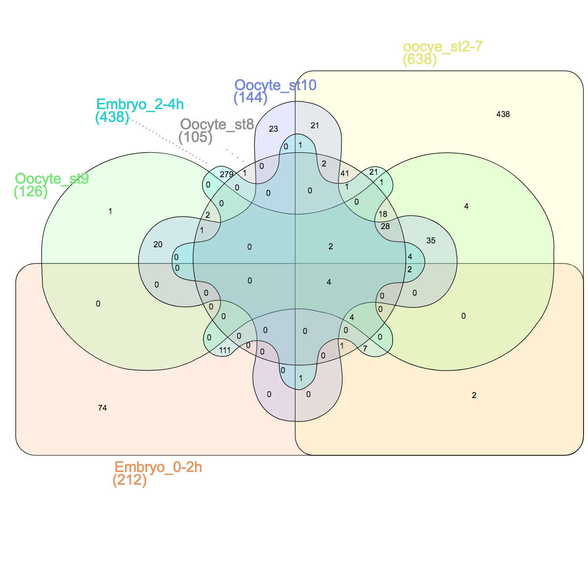
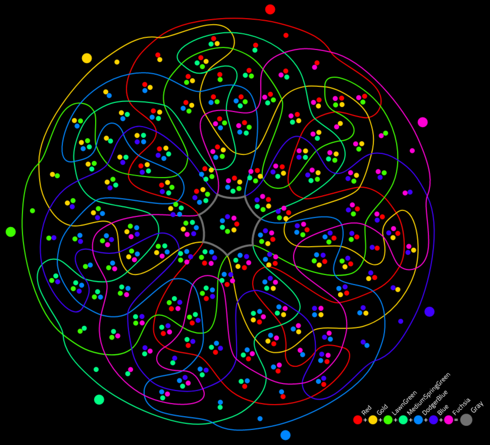

+++
author = "Yuichi Yazaki"
title = "オイラー図とベン図（Euler Diagram & Venn Diagram）"
date = "2020-08-03"
description = ""
categories = [
    "chart"
]
tags = [
    "",
]
image = "93480617_10157150544363201_5537643846042648576_n.jpg"
+++

ベン図ときくと、たとえばSQLデータベースにおいて、二つのテーブルを結合する際の、結合の仕方について説明した図を思い浮かべる方も多いと思います。

<!--more-->

[Four different types of JOINs](https://www.dofactory.com/sql/join)

作者のジョン・ベンにちなんだ名称で、閉曲線（閉じた曲線で作られた閉じた図形）を使って集合理論的な関係を示す図として知られています。

この図に登場するデータセット（テーブル）は二つですが、登場するセットが最大3つまでであれば、これはベン図といえます。それ以上のデータセットにおいては、ベン図といえないかもしれません。

同様のチャートで、レオンハルト・オイラーにちなんだオイラー図というものがあり、オイラー図とベン図の関係を図で示すとこのようになります。

[Four different types of JOINs](https://www.gliffy.com/blog/venn-diagram-types-templates)

つまり、より一般的なものがオイラー図であり、そのうちある要件を満たすものをベン図と呼びます。その要件とは「集合のすべての交差を示さなければならない」ということで、現実的にありえない組み合わせであっても数学的に示すことが求められます。

From Data Visualization Handbook.

四つのセットを対象にした際、現実的にありえる組み合わせのみを考慮すればよいオイラー図（左）と、すべての交差（組み合わせ）を示さなければならないベン図（右）の違いです。

実際には、数学や論理学などの特定のトピックを除き、ほとんどの場合はオイラー図と呼ぶ図を使用することになりそうです。

## 四つ以上のデータセットを対象にしたベン図

### 四つの場合

[https://science.sciencemag.org/content/sci/324/5926/522.full.pdf](https://science.sciencemag.org/content/sci/324/5926/522.full.pdf)

[https://www.gliffy.com/blog/venn-diagram-types-templates](https://www.gliffy.com/blog/venn-diagram-types-templates)

[https://www.researchgate.net/publication/50304549_Exact_and_Approximate_Area-Proportional_Circular_Venn_and_Euler_Diagrams](https://www.researchgate.net/publication/50304549_Exact_and_Approximate_Area-Proportional_Circular_Venn_and_Euler_Diagrams)

### 五つの場合

[https://thenode.biologists.com/venn-euler-upset-visualize-overlaps-in-datasets/education/](https://thenode.biologists.com/venn-euler-upset-visualize-overlaps-in-datasets/education/)

[https://thenode.biologists.com/venn-euler-upset-visualize-overlaps-in-datasets/education/](https://thenode.biologists.com/venn-euler-upset-visualize-overlaps-in-datasets/education/)

### 六つの場合

[https://www.nature.com/articles/d41586-020-00154-w](https://www.nature.com/articles/d41586-020-00154-w)

[https://thenode.biologists.com/venn-euler-upset-visualize-overlaps-in-datasets/education/](https://thenode.biologists.com/venn-euler-upset-visualize-overlaps-in-datasets/education/)

### 七つの場合

[7 sets Venn Diagram (interactive version)](http://moebio.com/research/sevensets/)

## 参考文献

- [Exact and Approximate Area-Proportional Circular Venn and Euler Diagrams](https://www.researchgate.net/publication/50304549_Exact_and_Approximate_Area-Proportional_Circular_Venn_and_Euler_Diagrams)
- Data Visualization Handbook