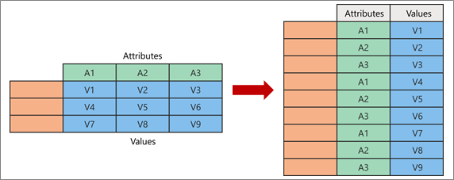

+++
author = "Yuichi Yazaki"
title = "Excelでのピボットテーブルの解除"
slug = "excel-reverse-pivot"
date = "2023-11-19"
categories = [ 
  "technology"
]
tags = [ 
  "excel","クレンジング"
]
image = "images/thumb_ph_vizjp.png"
+++

Excelでピボットテーブル化した（もしくはいわゆる横持ちと呼ばれる状態）の表を、ピボットテーブルする前の状態（もしくはいわゆる縦持ちと呼ばれる状態）に戻す作業は、これまでやや複雑でしたが、ExcelにPowerQueryエディタが搭載されてから、手順がかなりシンプルになりました。

<figure>

<figcaption>

公式ページ掲載の図。左が横持ち、右が縦持ち状態。

</figcaption>

</figure>

ここでは、作業手順を、[公式ページ](https://support.microsoft.com/ja-jp/office/%E5%88%97%E3%81%AEpivot%E8%A7%A3%E9%99%A4-power-query-0f7bad4b-9ea1-49c1-9d95-f588221c7098 "https://support.microsoft.com/ja-jp/office/%E5%88%97%E3%81%AEpivot%E8%A7%A3%E9%99%A4-power-query-0f7bad4b-9ea1-49c1-9d95-f588221c7098")を噛み砕いて紹介します。

1. Excelを起動し、空のブックを作成する。
2. 「データ」タブの「データの取得」から「PowerQueryエディタの起動」を選択する。別ウインドウでPowerQueryエディタが起動します。以後はPowerQueryエディタでの作業です。
3. 「ファイル」タブ「新しいクエリ」にある「新しいソース」から横持ちCSVファイルを開く。
4. 変換したい列のみを作業対象として範囲選択します。
5. 「変換」タブを開き「任意の列」欄から「列のピボット解除」を選択し「選択した列のみをピボット解除」を指定します。これでピボット解除の処理が行われます。
6. 「ホーム」タブの「閉じて読み込む」を選択します。PowerQueryエディタが閉じ、当初の空のブックに、作業した表データが格納されます。
7. ファイルとして保存します。
