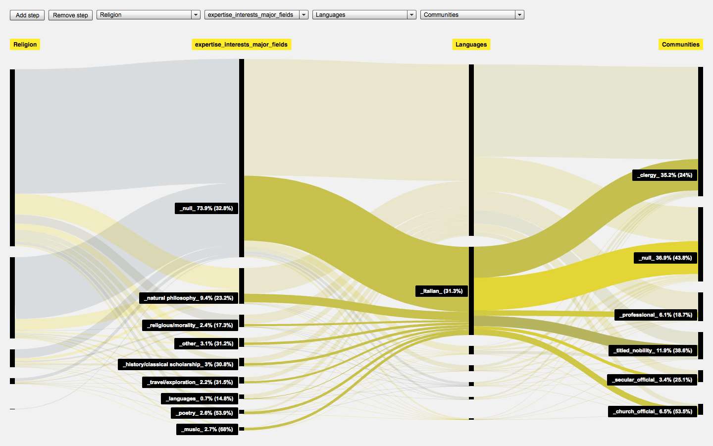
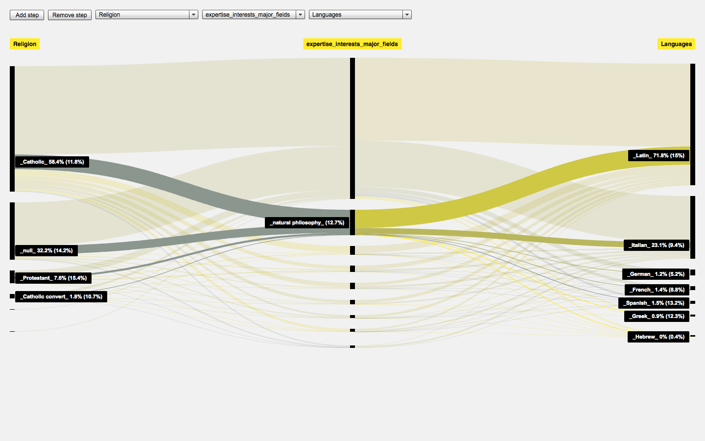
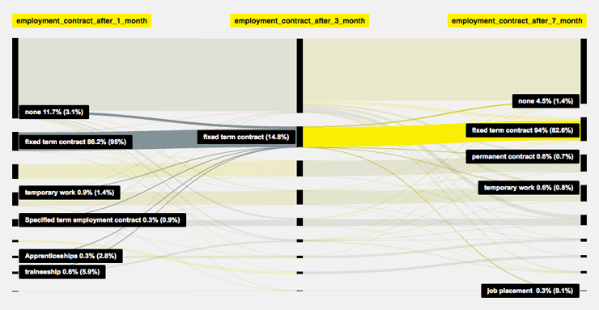
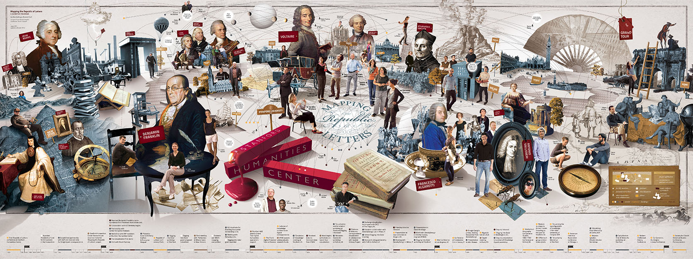
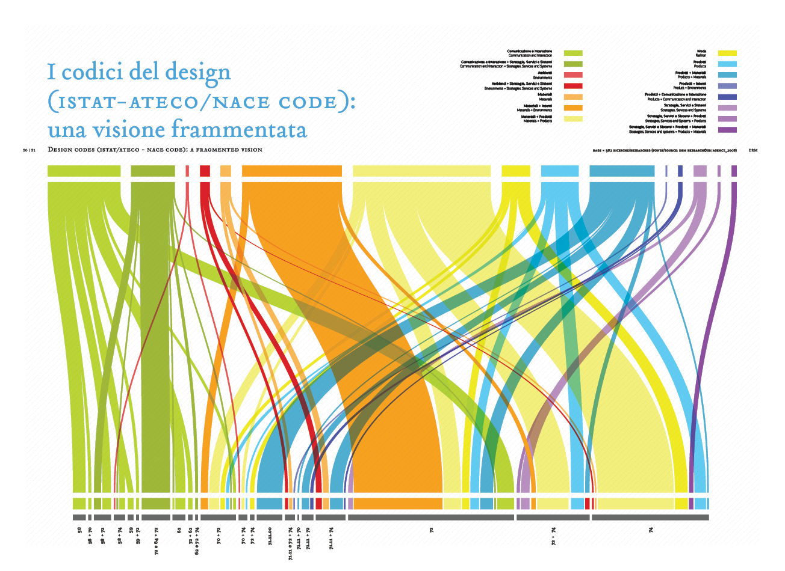
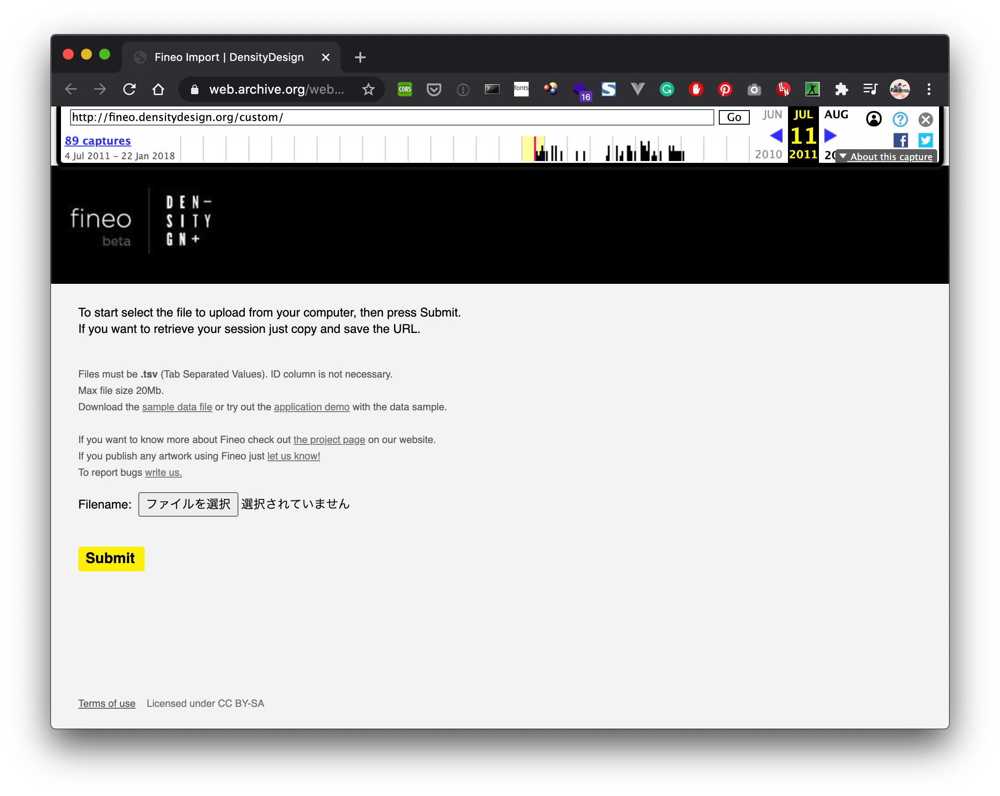
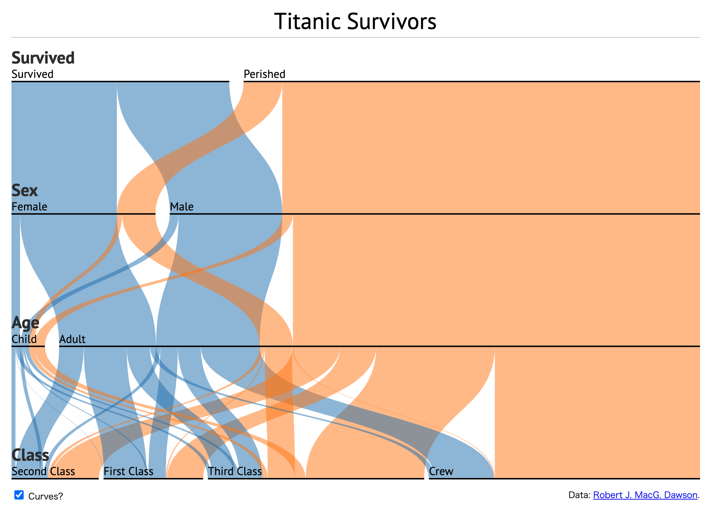
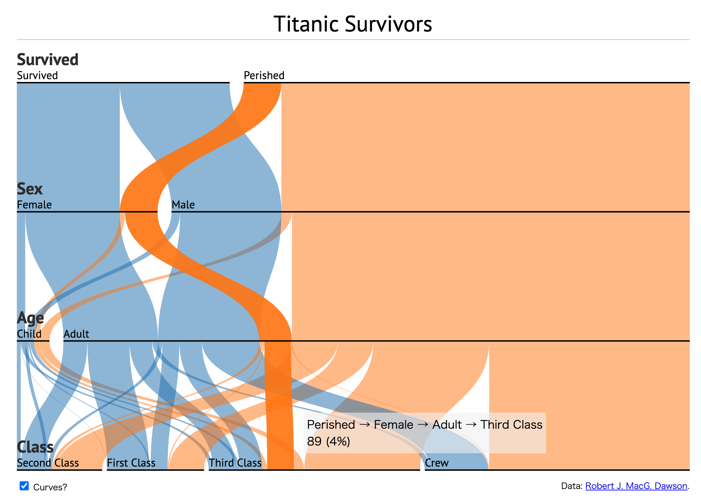

+++
author = "Yuichi Yazaki"
title = "フィネオ（Fineo）"
slug = "fineo"
date = "2020-08-02"
description = ""
categories = [
    "chart"
]
tags = [
    "",
]
image = "images/5950577682_6066025bc0_o.jpg"
+++

Fineoは、連続データを可視化するために利用されるサンキー・ダイアグラムの視覚モデルを元に、多次元のカテゴリカルなデータの、ディメンション間の関係を表現するために使うことができるのではないかという考えから生まれました。

<!--more-->

[FINEO](https://densitydesign.org/research/fineo/)

[https://www.flickr.com/photos/densitydesign/albums/72157627029953749](https://www.flickr.com/photos/densitydesign/albums/72157627029953749)

[https://www.flickr.com/photos/densitydesign/albums/72157627029953749](https://www.flickr.com/photos/densitydesign/albums/72157627029953749)

[CRISP (Centro di Ricerca Interuniversitario sui Servizi di pubblica utilità alla Persona)の保持するデータセットを適用したもの](https://www.crisp-org.it/)

つまり、カテゴリカルなデータ値を集計し、その間の関係を接続する線の幅と色で表します。ノードが黒い実線で、リンクが様々な色で着色された流れとその大きさを示す線で示されています。

また、リンクは明示的な方向を持ちません。サンキー・ダイアグラムが有向グラフを表現しているのに対して、Fineoは無向グラフを表現しているといえます。

スタンフォード大の Mapping the Republic of Letters プロジェクトにて利用されているそうです（ただし内部的に）。

[Mapping the Republic of Letters](https://republicofletters.stanford.edu/#maps)

## 誰が作ったのか？

ミラノのデザインスタジオ、DensityDesign Research Labによって2010年に開発されました。

DRMプロジェクトの一部として制作した静止画版を得て、これは二軸しかデータを保持できなかったことがあり、複数軸を持ち、かつインタラクティブに操作可能なものとして、Fineoの開発が進められました。

[DRM research](https://densitydesign.org/research/drm/)

[https://www.flickr.com/photos/densitydesign/2655862596/in/album-72157624265861504/](https://www.flickr.com/photos/densitydesign/2655862596/in/album-72157624265861504/)

FineoはFlashで制作されWebアプリケーションとして公開されていたようですが、現在は公開終了しています。

[https://web.archive.org/web/20110711013919/http://fineo.densitydesign.org/custom/](https://web.archive.org/web/20110711013919/http://fineo.densitydesign.org/custom/)

## 類似するチャート

Fineoを開発したDensityDesign自ら述べている通り、また sankey-diagrams.com で論評がある通り、Parallel Sets (ParSets)とかなり似ています。

[Fineo and ParSets](https://www.sankey-diagrams.com/fineo-and-parsets/)

違いとしては、Parallel Sets (ParSets)はデータを階層構造（ツリー）として扱うのに対し、Fineoはデータを（階層構造を持たない）ネットワークとして扱っている点にあります。

Parallel Sets (ParSets)は、最上部の軸をプライマリーとして、リンク部分の着色に利用されるほか、軸の並び順にデータを分割していきます。

[Jason Daviesのd3.parsetsより](https://www.jasondavies.com/parallel-sets/)

ただし、Parallel Sets (ParSets)作者のRobert Kosara自身はこう述べています。



「Fineoのようにカテゴリカルデータのクロス集計に基づいてチャートを作成する場合、それはParallel Setsですが。同じモデル、似たような考えだ」

筆者自身は、階層構造の内部を探索的に辿ることができるParallelSetsと、あるシステム全体を貫くカテゴリカルなデータの流れや存在感を把握するFineoは別のものだと考えています。ですので、現在Fineoが公開修了という状態は残念です（RawGraphsに引き継がれたとのことですが、インタラクティブなチャート生成という仕組みのみであり、Fineo自体はそれに含まれていません）。

## 参考文献

- [DensityDesign Lab | Fineo](http://densitydesign.org/research/fineo/)
- [Fineo and ParSets – Sankey Diagrams](http://www.sankey-diagrams.com/fineo-and-parsets/)