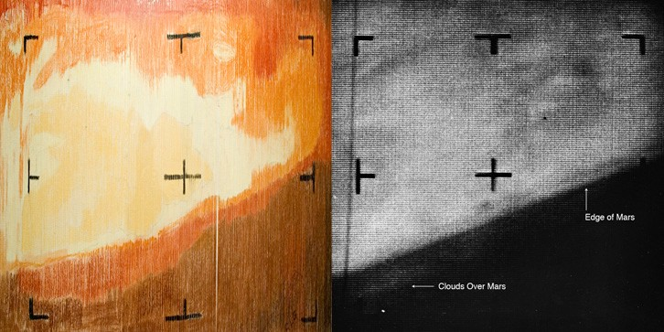
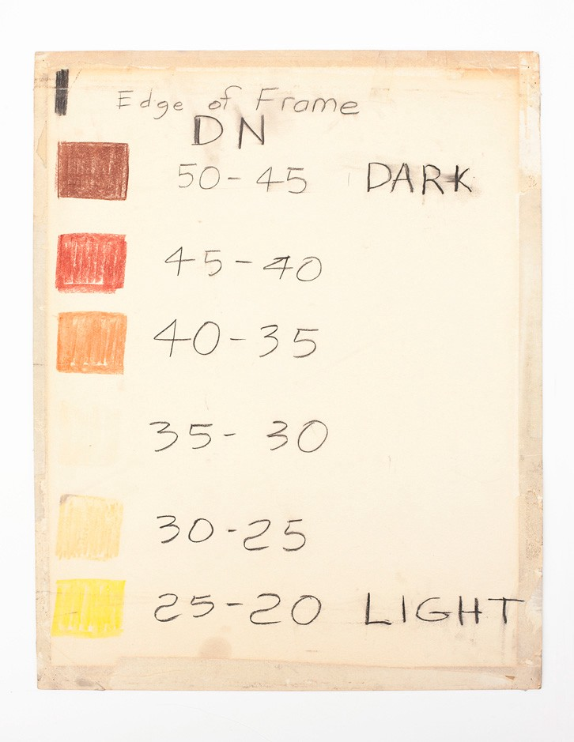

+++
author = "Yuichi Yazaki"
title = "はじめてテレビで放映された火星の写真は、データ可視化作品だった話"
slug = "first-mars-on-tv-dataviz"
date = "2020-06-23"
description = ""
categories = [
    "consume"
]
tags = [
    "色"
]
image = "images/1_FaYbeQRYIS7-C7hF-gNXYA.jpeg"
+++

テレビで放映されたはじめての火星画像はデータドリブンな絵だった話を、当時の関係者からアーティストのDan Goodsさんが聞き出して記事化しています。初めてわかる事実も多いので、これを元に紹介します。

- [Don Goods “FIRST TV IMAGE OF MARS, Interplanetary color by numbers”](https://www.directedplay.com/first-tv-image-of-mars)

<!--more-->

彼の記事によると、火星を探索していた宇宙探査船マリナー4号から、火星の様子を撮影した画像データが、NASAジェット推進研究所（Jet Propulsion Laboratory）へ送られてきました。22のクローズアップイメージと520万ビットのデータは正常に送信されてきたのですが、コンピュータが計算して実際の写真画像として描画するまでには結構時間がかかることがわかりました。

マリナー4号は3号の故障により急遽出番となったそうで、カメラの調子が万全かどうかわからなかったこともあり、テープに出力されていた生のバイナリーデータを基に、NASAの職員たちが手動で着色をはじめました。つまり送信データを画像化されることを待っている間に、データ値を元に、手書きで写真現像を始めたということです。この手法が、まさにデータ可視化の手法でした。

地元の美術館へ行ってグレースケールのチョークを買いにいったところ、チョークは売っていないということで、かわりに売っていたカラフルなパステルを買って帰り、火星の実際の色味を知る前に、茶・赤のカラースキームで値ごとに着色する色を決め、塗っていったということです。

画像の印象とは異なり、写真と見比べてもらうとわかりやすいのですが、暗い茶色が宇宙空間で、明るい茶色が火星の表面、その間にあるオレンジ色の部分は火星表面に漂う雲となっています。当初はマスコミにばれないように、武装警官に守られながらパテーションを設置して、着色していったそうですが、最終的にバレてしまい、テレビで放送されるに至ったということです。

あるデータをいくつかに分類しその分類ごとに表現を当てはめることを階級分類といいます。定量データは慣習として、値が大きくなるごとに色の明度が暗くなっていきます。このNASAの職員たちが自分たちできめた着色ルールは、可視化の定番手法に合致しています。

[Don Goods “FIRST TV IMAGE OF MARS, Interplanetary color by numbers”](https://www.directedplay.com/first-tv-image-of-mars)