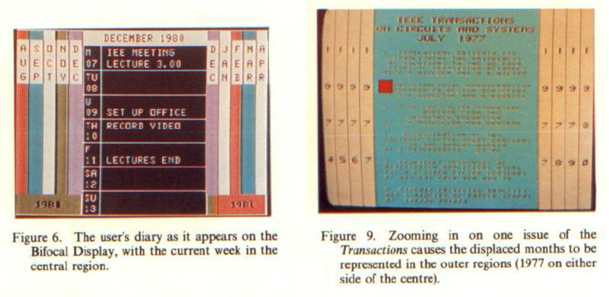
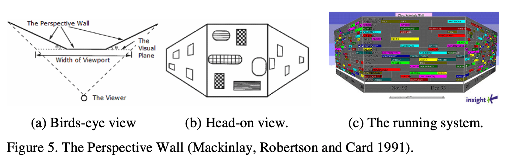
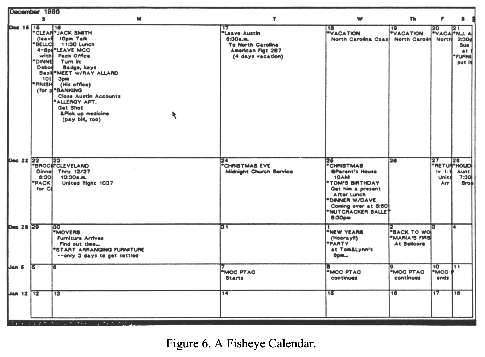
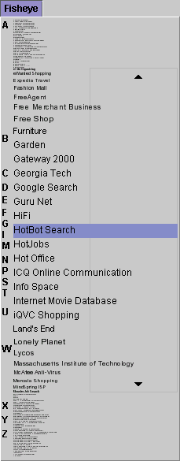
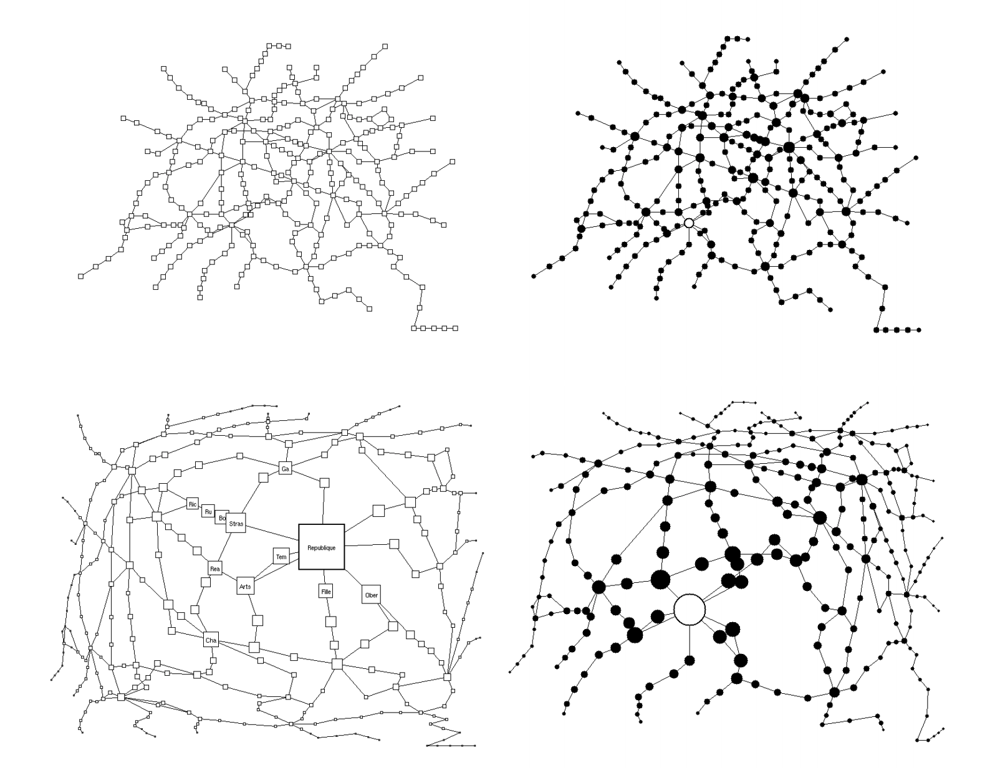
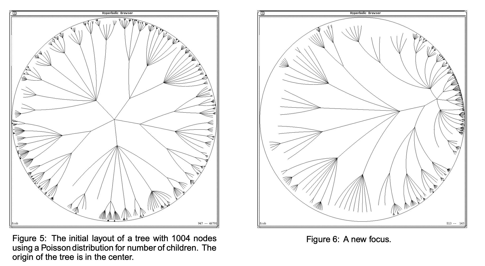
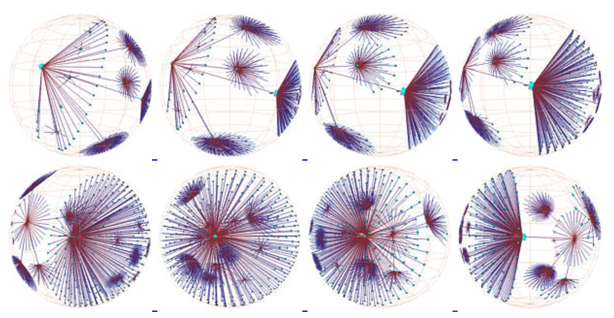

+++
author = "Yuichi Yazaki"
title = "Focus+Contextの実例"
date = "2020-11-11"
description = ""
categories = [
    "interaction"
]
tags = [
    "",
]
image = "image-35.png"
+++

情報可視化におけるテクニックとして、Focus+Contextとよばれる手法があります。これは、コンテクストと詳細を分離せずに同時に提供する…というと少し複雑に聞こえますが、概要と詳細の両方を同一画面で地続きに表現するために、表示領域の空間を歪める方法です。

<!--more-->

## 二焦点ビュー(Bifocal View)

### Bifocal View (1982)
こうした手法のさきがけは、1982年にRobert Spenceが発表しています。

[Data Base Navigation: an Office Environment for the Professional](https://www.researchgate.net/publication/247494429_Data_Base_Navigation_an_Office_Environment_for_the_Professional)

## 遠近ウォール(Perspective Wall)
### The Perspective Wall (1991)

[The perspective wall: Detail and context smoothly integrated](https://www.researchgate.net/publication/247494429_Data_Base_Navigation_an_Office_Environment_for_the_Professional)

## 魚眼ビュー (Fish­ Eye View)

### Generalized Fisheye Views (1986)

[Generalized Fisheye Views](https://citeseerx.ist.psu.edu/viewdoc/download?doi=10.1.1.124.1233&rep=rep1&type=pdf)

### Fisheye Menu (2000)

[Fisheye Menu](https://www.cs.umd.edu/hcil/fisheyemenu/)

### Graphical Fisheye Views (1993)

[Graphical Fisheye Views](https://dl.acm.org/doi/10.1145/198366.198384)

## ハイパーボリック・ブラウザー(Hyperbolic Browser)

### Hyperbolic Geometry (1995)

[A Focus+Context Technique Based on Hyperbolic Geometry for Visualizing Large Hierarchies](http://www.ramanarao.com/papers/startree-chi95.pdf)

### 3D Hyperbolic Space (1998)

[Exploring Large Graphs in 3D Hyperbolic Space](https://graphics.stanford.edu/papers/h3cga/html/)