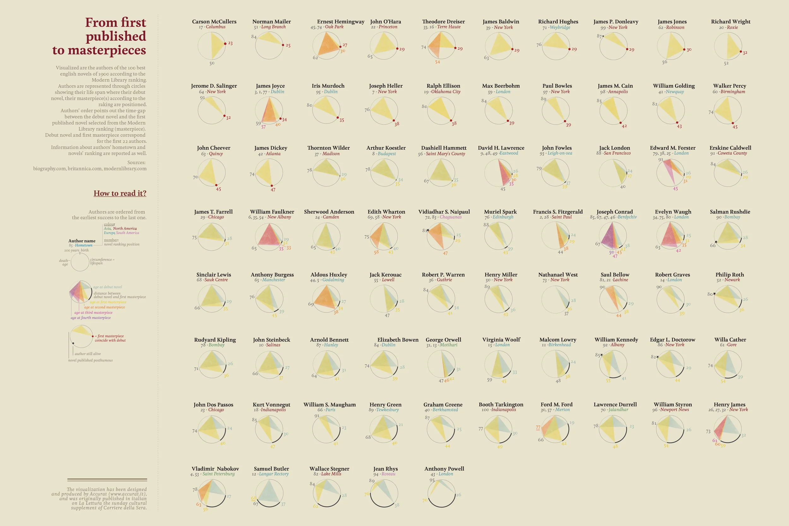
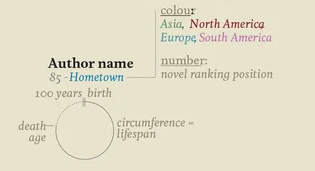
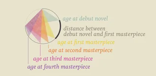
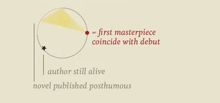

+++
author = "Yuichi Yazaki"
title = "From First Publication to Masterpieces: Timelines of Literary Lives"
slug = "from-first-published-to-masterpieces"
date = "2025-10-10"
categories = [
    "consume"
]
tags = [
    "オリジナルのビジュアル変換",
]
image = "images/cover.png"
+++

This work visualizes the lives and creative careers of writers whose twentieth-century English-language novels were selected for the **Modern Library's 100 Best Novels**. Created by **Federica Fragapane**, it appeared in the *Visual Data* series for *La Lettura*, the cultural supplement of the Italian newspaper *Corriere della Sera*.

<!--more-->

Each circular form represents a writer's life. Within it, the visualization overlays the age at which the writer published a debut work and the ages at which the novels regarded as major masterpieces appeared. The result is a comparative portrait of creative timing: early success, slow maturation, and late recognition all become visible at once.

## How to Read the Graphic

The legend states that the authors are ordered "from the earliest success to the last one." In practice, writers who reached a first masterpiece soon after debut appear toward the upper left, while those whose major work arrived later in life move toward the lower right.

| What is shown | Visual encoding |
|---|---|
| Author name | Set in bold |
| Hometown | Small text next to the name |
| Region or continent | Text color: Asia, North America, Europe, South America |
| Ranking position | Number shown near the author name |

| What is shown | Visual encoding |
|---|---|
| Birth and death age | Positioned around the circle |
| Lifespan | Length of the outer circumference |

| What is shown | Visual encoding |
|---|---|
| Age at debut publication | First radial line inside the circle |
| Time from debut to first masterpiece | Distance from debut line to the first major-work mark |
| First masterpiece | Yellow radial sector |
| Second masterpiece | Orange sector |
| Third masterpiece | Pink sector |
| Fourth masterpiece | Purple sector |

| What is shown | Visual encoding |
|---|---|
| First masterpiece coincides with debut | Red dot inside the circle |
| Debut position | Black star on the circumference |
| Living author | Open outer circumference |
| Posthumous publication | Small black dot outside the circle |

## Context and Intent

The visualization turns a literary question into a temporal one: how long did it take a writer to arrive at the work that later defined them? Literary history often contrasts precocious genius with late mastery, but this piece makes that comparison legible as data.

For example, **James Joyce** appears as a writer who reached canonical work relatively early, while authors such as **William Faulkner** and **Joseph Conrad** show longer stretches between debut and the works most strongly associated with their reputations.

## Data Sources

The work cites:

- biography.com
- britannica.com
- modernlibrary.com

These sources provide birth and death dates, debut publication years, and ranking information from the Modern Library list.

## Summary

"From first published to masterpieces" quantifies time and achievement in a literary domain that is usually described qualitatively. By placing lifespan, debut, and masterpiece publication into a shared visual grammar, it lets readers compare creative rhythm across writers and see literary history from a different angle.

## References

- [Federica Fragapane — Official Portfolio](https://federicafragapane.com/)
- [La Lettura – Visual Data Series](https://visualdata.corriere.it/)
- [Biography.com](https://www.biography.com/)
- [Encyclopaedia Britannica](https://www.britannica.com/)
- [Modern Library 100 Best Novels](https://www.modernlibrary.com/top-100/100-best-novels/)
