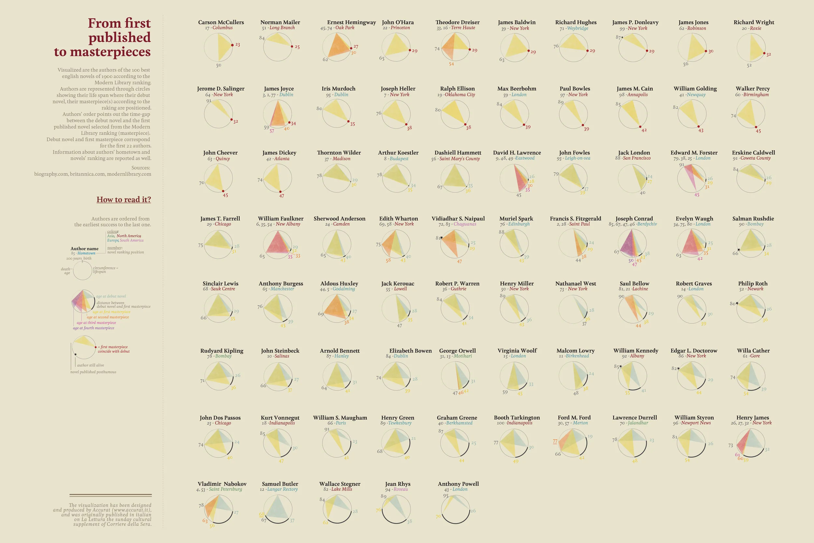

+++
author = "Yuichi Yazaki"
title = "初出版から傑作まで、人生と創作キャリアのタイムライン"
slug = "from-first-published-to-masterpieces"
date = "2025-10-10"
categories = [
    "consume"
]
tags = [
    "オリジナルのビジュアル変換",
]
image = "images/cover.png"
+++

本作は **20世紀に刊行された英語小説のうち、Modern Libraryによる「100 Best English Novels」** に選出された作家たちを対象とし、彼らの **人生と創作キャリアのタイムライン** を可視化したものです。制作は **Federica Fragapane** によるもので、イタリアの新聞『Corriere della Sera』の文化面「La Lettura」掲載の「Visual Data」シリーズの一作です。

<!--more-->

円グラフの形状で表されているのは各作家の「生涯」であり、そこに **デビュー作の発表時期、代表作（Masterpiece）とされる小説の刊行時期** を重ね合わせることで、作家の創作人生を視覚的に比較できる構造となっています。

## 図解の見方

左下の凡例部分には、**「authors are ordered from the earliest success to the last one（最初に成功を収めた順に並んでいる）」** とある通り、作家たちは **最初の代表作までの期間** が短い順に配置されています。  
つまり、若くして代表作を発表した作家ほど左上に、晩年に傑作を残した作家ほど右下に並んでいます。

図の中心要素は、各作家を表す円です。

| 表している内容 | 図での表現方法 |
|----------------|----------------|
| 作家の氏名 | 太字で表記（例：**Author name**） |
| 出身地（Hometown） | 作家名の右に小さく表示 |
| 地域・大陸区分 | 文字色で示す：アジア＝緑、北アメリカ＝赤、ヨーロッパ＝青、南アメリカ＝紫 |
| 代表作のランキング順位 | 作家名の左の数字（例：85）で示す |

| 表している内容 | 図での表現方法 |
|----------------|----------------|
| 作家の生誕と没年 | 円の上部に「birth」、左側に「death age」として配置、100歳は再び円の上部 |
| 作家の生涯（寿命） | 円の外周の実線の長さ（circumference）で表す |

| 表している内容 | 図での表現方法 |
|----------------|----------------|
| デビュー作の刊行年齢 | 円内の最初の放射線（中央の扇形の左端）で示す |
| デビュー作から最初の代表作までの期間 | デビュー作の線から最初の代表作までの距離（太い放射線の長さ）で表す |
| 第1代表作（first masterpiece）の刊行年齢 | 黄色の放射線と扇形で示す |
| 第2代表作（second masterpiece）の刊行年齢 | オレンジ色の扇形で示す |
| 第3代表作（third masterpiece）の刊行年齢 | ピンク色の扇形で示す |
| 第4代表作（fourth masterpiece）の刊行年齢 | 紫色の扇形で示す |

| 表している内容 | 図での表現方法 |
|----------------|----------------|
| 最初の代表作（first masterpiece）がデビュー作と同一である場合 | 円の内側に赤い点（●）を配置し、「first masterpiece coincide with debut」と注記 |
| デビュー作の位置 | 円周上の黒い星印（★）で示す |
| 作家が存命であること | 円が完全に閉じず、外周が開いた状態（実線の切れ目）で示す |
| 死後に出版された小説（posthumous publication） | 円の外側に配置された小さな黒点で示す |

## 背景と意図

本作品の目的は、作家の「創作寿命」や「成功までの時間差」をデータとして可視化することにあります。  
文学史のなかで「早熟な天才」と「晩成型の巨匠」はしばしば比較されますが、この作品はその議論を **客観的な時間軸のデータ** として提示しています。

例として、
- **James Joyce** は20代で代表作を発表しており、扇形の広がりが短い。
- **William Faulkner** や **Joseph Conrad** などは、デビュー後長い時間を経て代表作に至っており、放射線が広く延びています。

このように、**創作活動における「時間」と「成果」** の関係が直感的に読み取れるようになっています。

## データソース

作者は作品内で以下のデータソースを明記しています。

- biography.com  
- britannica.com  
- modernlibrary.com  

これらから作家の生没年、デビュー作発表年、Modern Libraryのランキング情報を取得し、作家ごとに統一フォーマットでプロットされています。

## まとめ

「From first published to masterpieces」は、文学という定性的な領域において **時間と成果を定量化し、可視化する試み** です。  
この図版により、作家それぞれの人生の長さや成功までの道のりが一目で比較でき、文学史を新たな角度から捉えることができます。

特に「デビューから代表作までの時間差」という視点は、単なる経歴紹介ではなく **創作のリズム** や **成熟のタイミング** を示唆するものとして教育的にも示唆に富みます。

## 参考・出典

- [Federica Fragapane — Official Portfolio](https://federicafragapane.com/)  
- [La Lettura – Visual Data Series](https://visualdata.corriere.it/)  
- [Biography.com](https://www.biography.com/)  
- [Encyclopaedia Britannica](https://www.britannica.com/)  
- [Modern Library 100 Best Novels](https://www.modernlibrary.com/top-100/100-best-novels/)  