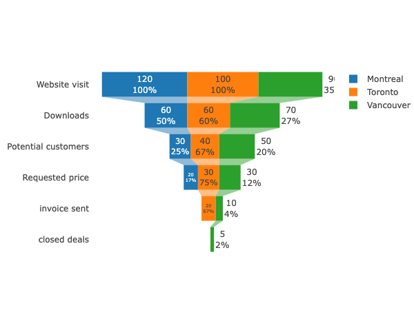

+++
author = "Yuichi Yazaki"
title = "Funnel Chart"
slug = "funnel-chart"
date = "2025-10-11"
categories = [
    "chart"
]
tags = [
    "",
]
image = "images/cover.png"
+++

A funnel chart visualizes the decrease in quantity across stages of a process. Its width narrows from top to bottom, resembling a funnel. It is common in marketing and sales analysis, such as website visits, product views, cart additions, and completed purchases.

<!--more-->

## Historical Background

The funnel concept in marketing traces back to the AIDA model proposed by E. St. Elmo Lewis in 1898: Attention, Interest, Desire, and Action. It describes how people move through stages before purchase.

## How to Read It

Each stage shows the number or percentage remaining. The drop between stages indicates loss or conversion. The most important insight is often where the largest drop-off occurs.

## Design Notes

- Use consistent stage definitions.
- Show both counts and conversion rates when useful.
- Avoid 3D funnel effects.
- Consider bar charts when exact comparison is more important than the funnel metaphor.

## Summary

Funnel charts are useful for communicating staged drop-off in processes. They are most effective when the process truly narrows from one stage to the next.
