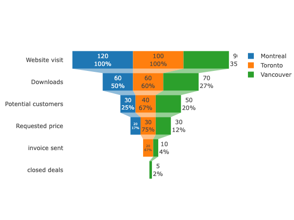

+++
author = "Yuichi Yazaki"
title = "ファネル・チャート（Funnel Chart）"
slug = "funnel-chart"
date = "2025-10-11"
categories = [
    "chart"
]
tags = [
    "",
]
image = "images/cover.png"
+++

ファネル・チャート（Funnel Chart）は、ビジネスやマーケティング領域でよく用いられる可視化手法で、プロセスの各段階でのデータ量や割合の減少を、上から下へと流れる「漏斗（ファネル）」の形で表します。  
たとえば、ウェブサイト訪問者が「閲覧 → 商品ページ閲覧 → カート追加 → 購入完了」という流れをたどる際に、どの段階でどれだけの人数が離脱したかを視覚的に示すのに適しています。

<!--more-->

## チャートの見方

ファネル・チャートでは、上から下に向かって段階的に値が減少する構造を持ちます。以下のような要素で構成されています。

| 要素 | 説明 |
|------|------|
| 段階（Stage） | プロセスの各ステップ（例：訪問、登録、購入など）を表します。 |
| 幅（Width） | 各段階での数量または割合を示します。上の段階ほど多く、下に行くほど少なくなります。 |
| 比率（Conversion Rate） | 各段階から次の段階に進む割合を示します。分析では特にこの値が重要です。 |
| 色の使い方 | ステージごとに異なる色を用いることで、視覚的区別を明確にします。グラデーションで連続性を表す場合もあります。 |

一般的に、上段は「流入」や「潜在顧客」、下段は「成果」や「コンバージョン完了」を意味します。

## 用途と背景

ファネル・チャートは、データ分析の分野でも特にマーケティング・営業・サービス運用において定番の指標可視化方法です。代表的な応用としては以下が挙げられます。

- **Eコマース分析**：購買プロセスでの離脱率分析  
- **営業パイプライン**：見込み顧客から契約成立までの進捗追跡  
- **アプリ利用分析**：インストールから課金ユーザーまでの行動段階の把握  

この図の利点は、プロセス全体を直感的に把握できる点にあります。一方で、各段階の詳細な原因分析には別のチャート（たとえば棒グラフやサンキー・ダイアグラム）を併用するのが望ましいです。

## まとめ

ファネル・チャートは、ユーザーや顧客が特定のプロセスをどのように通過していくかを示す「流れの図」です。上から下への形状の変化が、自然に「減少」や「離脱」を想起させ、特にビジネス領域で効果的なデータストーリーテリングを実現します。  
ただし、単一の指標に頼らず、補助的なグラフと組み合わせることで、より多面的な分析が可能になります。

## 参考・出典

- [Power BI 公式 — Create and use funnel charts in Power BI](https://learn.microsoft.com/en-us/power-bi/visuals/power-bi-visualization-funnel-charts)
- [Plotly.js 公式 — Funnel and Funnelarea Charts in JavaScript](https://plotly.com/javascript/funnel-charts/)
- [Highcharts 公式ドキュメント — Funnel series](https://highcharts.com/docs/chart-and-series-types/funnel-series)
- [Highcharts API — series.funnel](https://api.highcharts.com/highcharts/series.funnel)
- [Apache ECharts 公式 — Cheat Sheet（Funnel を含む）](https://echarts.apache.org/en/cheat-sheet.html)
- [Tableau 公式ブログ — Three different ways to build funnels in Tableau—and why](https://www.tableau.com/blog/three-different-ways-build-funnels-tableau-and-why-89871)