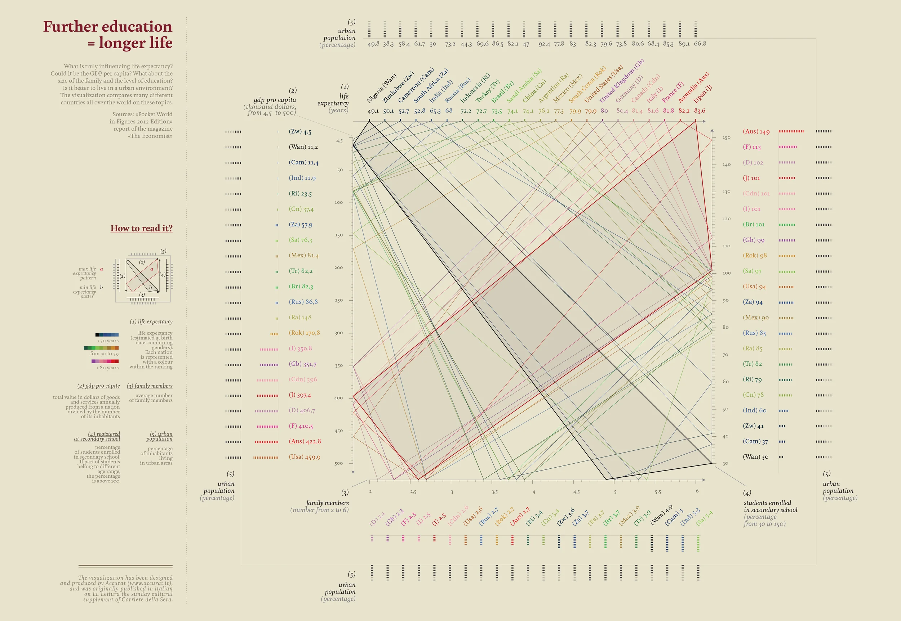
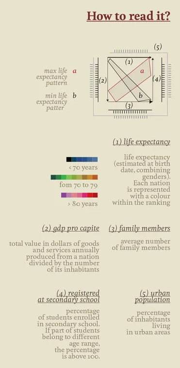

+++
author = "Yuichi Yazaki"
title = "Further Education, Longer Life: Visualizing Education and Social Structure"
slug = "further-education-longer-life"
date = "2025-10-08"
description = ""
categories = [
    "consume"
]
tags = [
    "オリジナルのビジュアル変換",
]
image = "images/cover.png"
+++

This work by Italian infographic designer **Federica Fragapane** shows the relationship between education level and life expectancy through a multivariate visual system. It was created for *La Lettura*, the cultural supplement of *Corriere della Sera*, and explores how education, wealth, family structure, urbanization, and longevity move together across countries.

<!--more-->

The data sources include *The Economist* and *Pocket World in Figures*. Each country can be compared across GDP, life expectancy, urban population share, family size, and secondary-school enrollment.

## How to Read It

The visualization arranges five variables within a square structure. Each country is represented by a line that passes through the axes, creating a compact profile of its social and demographic conditions.

Color represents life-expectancy range across the whole graphic:

- **Blue**: below 70 years
- **Green**: 70-79 years
- **Red**: 80 years or older

## Overall Structure

Axes 1-4 sit on the four sides of the square. Axis 5, urban population, wraps around the outer edge. This makes urbanization the broader context surrounding life expectancy, GDP, family size, and education.

### 1. Life Expectancy

The left axis shows life expectancy at birth. Countries with longer lives appear higher.

### 2. GDP per Capita

The lower axis shows economic output per person. Higher values move to the right and often align with education and longevity.

### 3. Family Members

This axis shows average household size. Smaller households are often associated with urbanized and highly educated societies.

### 4. Secondary School Enrollment

The right axis shows access to secondary education. Some countries can exceed 100% because of statistical coverage across age groups.

### 5. Urban Population

The outer axis shows the share of people living in urban areas, framing the other variables as part of a broader urban social system.

## Interpretation

Lines extending upward and rightward tend to indicate higher education, higher GDP, longer life expectancy, smaller household size, and greater urbanization. Lines concentrated lower and leftward tend to indicate lower education, lower GDP, larger households, and shorter life expectancy.

## Background

The work visualizes a long-discussed relationship in public health and social science: education is correlated with health and longevity. Education can shape income, health literacy, social participation, and access to care. Fragapane's design avoids reducing that relationship to a single scatterplot and instead lets readers experience several variables together.

## Note

The visualization shows **correlation**, not direct causation. It does not claim that education alone causes longer life; rather, it shows how education, economy, family structure, urbanization, and health tend to appear together.

## References

- [Visual Data — Giorgia Lupi](https://giorgialupi.com/lalettura)
