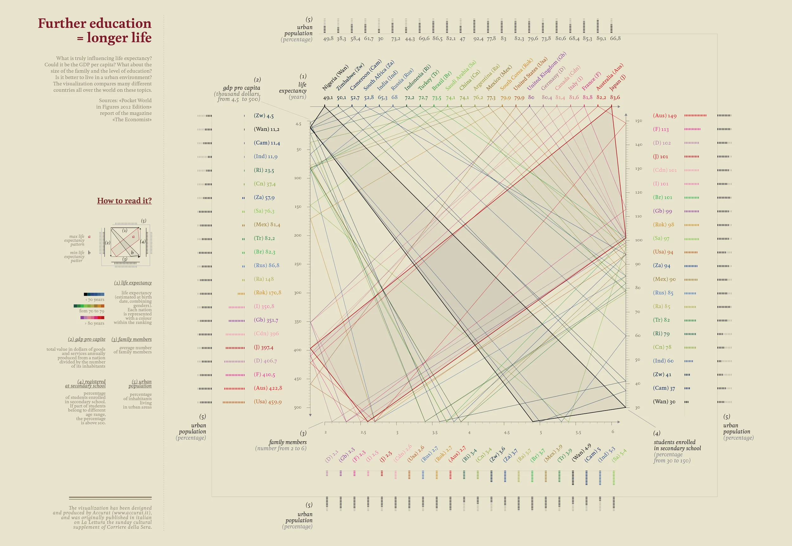
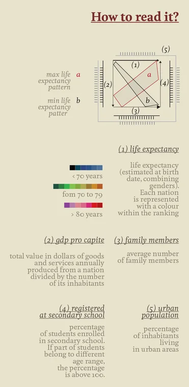

+++
author = "Yuichi Yazaki"
title = "学びと寿命のあいだ - 教育水準と社会構造の相関を描く"
slug = "further-education-longer-life"
date = "2025-10-08"
description = ""
categories = [
    "consume"
]
tags = [
    "オリジナルのビジュアル変換",
]
image = "images/cover.png"
+++

この作品は、イタリアのインフォグラフィック・デザイナー **Federica Fragapane** による作品で、教育水準と平均寿命の関係を多変量的に示しています。作品はイタリア紙 *Corriere della Sera* の文化面「La Lettura」向けに制作されたもので、「教育の普及がどのように人々の寿命を延ばすのか」を視覚的に表現しています。

<!--more-->

作品のデータソースは『The Economist』や *Pocket World in Figures* による国別統計をもとにしており、各国の **GDP、平均寿命、都市人口比、家族構成人数、教育就学率** といった複数の変数を同時に比較できます。

## 作品の読み解き方

この図は、5つの主要変数を四角形の構成の中に配置した複合的な比較図です。  
凡例に示された **(1)〜(5)** の軸はそれぞれ異なる社会指標を表しており、  
各国を1本の線が結ぶことで、教育・経済・家族構成・都市化・寿命といった要素の関係を読み取ることができます。  

また、この図の重要な特徴は、**各線の色が平均寿命のレンジを表す**という全体的ルールです。  
つまり、色は特定の軸に属するものではなく、全体を通して一貫した“寿命指標”になっています。

- **青系：70歳未満**  
- **緑系：70〜79歳**  
- **赤系：80歳以上**

色は国の寿命水準を象徴し、線の位置や傾きとともに社会的な傾向を示します。

### 図全体の構造
この図は、**正方形の形状**をもつ多軸配置になっています。  
(1)〜(4)の軸が四辺に配置され、**(5)の軸（都市人口比）はそれらを囲むように外周に位置**しています。  
これにより、「都市化」が他の変数全体を包み込む文脈として表現されています。  
つまり、教育や経済、家族構造、寿命といった要素がどれほど“都市的社会”の中で成立しているかを示す構造です。

### (1) life expectancy（平均寿命）
左辺に配置される軸で、出生時点の平均寿命（男女平均）を示します。  
値が高い国ほど上方に位置します。  
凡例の小図にある「a」は最長寿国、「b」は最短寿国の線型を表し、全体の基準として用いられています。

### (2) gdp pro capite（1人あたりGDP）
下辺に位置する軸で、国民1人あたりの経済生産力を示します。  
値が高いほど右方向に位置し、一般に教育水準や寿命と正の相関を示します。

### (3) family members（平均家族人数）
下辺中央付近に配置される軸で、1世帯あたりの平均人数を示します。  
数値が小さいほど少人数家族であり、都市化や高教育化が進んだ国で見られます。  
家族規模は社会構造や文化的背景を反映する要素でもあります。

### (4) registered at secondary school（中等教育就学率）
右辺に位置し、教育へのアクセスを示します。  
中等教育に在籍する学生の割合（％）を表し、値が高い国ほど右上に位置します。  
なお、統計上の年齢範囲が異なる国では、**100％を超える値**となることがありますが、  
これは複数の学年層を含む集計のためであり、異常値ではありません。

### (5) urban population（都市人口比）
四辺を取り囲む外周に配置された軸で、都市部に住む人口の割合（％）を示します。  
この変数は他の4軸全体を包み込むスケールとして作用し、  
都市化が教育、家族構造、経済、寿命のすべてに影響を与えることを視覚的に示します。

### 作品の読み解き方のまとめ

各国の線がこの四角形の中を通過することで、5つの変数の関係が一目で分かります。  
線が上方・右方に伸びるほど、教育水準・GDP・寿命が高く、家族人数が少なく、都市化が進んでいる傾向を示します。  
線が下方・左方に集中する国は、教育水準が低く、大家族・低GDP・短命傾向にあることを示します。

中央左下のミニ図（凡例）は、この四角形全体の縮図です。「a」と「b」はそれぞれ最長寿国・最短寿国の典型的なパターンで、これを参照することで、実際のグラフの構造を直感的に理解できます。

## 背景知識

この作品が扱うテーマは、社会経済学や公衆衛生学でも古くから議論されている「 **教育と健康の相関関係** 」です。  
多くの研究で、高い教育水準を持つ人ほど健康的な生活習慣を選択し、より長寿になる傾向が示されています。これは医療知識へのアクセス、所得水準、社会参加の機会といった要素が複合的に影響するためです。

Fragapaneの作品は、このような統計的相関を単なる散布図ではなく **多変量を同時に視覚的に体験できる構造** として設計されています。特に「教育就学率」軸の右上に向かう国々（例：日本、ドイツ、フランス）は、平均寿命とGDPの両面で高い値を示し、教育の影響を直感的に理解させます。

## まとめ

この作品は、数値の羅列ではなく、変数間の「構造的関係」を見せることによって、教育が社会の豊かさや健康にどのように寄与するかを示しています。

単なる統計図ではなく **社会的メッセージを内包したビジュアルエッセイ** として高く評価される理由はここにあります。Fragapaneが得意とする繊細な色使いと、静的でありながら動的な読み取りを誘発する構成は、データビジュアライゼーションの芸術性を体現しています。

> **注記**  
> この作品は、教育水準と平均寿命の間に見られる **統計的な相関関係（correlation）** を視覚的に示したものであり、教育が寿命を直接的に延ばすという **因果関係（causation）** を示すものではありません。
> 図の目的は、複数の社会的要因がどのように連動して現れるかを俯瞰的に理解させることにあります。

## 参考・出典
 
- [Visual Data — giorgialupi ](https://giorgialupi.com/lalettura)  
