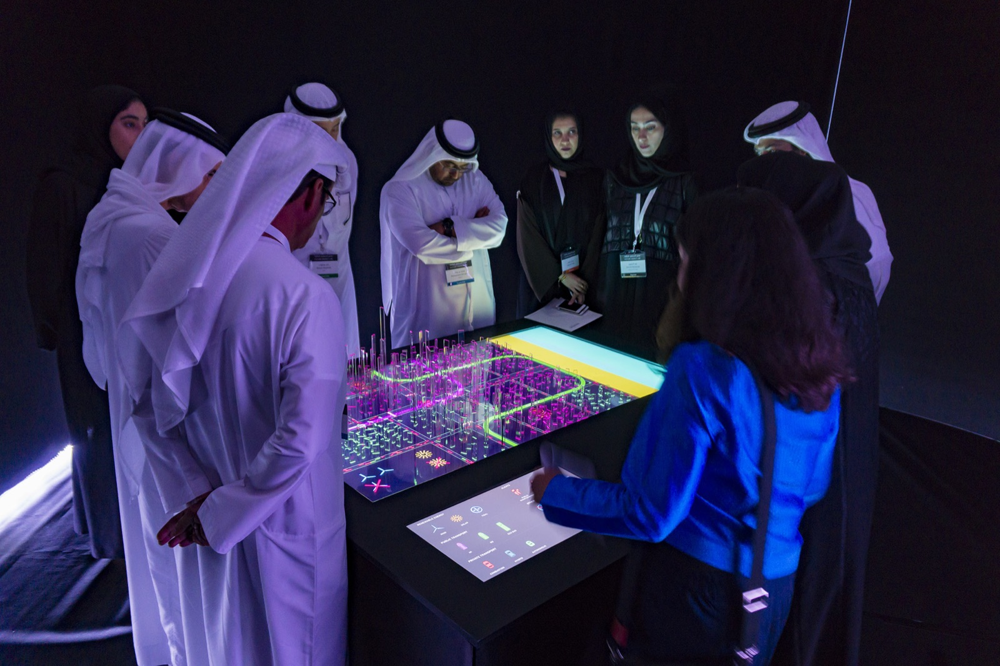
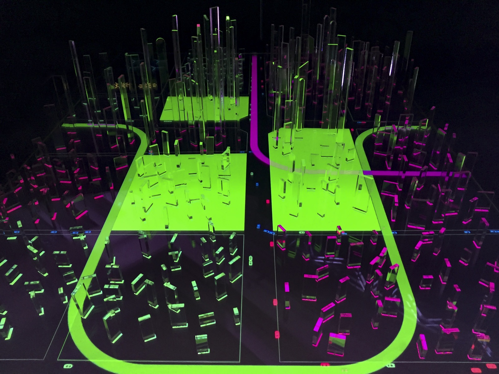
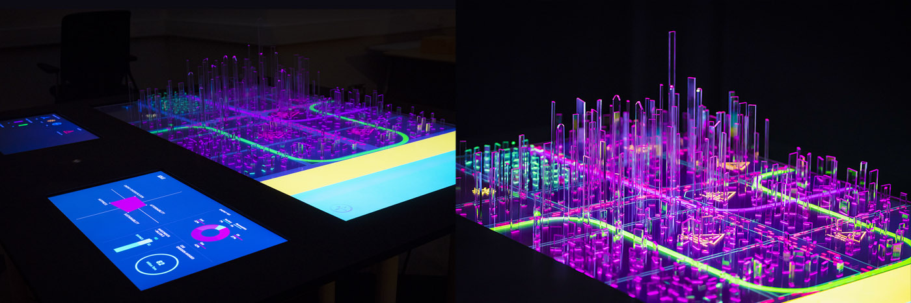
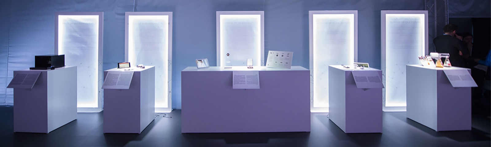
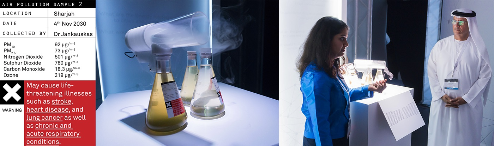
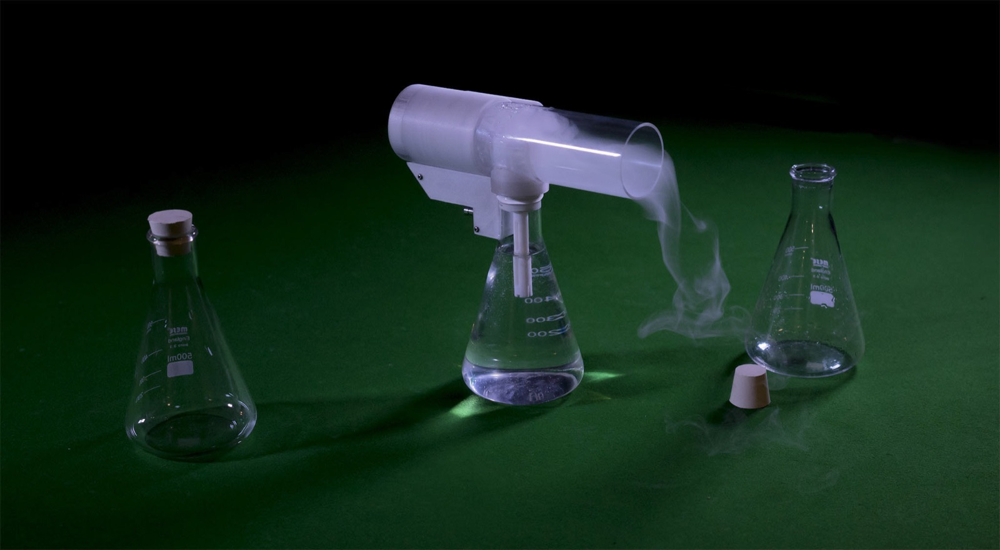
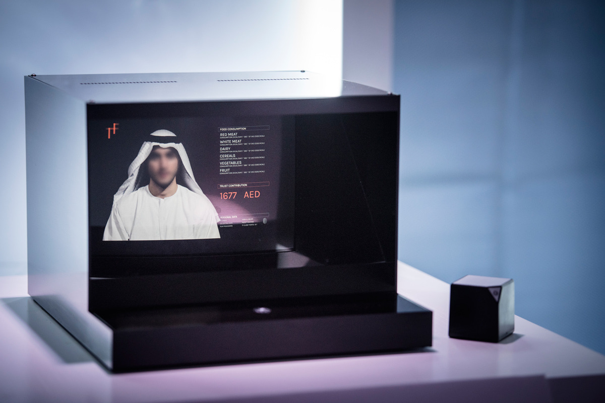
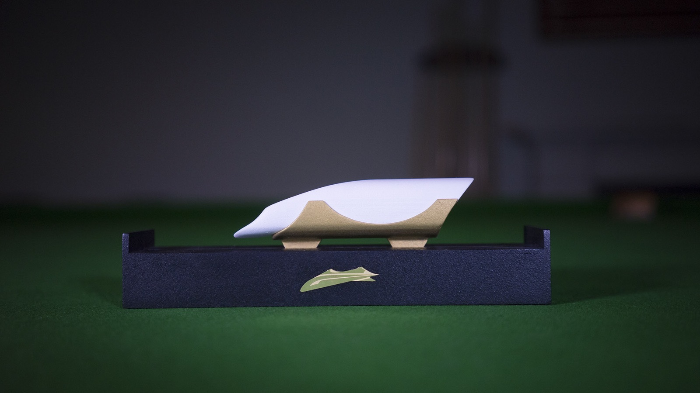
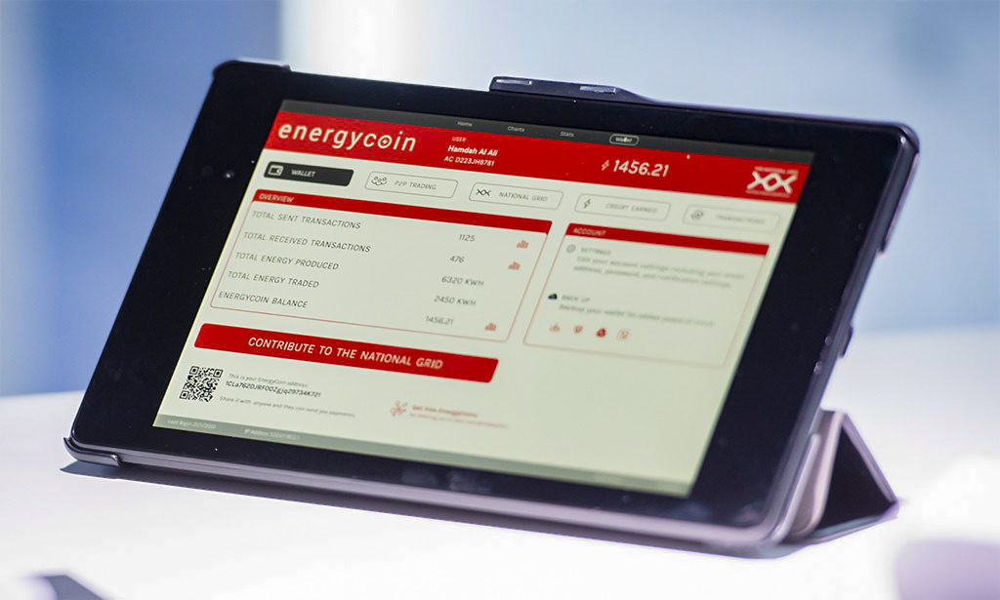

+++
author = "Yuichi Yazaki"
title = "数字を、息のできる証拠にする——Superflux『The Future Energy Lab』"
slug = "future-energy-lab"
date = "2026-08-16"
description = "UAE の計量経済データから、歩ける都市模型と吸える大気試料をつくった Superflux の Future Energy Lab を、データ可視化とスペキュラティブ・デザインの交差から読む。"
categories = [
    "consume"
]
tags = [
    "オリジナルのビジュアル変換",
]
image = "images/cover.jpg"
+++

Superflux の『The Future Energy Lab』（発表 2017）は、アラブ首長国連邦（UAE）のエネルギー政策を、グラフの延長ではなく **体験可能な証拠** として組み立てた仕事です。依頼主は UAE のエネルギー省と首相府。スタジオは、省が持っていた計量経済データと将来推計を外挿し、未来の大都市模型（Future Energy Zone）と、各シナリオに属する人工物をつくりました。

ここで重要なのは、本作が「2050年を正しく予測した図」ではない点です。Anab Jain は、データはしばしば証拠と同一視されるが、**データは証拠ではない** と書いています。証拠とは、仮説との検証関係に置かれた特別なデータである、という Brendan Clarke の定義を引いたうえで、スタジオは未来の空気・製品・サービスを「つくり、構成する」と言います。データ可視化とスペキュラティブ・デザインが交差するのは、この自己規定においてです。数字を画面に残すのではなく、その政策を決める人が歩き、操作し、吸い、持ち帰れる状態へ移した。

<!--more-->

写真はいずれも [Superflux 公式ページ](https://superflux.in/index.php/work/futureenergylab/) より。公開体験ではなく、2017年1月前後に開催された政策ラボの記録です。

## 何が、誰の前で、起きたか

Superflux が公式に書く課題は、安全と確実さから不確実さへ移ること、そしてその不確実さを制御できる感覚に変えることです。エネルギー省と首相府からの依頼は、エネルギーをめぐる複数の未来を体験する仕組みをつくること、さらに各未来の機会とシステム全体への帰結を、閣僚と意思決定者と一緒にストレステストすることでした。目標は、2050年までの国家エネルギー政策に資することでした。

成果は Future Energy Lab で提示されました。出席者として公式が挙げるのは、首相、内閣首脳、エネルギー省、政策担当者、公益事業とエネルギー部門の組織長です。同じ場で、foresight 会社 Rorosoro がエネルギーシミュレータとロールプレイングゲームを担当しています。Superflux の主担当は Future Energy Zone です。方法として挙げるのは、speculative design、experiential futures、speculative evidence generating、diegetic prototyping です。

制作年は公式ページでは 2017、スタジオの年次回顧では 2016年の仕事として載っています。TED（2017年4月）では「今年の初め」と語られます。UAE の Energy Strategy 2050 が発表されたのは **2017年1月10日** です。作業は2016年、提示は戦略発表の直前、という時系列が一次情報から取れます。

チームは Jon Ardern、Anab Jain、Jon Flint、Jake Charles Rees、Marianna Czwojdrak、Vytautas Jankauskas、Claire Sullivan。追加貢献者に Rohit Iyer、Simone Nunziato、Paul Graham Raven。首相府の Dr. Radheya AlHashmi、エネルギー省の Fatima AlFoora AlShamsi、首相府の Giulio Quaggiotto への謝辞が公式ページにあります。

## Future Energy Zone：データを、歩ける都市にする

中核は、未来の大都市模型です。エネルギー省の計量経済データと推計を外挿し、新しいエネルギー政策が都市景観に及ぼす含意を「演じた」と Superflux は書いています。マクロ（投資）とミクロ（社会・技術の変化）の接続を表面化させるためです。

公式写真が示すものは、暗い部屋の大きなテーブルです。白いトーブと黒いアバヤの参加者が、発光する盤面を囲んでいます。盤面は二層です。

- **都市模型**：格子状の都市。高さの違う半透明の柱が建物のように立ち、盤面から照らされる。桃色の経路と黄緑の大きなループが走り、太陽の記号や交差の記号が点在する。公式が挙げる差分——再生可能エネルギーの導入、代替公共交通、ピアツーピアのエネルギー取引、社会文化の変化——が、この盤面の経路と記号に落ちている、と読むのが自然です。
- **操作盤**：手前に埋め込まれた画面。見えるラベルは RENEWABLE ENERGY（太陽・風車）、PUBLIC TRANSPORT、PRIVATE TRANSPORT。縦のゲージがあり、選択が模型へ返る前提で組まれています。

参加者は **五つの未来世界** を通されます。同時に、別画面で future happiness index、エネルギー多様化、各未来の affordability と sustainability、費用と炭素排出の変化を追える、と公式は書いています。別カットでは、ENERGY SYSTEM と題した青い画面に、象限図・棒グラフ・ドーナツグラフが並びます。Sustainability と Affordability のトレードオフを、模型の横で読む装置です。

つまり本作の「可視化」は、公開ウェブのチャートではありません。**政策変数を都市の形と経路と指標へ写し、その場で切り替えるテーブル** です。Jain の TED では、この大きな都市模型のうえで「多くの可能な未来を可視化した」と、可視化という言葉がそのまま使われます。

## Experiential evidences：予測の物体ではなく、可能性の物体

模型だけでは足りない、というのが公式の構成です。各未来に対して、人工物の一式がつくられました。「予言の物体ではなく、可能性の物体」だと Superflux は書いています。役割は、その発展経路で出会う課題と機会を体現し、政策がつくりうる物質的な生活を表すことです。公式写真では、白い台座が横に並び、背後に光るパネル、手前に placard があります。実験器具、画面、表彰盾、端末が、シナリオごとの証拠として置かれています。

公式が詳述するのは、次の五つです。

### 1. 未来の大気試料（Business As Usual）

現状維持——化石燃料を燃やし続ける経路——の帰結として、都市の大気汚染を置きました。試料は 2020年、2028年、2034年。含むのは、気候と化石燃料排出の推計に基づく PM10、PM2.5、一酸化炭素、二酸化硫黄、二酸化窒素、オゾンの「もっともありそうな組み合わせ」です。公式は *noxious stuff, impossible to inhale even a small amount* と書いています。予測とデータが届かない点を、体験的証拠が届ける、という主張です。

公式写真のラベルは、その主張を数値のまま残しています。AIR POLLUTION SAMPLE 2。場所は Sharjah、日付は 4th Nov 2030。PM10、PM2.5、二酸化窒素、一酸化炭素の値が並び、下部は赤い × と、脳卒中・心疾患・肺がんなど生命を脅かす疾患を起こしうる、という警告です。TED と Medium が 2030年に寄せて語るのは、このラベルの年です。公式ページの三年分（2020 / 2028 / 2034）と、語りの「2030年の一吸い」は、同じ系列の要約です。

Jain は、インドの出身都市の化学研究室の科学者とつくった近似試料だ、と TED で述べています。のちの人道支援向け仕事では、この吸入器が再提示され、Ahmedabad の化学者と協働した、と Superflux は書いています。スタジオ写真の装置は、三角フラスコの上に白い管が乗り、蒸気が落ちるものです。グラフの代わりに、肺への入力があります。

### 2. The Tomorrow Fund

高価な未来を賄うための長期投資です。市民が、今日のエネルギー行動に応じて子どもの未来へ拠出する、という設定。ラボ内では、ホログラフィックな基金アドバイザーが支払い計画を走り、環境配慮行動に対する控除を示します。公式写真の黒い筐体には、人物の顔（写真ではぼかされている）と FOOD CONSUMPTION の内訳（赤身肉、白身肉、乳製品、穀物、野菜、果物）、その下に TRUST CONTRIBUTION 1677 AED が出ます。費用と炭素の画面が、家計と「信頼」の会話へ翻訳されます。

### 3. The Order of the Emirates

政策変更は、文化と行動の変更と結びつかねばならない、という問いへの応答です。気候チャンピオン——コミュニティで需要削減に努めた個人と組織——を称える勲章。公式写真の盾には、金の六角形と黒い結晶体、英語の功績文があります。一例は University Hospital Sharjah がカーボンニュートラルになり、余剰再エネを National Grid へ出したこと。別例は、生態的実践と自然環境への敬意を広げる草の根運動です。襟のピンも同じ幾何です。指標の達成が、国家の栄誉の見た目を借りて流通します。

### 4. Desert Falcon

公共交通が強制規制ではなく誇りになる未来の手がかりとして、アブダビとロンドンを結ぶ次世代リニアの土産物を置きました。ロンドンバスのように、観光店で買える模型。公式は、磁気軌道つきの機能する模型だった、と書いています。公式写真は、白いポッドを金の受けが支え、暗い台座に緑のロゴがある物体です。ネットワークの図を、棚に置ける物体へ圧縮しています。

### 5. Energycoin と National Grid

エネルギー政策の転換は参加型でなければならない、という主張の実装です。National Grid がブロックチェーンで動き、暗号通貨が Energycoin。家庭のタービンと太陽電池の余剰を、地域とグリッドへ送れる。得た通貨は、環境配慮の財とサービスに換えられる。公式写真のタブレット画面は、現行のフィンテックに似せた赤いヘッダです。WALLET / P2P TRADING / NATIONAL GRID / CREDIT EARNED / TRANSACTIONS。Overview には送受信件数、発電量（kWh）、取引量、残高。大きなボタンは CONTRIBUTE TO THE NATIONAL GRID。計量の単位（kWh）と、市民が押せる操作が、同じ画面にあります。

## データ可視化 × スペキュラティブ・デザイン

スペキュラティブ・デザインは、完成解を提示するより、「もし〜だったら」を議論可能にします。本作が自分を experiential futures と speculative evidence と呼ぶとき、模型と大気は装飾ではなく方法です。

**データを、傍観の対象から外す。** NPR の TED Radio Hour で Jain は、*data spectatorship* という言葉を使います。美しい可視化、グラフ、指標を見るが、生活に直接つながる物語を理解しない。だから行動が起きない。Lab の操作盤と模型は、その批判への応答です。参加者は画面の外に立ち、変数を変え、都市の光が変わるのを見ます。それでも「息子に車をやめろとは言えない」という反応が出た、と TED は記録します。模型は理解を保証しません。理解の失敗が、次の証拠（大気）を必要にした、というのが Jain の話の骨格です。

**データと証拠を分ける。** Medium の論考（2017-06-28）は、歴史・現代データが「将来の変化の委任状」として使われる、と観察したうえで、データ資本の時代にデータ＝証拠という信念が固定した、と疑います。測れないもの、情報があるのに動かないこと、生成者と解釈者のバイアス、不確実性のなかでデータだけを証拠にしてよいか。Clarke の一文——証拠は仮説との検証関係に置かれた特別なデータ——が、ここで方法になります。Future Energy Lab では、計量経済データから未来の空気・製品・サービスを構成した、と明記されます。可視化が「正しい数」を示す仕事なら、本作は「その数が、どの仮説を検証しているか」を物体にする仕事です。シャルジャのラベルに並ぶ PM 値は、その検証関係を隠していません。

**一つの予測図ではなく、五つの経路を置く。** 公式は、人工物を予言ではないと言います。Business As Usual の大気、Tomorrow Fund、勲章、リニアの土産、Energycoin は、同じ 2050 の完成形ではありません。投資・需要削減・再エネ・文化の組み合わせが違うと、都市も栄誉も家計も変わる、という並列です。追加画面の happiness / 多様化 / 費用 / 炭素は、経路ごとの差分を数値で残します。模型が空間、画面が指標、物体が生活。三層が揃ってはじめて、「政策の帰結」が一つのグラフに潰れません。

**届かない時間を、いまの感覚へ折る。** 公式が挙げる大きな問いの一つは、現在の快適さから、効果が見えるまで何十年もかかる行動へ、どう人を移すかです。大気の一吸い、子どもの基金、勲章、土産、余剰電力の通貨は、いずれも 2050 年の報告書を、いまの肺・財布・名誉・観光・取引へ翻訳します。Dunne & Raby 的なギャラリーの批判装置というより、内閣のテーブルで使う翻訳装置です。SpeculativeEdu のインタビューで Superflux は、自作を必ずしも Speculative Design と呼ばない、potential を調べる開かれた探究だ、と述べています。Lab はその言い方と一致します。閉じたディストピアではなく、選択肢としての未来です。

## 第三者による評価・評判

公開直後のデザインメディアによる作品単体レビューは、多くありません。流通の中心は、Jain 自身が TED で語った「閣僚に未来の空気を吸わせた」エピソードです。第三者評は、独立した検証というより、**どの場がこの話を政策デザインの事例として採用したか** として読むのが正確です。

- **TED2017**（2017-04、Vancouver）。Jain が会議の冒頭で *Why we need to imagine different futures* を話し、都市模型と 2030年の大気、その翌日の再エネ投資発表を連続して語ります。因果は留保されます。「私たちの未来体験がこの決定のどの部分を担ったかは分からない。だが、そのようなシナリオを緩和するようエネルギー政策を変えたことは知っている」。再生回数は TED ページで約 194 万回（本稿執筆時）。スタジオ自身の一次語りですが、政策ラボのエピソードが国際的に固定された場です。
- **NPR TED Radio Hour**（2017-09-15）。Guy Raz が同トークを再放送し、大気が「ほぼ危険すぎる」ほどだったか、閣僚が「これを望まない」と言ったかを確認します。Jain は「一因だったと思う。要因は多い」と答え、続けて *data spectatorship* を説明します。第三者の聞き手が、因果の過大評価をその場で削った記録です。
- **BBC Radio 4** *Positive Thinking*（2022-08-04）。問いかけは *Can ‘feeling’ the future create meaningful action to solve the climate crisis?*。UAE 向けの「未来の空気」、*Mitigation of Shock*、*Refuge for Resurgence* が並びます。Lab は、気候危機に「感じる未来」が効くかという番組の、初期事例として再掲されています。
- **The Architectural Review**（2022-10、Energy 号）。*In practice: Superflux on the Future Energy Lab*。著者は Anab Jain と Hanna Sarsa。見出しは *Imagining and spatialising possible futures on our planet helps overcome climate change apathy*。第三者媒体の In Practice 枠に、当事者が書いた論考です。独立批評ではなく、建築誌がこの仕事をエネルギー特集の実践例として選んだ、という評価です。有料のため本文は未確認です。
- **Design Week**（2023-01）。スタジオ特集の導入写真に Future Energy Lab を使い、「特定のエネルギー源と燃料に依存する異なる未来の成否をストレステストする」と説明しています。作品論というより、Superflux の方法の代表画像としての採用です。
- **designboom** のスタジオ特集は、予測はデータから延び、スペキュラティブ・デザインは研究に支えられた想像から建てる、出力は読む報告書ではなく入る部屋・見るフィルム・理解する前に届く匂いだ、と一般化します。Lab 固有の評ではありませんが、大気試料の位置づけと重なります。
- **SHAMICO**（制作関与者のポートフォリオ）は、閣僚によるストレステスト、2050年までの政策への情報提供、という公式と同じ要約を、designer / fabricator / technologist の仕事として再掲しています。

学術側で、この Lab だけを対象にした独立論文は、本稿が確認した範囲では中心になっていません。引用されるときは、Superflux の政策応用の一例、あるいは experiential futures の系譜に乗る事例として、スタジオ自身の記述が参照されることが多いです。

## 政策への「影響」を、公式と自己評価で分ける

Superflux の公式ページは、影響を三つに分けます。(1) 意図した帰結と意図しなかった帰結を、選択肢として理解できる。(2) 製品・サービス・システムのイノベーション機会が表面化する。(3) UAE の National Energy Strategy 2050 に向けた実行可能な洞察が直ちに生まれ、戦略はその直後に発表された。投資額として *$163 billion in renewables* と書きます。

UAE 側の一次情報は、Studio 名を出しません。The National（2017-01-10）と World Nuclear News によれば、シェイク・ムハンマド・ビン・ラーシド・アール・マクトゥーム（副大統領兼首相、ドバイ首長）が、エネルギー省と内閣・未来省が主催したエネルギーの未来に関する議論の場で戦略を発表しました。初めての全国統一エネルギー戦略。2050年の構成は再エネ 44%、ガス 38%、クリーン化石 12%、原子力 6%。発電の炭素を 70% 削減、効率 40% 改善、節約 AED 700 billion。投資は **AED 600 billion**（当時約 1630 億ドル）で、再エネ単体ではなく需要増と持続的成長のための総額です。公式は「すべてのエネルギー関係機関と行政評議会の共同作業」と書いています。

重ねると、次までが一次情報で支えられます。Lab は首相が出席するエネルギーの未来の場で提示された。戦略発表は 2017年1月10日で、TED の「翌日」と整合する。投資額の数字は AED 600 billion ＝ 約 $163 billion で一致する。**Superflux が戦略を決めた、あるいは 1630 億ドルを再エネに振り向けさせた、とは UAE 公式は書いていない。** Jain 自身も TED で、寄与の割合は分からない、と先に言っています。可視化の成功談として因果を一本化すると、公式が残した留保を消します。

## まとめ

『The Future Energy Lab』は、計量経済データと推計を、内閣が囲める都市模型と、肺と財布と名誉に届く物体へ移した仕事です。画面上のチャート（ENERGY SYSTEM、happiness、炭素、費用）は残っています。しかし主界面は、五つの未来を切り替えるテーブルと、Business As Usual の大気です。

データ可視化として読めば、変数・経路・指標・都市形態を一枚の盤面に束ねた、政策用の物理模型です。スペキュラティブ・デザインとして読めば、予言ではなく経路ごとの証拠を構成し、いまの意思決定に戻す装置です。交差点は、Jain が *data spectatorship* と呼んだ状態——数字を見て、未来の自分を他人のままにする状態——を、吸う・歩く・操作するへ移したことにあります。

美しさで滞在させる『Plastic Air』とは逆に、こちらは一吸いが不可能なほど悪い空気を、政策のテーブルに置きました。どちらも、欠損や不確実性を隠さず、近似であることを方法にしています。違うのは観客です。公開ウェブの通行人ではなく、2050年のエネルギー構成をその週に発表する人々です。

## 参考・出典

**一次情報**

- [The Future Energy Lab — Superflux](https://superflux.in/index.php/work/futureenergylab/)（写真も同ページ）
- Superflux, [Back to the Future: What We Did in 2016](https://superflux.in/index.php/back-future-2016/)（2017-01-31）
- Anab Jain, [Can speculative evidence inform decision making?](https://medium.com/superfluxstudio/can-speculative-evidence-inform-decision-making-6f7d398d201f)（2017-06-28）
- Anab Jain, [Why we need to imagine different futures](https://www.ted.com/talks/anab_jain_why_we_need_to_imagine_different_futures)（TED2017）／[スタジオ掲載の全文](https://superflux.in/index.php/work/why-we-need-to-imagine-different-futures-ted-talk/)
- Superflux, [Evidencing Humanitarian Futures](https://superflux.in/index.php/work/humanitarianfutures/)（大気吸入器の再提示）
- UAE Ministry of Climate Change and Environment, [Strategies](https://site.moccae.gov.ae/en/about-ministry/irena/strategies.aspx)（Energy Strategy 2050 の公式要約）
- LeAnne Graves & Thamer Al Subaihi, [UAE Energy Plan aims to cut CO2 emissions 70% by 2050](https://www.thenationalnews.com/uae/uae-energy-plan-aims-to-cut-co2-emissions-70-by-2050-1.51582)（*The National*, 2017-01-10）
- [UAE unveils long-term energy strategy](https://www.world-nuclear-news.org/Articles/UAE-unveils-long-term-energy-strategy)（World Nuclear News）

**第三者**

- NPR / TED Radio Hour, [Anab Jain: Can A Glimpse Of Tomorrow, Change Our Decisions Today?](https://text.npr.org/547886265)（2017-09-15）
- BBC Radio 4, *Positive Thinking*（2022-08-04）。紹介は [Superflux Featured on BBC Radio 4](https://superflux.in/index.php/superflux-featured-on-bbc-radio-4/)
- Anab Jain & Hanna Sarsa, [In practice: Superflux on the Future Energy Lab](https://www.architectural-review.com/essays/in-practice-superflux)（*The Architectural Review*, 2022-10, Energy 号）。著者は当事者。媒体の選定として読む
- [Designing the future: how Superflux is demystifying speculative design](https://www.designweek.co.uk/issues/3-6-january-2023/experiential-futures-superflux-speculative-design/)（*Design Week*, 2023-01）
- [how superflux uses speculative designs to transform our present](https://www.designboom.com/design/critical-futures-how-superflux-draws-upon-speculative-designs-transform-present/)（designboom）
- James Auger, [Superflux: Tools and methods for making change](https://speculativeedu.eu/interview-superflux/)（SpeculativeEdu, 2019-02-04）
- [Future Energy Lab — SHAMICO](https://shami.co/future-energy-lab)（制作関与者）
