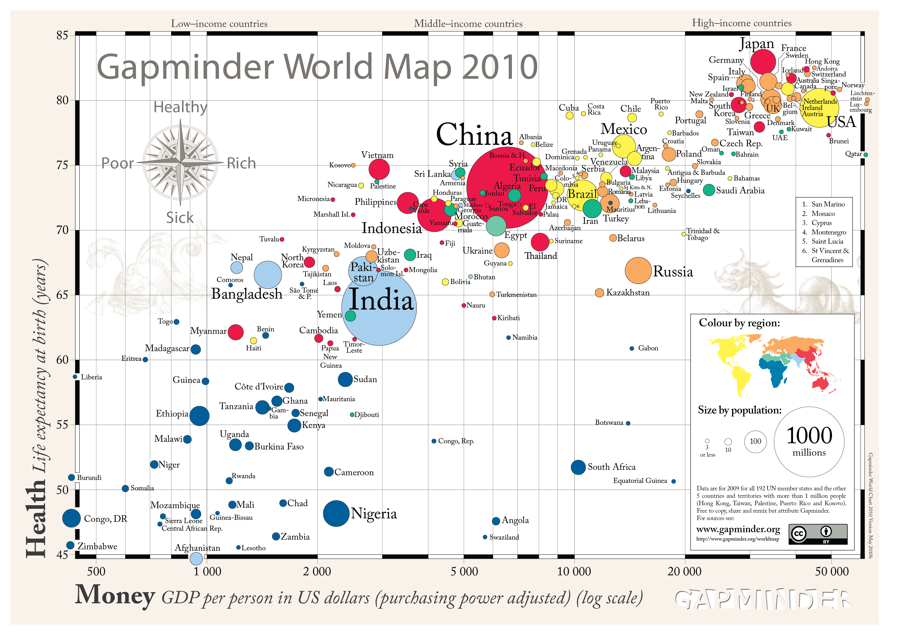

+++
author = "Yuichi Yazaki"
title = "Gapminder World Map 2010"
slug = "gapminder-world-map-2010"
date = "2025-10-11"
categories = [
    "consume"
]
tags = [
    "",
]
image = "images/cover.png"
+++

"Gapminder World Map 2010" is a bubble chart showing the relationship between national income and life expectancy. Created by the Gapminder Foundation and popularized by Hans Rosling, it was designed to help people understand global health and wealth through data.

<!--more-->

## How to Read It

Each bubble represents a country. The horizontal position usually indicates income, the vertical position indicates life expectancy, bubble size indicates population, and color often represents world region.

## Why It Matters

Gapminder helped make animated bubble charts a public storytelling tool. It showed that global development data could be explored visually and interactively rather than read only as tables.

## Summary

Gapminder World Map 2010 is a representative example of public data visualization. It combines statistical data, animation, and accessible storytelling to challenge assumptions about global development.
