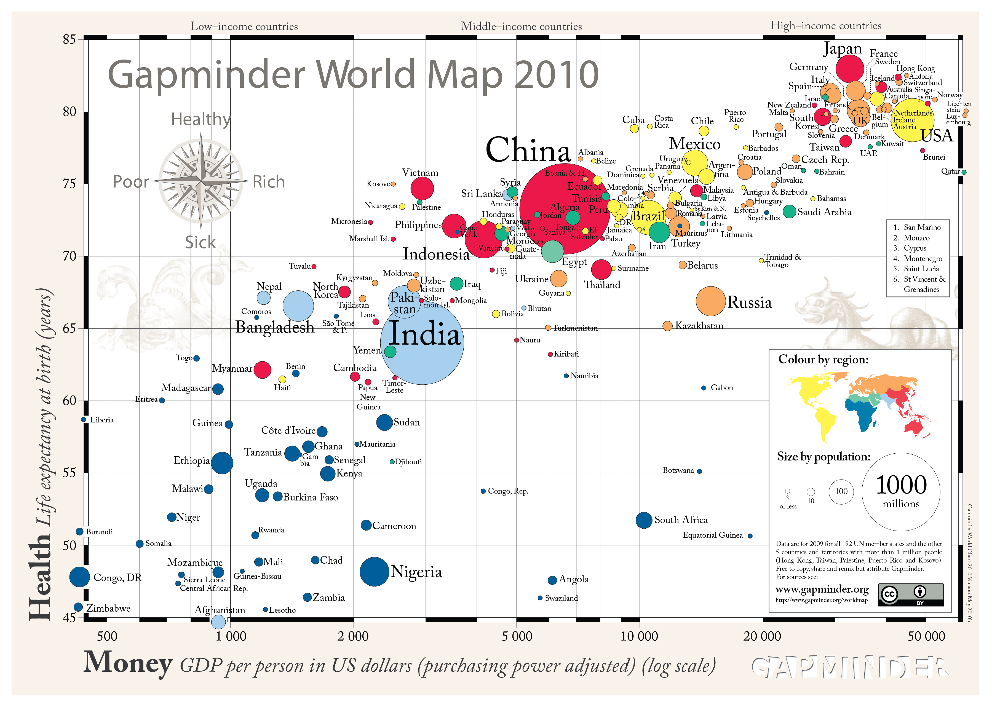
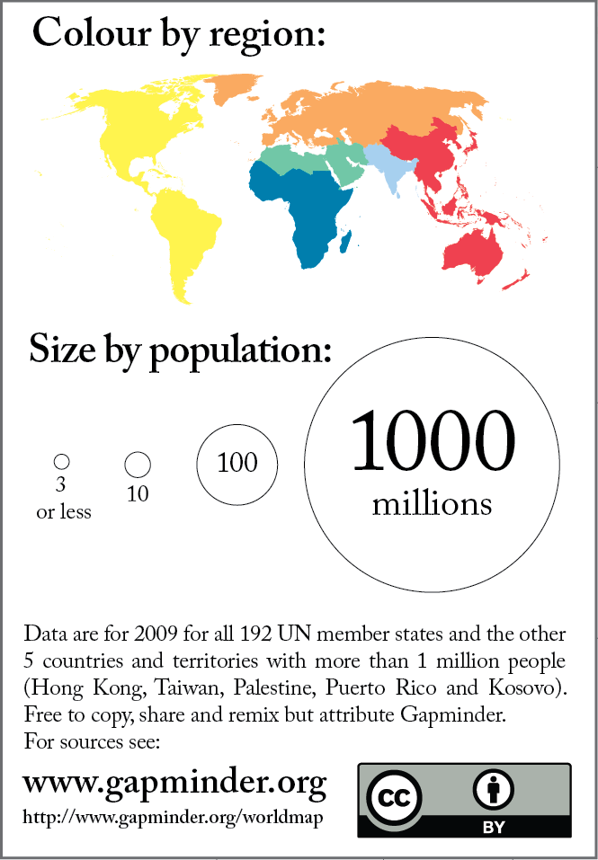

+++
author = "Yuichi Yazaki"
title = "Gapminder World Map 2010"
slug = "gapminder-world-map-2010"
date = "2025-10-11"
categories = [
    "consume"
]
tags = [
    "",
]
image = "images/cover.png"
+++

「Gapminder World Map 2010」は、各国の **所得（GDP）** と **平均寿命** の関係を視覚化したバブルチャートです。スウェーデン・ストックホルムに拠点を置く **Gapminder財団** によって制作され、統計学者であり公衆衛生の教育者でもあった **ハンス・ロスリング（Hans Rosling）** によって広く知られるようになりました。この図は、データをもとに「世界の健康と豊かさ」を直感的に理解できるよう設計されています。

<!--more-->

## チャートの見方

このチャートは、横軸に「 **1人あたりGDP（購買力平価調整済み、対数スケール）** 」、縦軸に「 **出生時の平均寿命（年）** 」を取っています。各国は **円（バブル）** で表され、その **位置** ・ **大きさ** ・ **色** に意味があります。

| 表現要素 | 意味 |
|-----------|------|
| 横軸（X軸） | 1人あたりGDP（購買力平価、米ドル換算） |
| 縦軸（Y軸） | 平均寿命（出生時） |
| バブルの大きさ | 各国の人口規模 |
| バブルの色 | 地域（例：アジア＝赤、ヨーロッパ＝黄、アフリカ＝青など） |

横軸は対数スケールであるため、1人あたりGDPが10倍になっても等間隔には描かれません。これにより、低所得国から高所得国までを一枚の図で比較できるようになっています。
縦軸では、健康状態を「平均寿命」で表現しており、上に行くほど健康で長寿な国となります。

## 背景と目的

Gapminderは「統計をアニメーションでわかりやすく伝える」ことを目的としたプロジェクトです。このポスター版は、もともと**インタラクティブな「Gapminder World」ツール**をもとに作られた静的な可視化で、世界の格差を一目で把握できるようになっています。

ハンス・ロスリングは講演の中で、この図を使って「世界は貧困と病気の2極構造ではなく、中間層の国々が急速に伸びている」ことを示しました。

たとえば2010年時点では **中国** や **インド** が「低所得・短寿命」から「中所得・長寿命」へと移行しつつあることが見て取れます。

## 特徴と意義

- **データの統合性**：世界各国の統計（GDP、寿命、人口）を組み合わせて視覚化。
- **対数スケール**：極端な値を持つ国を含めても、全体像が見やすい。
- **デザイン性**：丸の大きさと色によって、直感的に地域差と人口構成を理解可能。
- **教育的価値**：ロスリングはこの図を通じて、データが持つ「物語性」を伝えることを重視しました。

## まとめ

「Gapminder World Map 2010」は、統計を単なる数字ではなく「動的なストーリー」として見せる代表的な可視化作品です。

所得と健康という二つの指標を組み合わせることで、世界の発展段階をわかりやすく示し、また「世界は確実に健康で豊かになっている」という希望のメッセージを発信しています。

今日でもこのアプローチは、教育・国際開発・データリテラシー教育などの分野で広く参照されています。

## 参考・出典

- [Gapminder — About the Foundation and mission](https://www.gapminder.org/about/)
- [Gapminder — History (establishment, founders etc.) ](https://www.gapminder.org/about/about-gapminder/history/)
- [Gapminder Tools (インタラクティブ版の可視化ツール) ](https://www.gapminder.org/tools/)
- [Gapminder — データダウンロードページ（各種指標を含む）](https://www.gapminder.org/data/)
- [Health advocacy with Gapminder animated statistics （Gapminder World の説明を含む論文）](https://pmc.ncbi.nlm.nih.gov/articles/PMC7320389/)