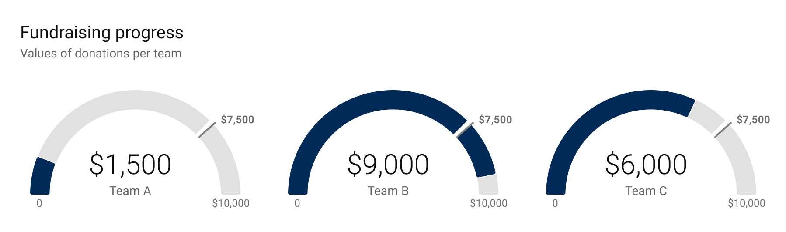

+++
author = "Yuichi Yazaki"
title = "Gauge Chart"
slug = "gauge-chart"
date = "2025-10-11"
categories = [
    "chart"
]
tags = [
    "",
]
image = "images/cover.png"
+++

A gauge chart shows a single value on a circular or semicircular scale, often with a needle like a speedometer. It is commonly used to show where a current value sits relative to a target, threshold, or acceptable range.

<!--more-->

## Use Cases

- Dashboard KPIs
- Operational monitoring
- Performance against target
- Status displays

## Design Notes

- Use gauges for quick status, not detailed analysis.
- Show thresholds clearly.
- Avoid wasting too much dashboard space.
- Consider bullet charts or bar charts when comparison matters.

## Summary

Gauge charts are familiar and easy to scan, but they are space-inefficient and limited to simple status messages. Use them when the metaphor of a meter helps the audience.
