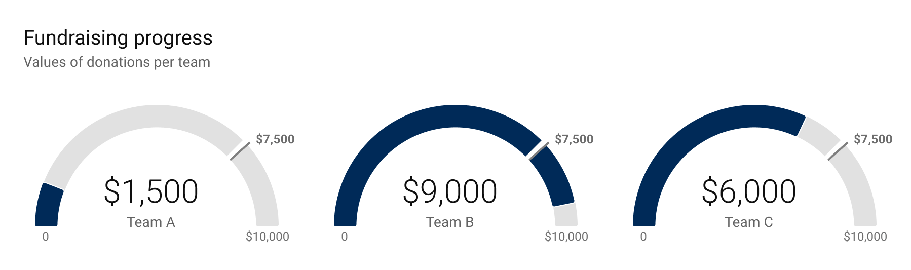

+++
author = "Yuichi Yazaki"
title = "ゲージ・チャート（Gauge Chart）"
slug = "gauge-chart"
date = "2025-10-11"
categories = [
    "chart"
]
tags = [
    "",
]
image = "images/cover.png"
+++

ゲージ・チャート（Gauge Chart）は、円弧や半円の形状を用いて、単一の数値が全体の中でどの位置にあるかを直感的に示す可視化手法です。見た目はスピードメーターや燃料計に似ており、「現在の値がどの程度の状態か」を針や色で分かりやすく伝えます。

<!--more-->

## 図解の見方

| 要素 | 説明 |
|------|------|
| 1. スケール範囲（最小値〜最大値） | 値の全体的な範囲を示す円弧部分。通常は0を起点とし、最大値を右端に設定します。 |
| 2. 目盛り（刻み） | 数値の読み取りを補助する線や数字。針の位置の定量的な理解を助けます。 |
| 3. 色域（セグメント） | 範囲ごとに異なる色を割り当て、「危険・注意・良好」などを視覚的に分類します。 |
| 4. 針（インジケータ） | 現在の値を指す要素。スケール上の角度で、現在値を示します。 |
| 5. 目標値ライン（任意） | KPIや目標値を別のマークで明示する場合に用いられます。 |

## 特徴と用途

ゲージ・チャートは、主に **単一の指標（KPIなど）** を評価するために使用されます。
具体的には、次のような用途に適しています。

- 目標達成率の表示（例：売上目標の進捗）  
- 設備の稼働率や利用率の監視  
- 顧客満足度・品質スコアの視覚化  
- センサー値（温度・圧力・速度など）のリアルタイムモニタリング  

このチャートは **直感的な理解** を促す一方で **複数指標の比較** や **時系列変化の表示** には不向きです。

## 長所と短所

| 観点 | 長所 | 短所 |
|------|------|------|
| 視覚的理解 | 一目で状況を把握できる直感的デザイン | 針の角度で誤解を生みやすい設定もある |
| 情報量 | 単一の値を強調するには最適 | 同時に複数値を比較するには不向き |
| スペース効率 | 単体ではインパクトがある | 多数並べると冗長になりやすい |

## デザイン上の注意点

1. **最小値は原則0に設定する**  
　0以外から始めると、針の位置が誤解を招く場合があります。  
2. **色の分割は慎重に**  
　閾値の設定が曖昧だと「良・悪」の判断が不明確になります。  
3. **過剰な装飾を避ける**  
　立体的な影や光沢を付けすぎると、情報伝達よりデザイン重視に見える恐れがあります。  
4. **比較には代替チャートを検討**  
　複数KPIを比較する場合は、バレット・グラフや棒グラフの方が適切です。

## 関連する可視化手法との比較

| チャート種別 | 特徴 | 適した用途 |
|---------------|------|-------------|
| バレット・グラフ（Bullet Graph） | ゲージを直線上で表現し、複数値の比較に向く | KPIの並列比較 |
| ドーナツ・チャート | 円環の一部を塗りつぶして割合を示す | 全体に対する進捗率表示 |
| 棒グラフ | 値の比較・増減が明快 | 複数項目の比較や時系列分析 |

## まとめ

ゲージ・チャートは、「ひと目で現状を把握する」ための優れた可視化手法です。特に経営ダッシュボードやモニタリング系のUIで広く用いられています。ただし、情報量や比較性には限界があるため **使用目的を明確にし、代替チャートとの使い分け** を行うことが重要です。

## 参考・出典

- [Gauge Chart Reference - Google Looker Studio](https://cloud.google.com/looker/docs/studio/gauge-chart-reference)
- [What is a Gauge Chart? - Jaspersoft](https://www.jaspersoft.com/articles/what-is-a-gauge-chart)
- [Gauge Chart Documentation - Apache Superset (Preset)](https://docs.preset.io/docs/gauge-chart-1)
- [Spotfire Glossary: Gauge Chart](https://www.spotfire.com/glossary/what-is-a-gauge-chart)
- [Gauge Chart - Dell Design System](https://www.delldesignsystem.com/data-visualization/gauge-chart)