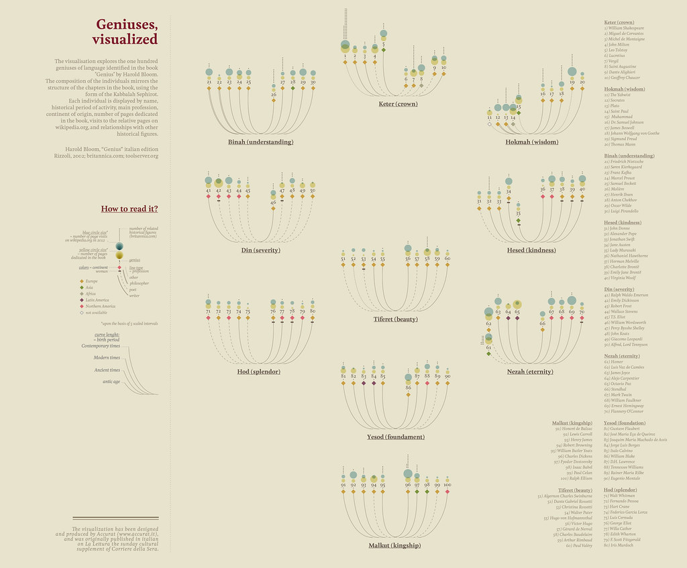
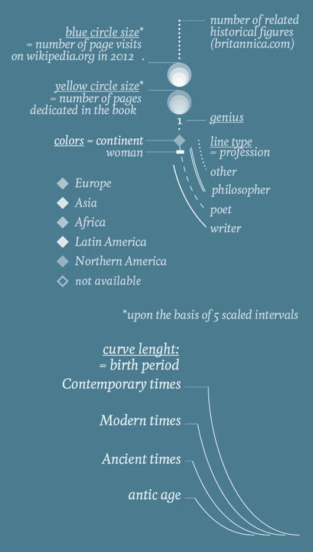
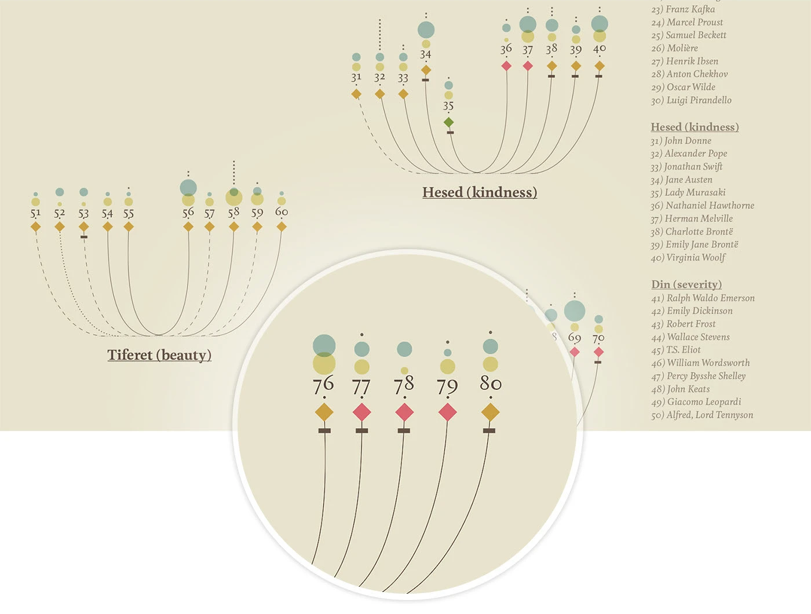

+++
author = "Yuichi Yazaki"
title = "Geniuses, Visualized: Harold Bloom and the Kabbalistic Tree"
slug = "geniuses-visualized"
date = "2025-10-03"
description = ""
categories = [
    "consume"
]
tags = [
    "オリジナルのビジュアル変換",
]
image = "images/cover.png"
+++

**Geniuses, visualized** is an infographic based on the 100 "exemplary creative minds" discussed by literary critic **Harold Bloom** in his book *Genius*. Published in 2012 in *La Lettura*, the cultural magazine of *Corriere della Sera*, it later appeared on Behance.

<!--more-->

Bloom's literary figures, from Shakespeare to Lewis Carroll, are arranged through the symbolic structure of the **Tree of Sephiroth** from Kabbalistic thought. The result is not a list of names, but a map of cultural influence and literary imagination.

## How to Read It

### Circle Size

- **Blue circle size**: Wikipedia page views as of 2012, representing public attention.
- **Yellow circle size**: number of pages devoted to the figure in Bloom's *Genius*.
- **Gray dotted number**: related historical figures in Encyclopaedia Britannica.

The sizes are normalized into a five-step scale.

### Continent

- Green: Europe
- Red: Asia
- Yellow: Africa
- Orange: Latin America
- Blue: North America
- Light gray: unknown

### Gender

Women are marked with a small diamond beneath the circle. Men are represented by the circle alone.

### Profession

- Thick solid line: writer
- Medium solid line: poet
- Thin solid line: philosopher
- Dotted line: other

### Period of Birth

Curve length indicates historical period, from contemporary times to ancient or pre-ancient periods.

## Context

The Tree of Sephiroth is a diagram from Jewish mysticism that organizes divine attributes into a tree-like structure. This visualization borrows that symbolic system to classify literary genius as if it belonged to a cosmic order of knowledge.

By combining Bloom's evaluation with Wikipedia and Britannica indicators, the work also contrasts historical prestige with contemporary visibility.

## Summary

"Geniuses, visualized" transforms literary criticism into a navigable symbolic map. Color, size, line, and position encode fame, influence, geography, gender, occupation, and historical period, creating a visual universe of literary culture.

## References

- [Geniuses, visualized — Behance](https://www.behance.net/gallery/18723575/Geniuses-visualized?locale=ja_JP)
- [Writing Without Words — Stefanie Posavec](https://www.stefanieposavec.com/archive/writing-without-words)
- [Geniuses, visualized — La Lettura](https://www.corriere.it/la-lettura/)
