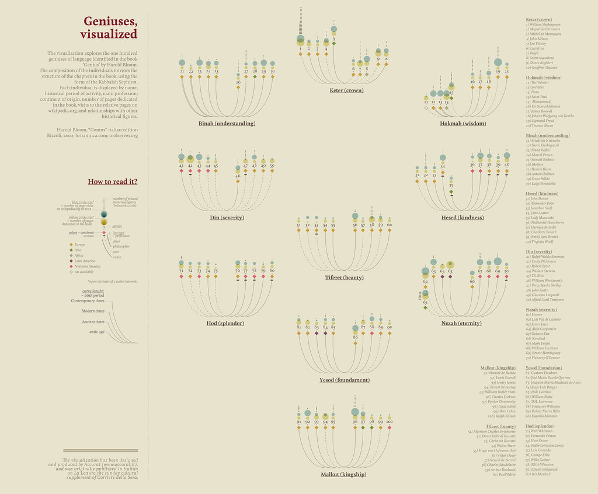
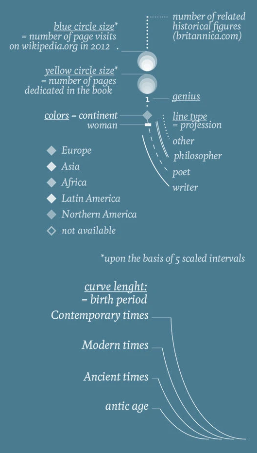
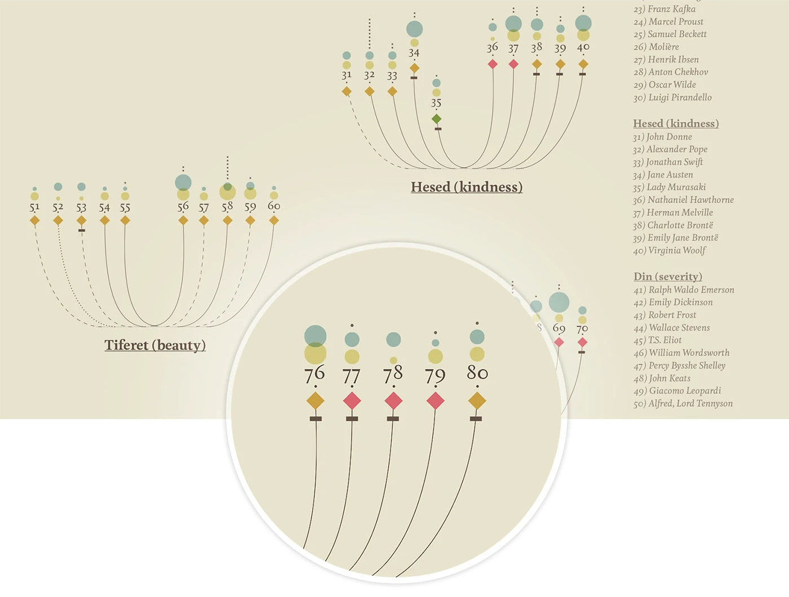

+++
author = "Yuichi Yazaki"
title = "視覚化された天才たち - Harold Bloomとカバラの樹形図"
slug = "geniuses-visualized"
date = "2025-10-03"
description = ""
categories = [
    "consume"
]
tags = [
    "オリジナルのビジュアル変換",
]
image = "images/cover.png"
+++

文芸批評家ハロルド・ブルームが著書『天才（Genius）』で取り上げた100人の「規範となる創造者」たちを題材にしたインフォグラフィック作品があります。2012年にイタリアの新聞『Corriere della Sera』の日曜版文化誌『La Lettura（ラ・レットゥラ）』に掲載され、後にBehanceにも公開された「Geniuses, visualized」です。

<!--more-->

ブルームが選出した文学的天才たち -シェイクスピアからルイス・キャロルに至るまで- を、カバラ思想における「セフィロトの樹（Tree of Sephiroth）」に見立てて配置することで、知の宇宙的な秩序を示しています。単なる人名リストではなく、文化的な影響関係や文学史上の広がりを「体系」として視覚化した点が大きな特徴です。

## 図解の見方

このインフォグラフィックでは、文学的天才たちを多層的に表現するために、複数の視覚要素が組み合わされています。凡例を読み解くと以下のようになります。

### 円の大きさ
- **青い円の大きさ** ：2012年時点のWikipediaページ訪問数（知名度や一般的関心度を示す）。
- **黄色い円の大きさ** ：ハロルド・ブルームの著書『Genius』に割かれたページ数（ブルームの評価の比重）。
- **灰色の点線で示される数** ：大英百科事典（britannica.com）における関連する歴史的人物の数（ネットワーク的広がり）。

※これらのサイズは「5段階スケール」に基づいて正規化されています。

### 出身大陸（色分け）
- **緑** ：ヨーロッパ
- **赤** ：アジア
- **黄** ：アフリカ
- **オレンジ** ：ラテンアメリカ
- **青**：北アメリカ
- **薄灰** ：不明

### 性別（追加記号）
- **女性の場合** ：円の下に小さな菱形（◇）が追加される。
- **男性の場合** ：追加記号なし（円のみ）。

※つまり、基本記号は全員「円」で共通し、女性には菱形が付加される形で区別されます。

### 職業（線の種類）
- **太実線** ：作家（writer）
- **中実線** ：詩人（poet）
- **細実線** ：哲学者（philosopher）
- **点線** ：その他（other）

### 誕生時代（曲線の長さ）
- **最短** ：現代（Contemporary times）
- **やや長い** ：近代（Modern times）
- **長い** ：古代（Ancient times）
- **最長** ：古代以前（Antic age）

これらの要素を組み合わせることで、一人ひとりの天才の出自・時代背景・職業・影響力が一目でわかるように設計されています。セフィロトの樹を基盤に、10の段階（「理解」「冠」「知恵」「美」「永遠」など）ごとに人物が配置され、知の系譜が神秘思想的な秩序を持って描かれています。

## 背景知識 ― セフィロトとブルームの文学観

「セフィロトの樹」はユダヤ神秘思想（カバラ）において、宇宙や人間存在の原理を説明する図式で、10個のセフィラ（神的属性）が樹木の形に並び立ちます。この作品では、その枠組みを借り、文学的天才を「神的秩序」に見立てて分類しました。

ブルームの『Genius』は、言語と文学における「100人の偉大な創造者」を選出し、その文化的意義を論じた大著です。本作はその内容をさらに視覚化することで、読者が各天才の影響力や相互関係を直感的に理解できるよう補完しています。Wikipediaやブリタニカといった現代的な指標を参照することで、歴史的評価と現代的認知度を対比できるのも興味深い工夫です。

## まとめ

「Geniuses, visualized」は、文学的天才たちの文化的広がりや時代的背景を多次元的に表現したインフォグラフィックです。色・形・大きさ・線の種類・曲線の長さといった視覚要素を組み合わせることで、知名度・影響力・地理的背景・活動時代・職業などを同時に読み解くことができます。

ブルームの豊かな文学観を、カバラの象徴体系に重ね合わせた本作は、単なる批評やリストではなく「文学的宇宙の地図」として機能しています。視覚化によって、読者は比較し、探し、再発見するという体験を得ることができるのです。

## 参考・出典

- [Geniuses, visualized. :: Behance](https://www.behance.net/gallery/18723575/Geniuses-visualized?locale=ja_JP)
- [Writing Without Words — Stefanie Posavec](https://www.stefanieposavec.com/archive/writing-without-words)
- [Geniuses, visualized — La Lettura (2012)](https://www.corriere.it/la-lettura/)

