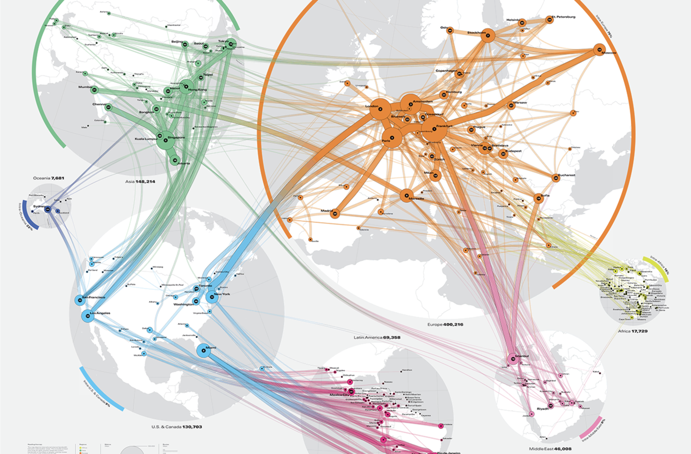

+++
author = "Yuichi Yazaki"
title = "ジオグラフィ・ベースド・コネクション（Geography Based Connection）"
slug = "geography-based-connection"
date = "2025-10-11"
categories = [
    "chart"
]
tags = [
    "",
]
image = "images/thumb_ph_vizjp.png"
+++

地理情報を基盤としたネットワーク構造の可視化手法です。地図上にノード（都市や地点など）を配置し、それらの関係性を線で結んで表現します。たとえば、都市間の移動・通信・物流など、空間的に位置づけられた関係を可視化する際に用いられます。

<!--more-->

## 図解の見方

| 要素 | 内容 |
|------|------|
| 1. ネットワーク構造 | データの結びつきを線で表現します。 |
| 2. 点（ノード） | 地理座標に基づき配置され、色やサイズで属性を示します。 |
| 3. 名義・線形スケール | 線の太さや長さで関係の強さ・距離などを表すことがあります。 |
| 4. 地理座標系 | 地図上の緯度・経度情報をもとに配置が行われます。 |
| 5. 地理座標 | 各ノードが位置する実際の地理的地点です。 |

## 背景と用途

ジオグラフィ・ベースド・コネクションは、社会ネットワーク分析や交通流動、情報通信、地域間交流などのデータ可視化に広く用いられています。

空間的関係を保持したままネットワーク構造を理解できる点が特徴であり、抽象的なネットワーク図（ノードリンク図）とは異なり、「どこで」「どのようにつながっているか」を地理的文脈の中で示します。

この手法はGIS（地理情報システム）とも親和性が高く、都市計画、物流設計、感染症拡大シミュレーションなどにも応用されています。

## まとめ

「ジオグラフィ・ベースド・コネクション」は、ネットワークデータを地理空間上に投影することで、位置と関係を同時に視覚化する手法です。単なる地図でも単なるネットワークでもない、両者を統合した表現として、地理的なつながりを理解するのに有効な図解形式といえます。

## 参考・出典

- [ArcGIS Network Analyst — ESRIジャパン](https://www.esrij.com/products/network-analyst/)  
- [交通ネットワーク解析 — ESRIジャパン／GIS 基礎解説](https://www.esrij.com/gis-guide/spatial/network-analysis/)  
- [Map Geocoded Data with Gephi — Gephi Blog](https://gephi.wordpress.com/2010/05/17/map-geocoded-data-with-gephi/)
- [Global Internet Map Map 2021](https://global-internet-map-2021.telegeography.com/)