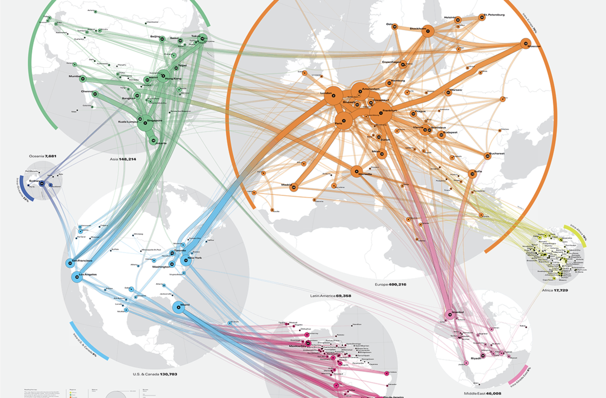

+++
author = "Yuichi Yazaki"
title = "ジオグラフィ・ベースド・コネクション（Geography Based Connection）"
slug = "geography-based-connection"
date = "2025-10-11"
categories = [
    "chart"
]
tags = [
    "地図",
]
image = "images/thumb_ph_vizjp.png"
+++

ジオグラフィ・ベースド・コネクション（Geography Based Connection）は、**地理情報を基盤としてネットワーク構造を地図上に可視化する手法**です。地図上にノード（都市や地点など）を配置し、それらの関係性を線（エッジ）で結んで表現します。都市間の移動・通信・物流など、空間的に位置づけられた関係を「どこで」「どのようにつながっているか」という地理的文脈の中で示すことができます。

<!--more-->



## 別名

なし

## 歴史的経緯

地理的な接続関係の可視化は、19世紀のフローマップにまで起源を遡ることができます。フランスの土木技術者シャルル・ジョセフ・ミナールは、1869年に「ナポレオンのロシア遠征図」を制作し、地理空間上に移動と損耗の関係を表現しました。20世紀に入ると、航空路線図や通信ネットワーク図として地理ベースのコネクション表現が広まりました。GIS（地理情報システム）やネットワーク科学の発展に伴い、デジタル地図上にネットワーク構造を重ねる技術が確立され、現在ではdeck.glやKeplergl、Gephiなどのツールで手軽に作成できるようになっています。

## データ構造

| 項目 | 内容 | 例 |
|------|------|-----|
| ノード（Node） | 地理座標を持つ各地点 | 都市、空港、拠点、センサー |
| 緯度・経度 | 各ノードの地理的位置 | 35.6762, 139.6503（東京） |
| エッジ（Edge） | ノード間の接続関係 | 航空路線、通信回線、物流ルート |
| エッジの重み（任意） | 関係の強度や量 | 乗客数、通信量、輸送量 |
| ノードの属性（任意） | ノードの追加情報 | 人口、カテゴリ、重要度 |

## 目的

ジオグラフィ・ベースド・コネクションの主な目的は、ネットワークデータを地理空間上に投影することで、位置と関係を同時に視覚化し、地理的な文脈の中でつながりのパターンを理解することです。抽象的なネットワーク図では失われがちな空間的距離感や地理的分布を保持しながら、接続構造を伝えることができます。

## ユースケース

- 航空路線ネットワークのハブ空港と接続パターンの分析
- インターネットの海底ケーブルや通信インフラの接続状況の可視化
- 都市間の人口移動や通勤パターンの地図上での表現
- 国際貿易における輸出入関係のフローの視覚化
- 感染症の地域間伝播経路のシミュレーションと可視化
- サプライチェーンの拠点間物流ネットワークの把握

## 特徴

| 特徴 | 説明 |
|------|------|
| 地理的文脈の保持 | ネットワーク構造を実際の地理的位置関係の中で理解できます |
| 空間パターンの把握 | 距離・方向・クラスタリングなどの空間的特徴が直感的に読み取れます |
| ハブの特定 | 多くの接続が集中する地点を視覚的に特定できます |
| GISとの親和性 | 地理情報システムとの統合が容易で、地図レイヤーとして重ねられます |
| エッジの重なり | 接続が密集するとエッジが重なり合い、可読性が低下する場合があります |

## チャートの見方

| 要素 | 表すもの | 説明 |
|------|-----------|------|
| 点（ノード） | 地理的地点 | 地理座標に基づき配置され、色やサイズで属性を示します |
| 線（エッジ） | 接続関係 | ノード間の関係を直線や曲線で結びます |
| 線の太さ | 関係の強さ | 接続の量や重要度に応じて太さが変化することがあります |
| 線の色 | カテゴリや方向 | 接続の種類や方向性を色で区別する場合があります |
| ノードのサイズ | 重要度や規模 | 接続数や人口などに応じてノードの大きさが変わります |

## デザイン上の注意点

- エッジが多い場合は線の重なりによる可読性の低下が問題になります。エッジバンドリング（Edge Bundling）を用いて関連する線を束ねる手法が有効です
- 大円航路（Great Circle）を用いた曲線でエッジを描くと、地球の曲面上での実際の経路に近い表現になります
- ノード数やエッジ数が多い場合は、フィルタリングや閾値を設定して重要な接続のみを表示することを検討します
- 背景地図の詳細度を調整し、ネットワーク構造の視認性を確保することが重要です
- 色の選択において、背景地図との十分なコントラストを確保し、線やノードが明確に見えるようにします

## 応用例

- **航空ネットワーク分析**：世界の航空路線を地図上に描き、ハブ空港の特定や路線の偏りを分析する
- **インターネットインフラ**：海底ケーブルやIXP（インターネットエクスチェンジポイント）の接続を地図上に表示し、通信インフラの地理的分布を把握する
- **都市計画**：通勤・通学の流動パターンを地図上に可視化し、交通インフラの設計に活用する
- **感染症疫学**：地域間の移動データと感染拡大パターンを重ね合わせ、伝播経路を分析する

## 代替例

- フローマップ（Flow Map）：地理上の移動や流れを矢印の太さで表現する手法
- コネクションマップ（Connection Map）：地理的位置に基づかない抽象的なネットワーク図
- アーク・ダイアグラム（Arc Diagram）：ノードを一直線に並べ、弧でつなぐ表現
- コード・ダイアグラム（Chord Diagram）：円形のレイアウトで関係の強さを帯で表す手法
- OD マトリクス（Origin-Destination Matrix）：出発地と目的地の関係をマトリクスで表す

## まとめ

ジオグラフィ・ベースド・コネクションは、ネットワークデータを地理空間上に投影することで、位置と関係を同時に視覚化する手法です。単なる地図でも単なるネットワークでもない、両者を統合した表現として、地理的なつながりを理解するのに有効な図解形式といえます。エッジの重なりや背景地図とのバランスに注意しながら設計することで、空間的なパターンを効果的に伝えることができます。

## 参考・出典

```
- [Wikipedia: Flow map](https://en.wikipedia.org/wiki/Flow_map)
- [Wikipedia: Network science](https://en.wikipedia.org/wiki/Network_science)
- [Map Geocoded Data with Gephi - Gephi Blog](https://gephi.wordpress.com/2010/05/17/map-geocoded-data-with-gephi/)
- [Global Internet Map 2021 - TeleGeography](https://global-internet-map-2021.telegeography.com/)
- [ArcGIS Network Analyst - ESRIジャパン](https://www.esrij.com/products/network-analyst/)
```
