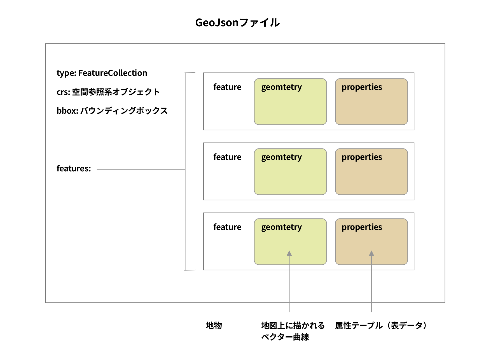
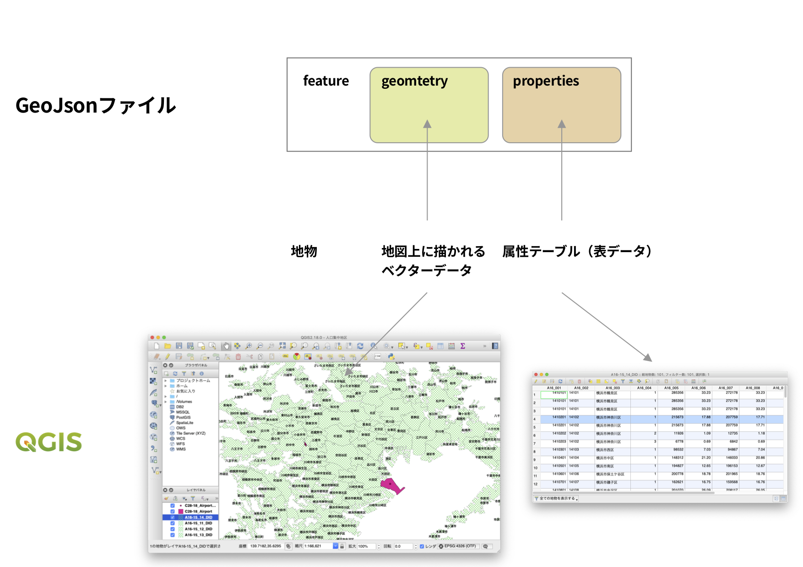
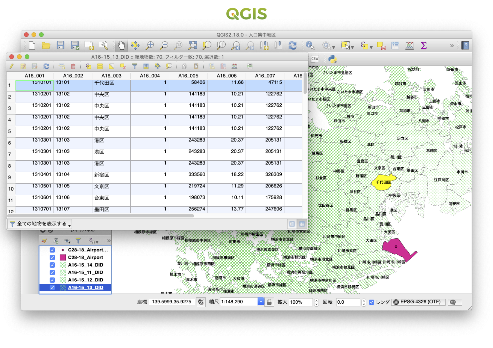
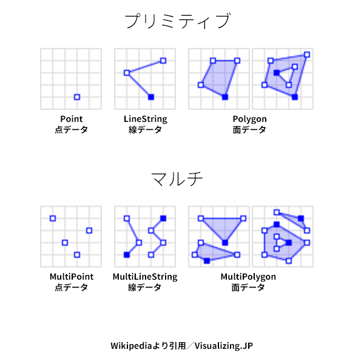

+++
author = "Yuichi Yazaki"
title = "GeoJsonとは"
slug = "geojson"
date = "2020-03-12"
categories = [
    "technology"
]
tags = [
    "geojson","地図"
]
image = "images/GeoJson_3.png"
+++

GeoJsonとは、Jsonというデータフォーマットを用いて、空間データと非空間データを関連付けることができるファイルフォーマットです。

空の状態から作り上げるというよりは、政府機関などから公開されているものを加工することが多いと思います。ファイルの内部構成をご紹介します。

### ルート（最上階層）

ルート（最上階層）には、GeoJsonのメタデータ的な部分と実体のデータの部分があります。

<figure>

<figcaption>

筆者作成

</figcaption>

</figure>

typeは固定で、FeatureCollection（地物の集合の意）です。地物（feature）が集まってデータファイルになっているということですね。

crsは、Coordinate Reference System（空間参照系）のことです。

bboxは地物がすべて収まる矩形の四隅の座標を格納しています。

そして、featuresの中に、実際の地物（feature）データを格納しています。

### 地物（feature）

地物（feature）は、geometry（ジオメトリ = 空間データ）とproperties（プロパティ = 非空間データ）が格納されています。typeは固定で”Feature”です。geometryは地図上に描かれるベクターデータを、propertiesは地図には描かれない表データを格納しています。

<figure>

<figcaption>

筆者作成

</figcaption>

</figure>

一つの地物（feature）の中にgeometryとpropertiesが格納されていますので、たとえばオープンソースのQGISというアプリケーションでGeoJsonファイルを開いてみると、同一の地物（feature）が同一選択範囲であることがわかります（画像の、地図上の黄色くハイライトされている箇所geometryと、表データのハイライトしている箇所propertiesです）。

<figure>

<figcaption>

筆者作成

</figcaption>

</figure>

データ地図（主題地図）を作る際に、たとえば他のデータと結合する際には、propertiesに格納されたデータフィールドを活用します。

### geometry

ジオメトリはベクター形式で様々な地物を描きます。

### properties

プロパティは任意の表データです。geometryとセットで格納されることで、空間（位置）情報と関連づきます。
