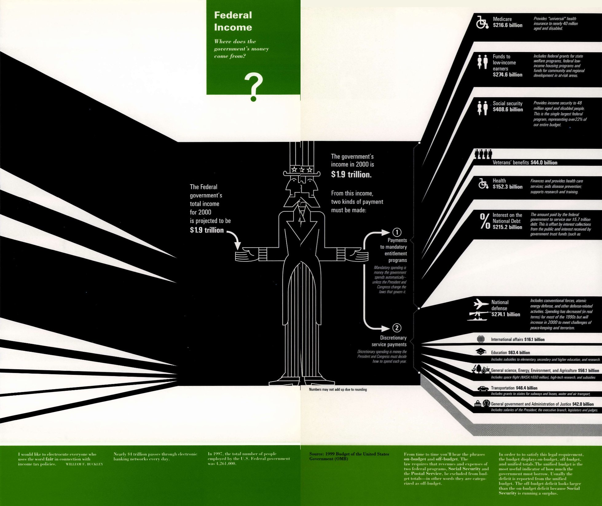
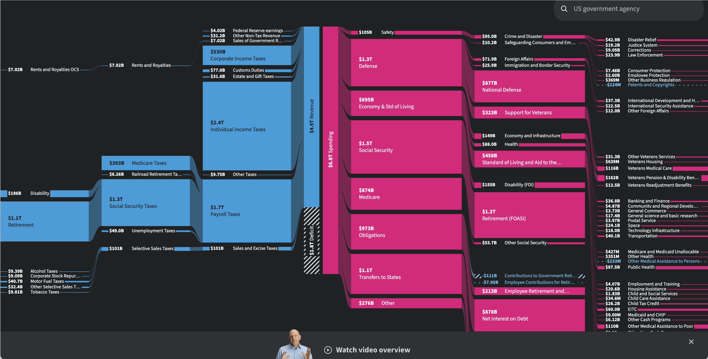

+++
author = "Yuichi Yazaki"
title = "アメリカ財政をどう見せるか：Understanding USAとUSAFacts"
slug = "government-budget-icicle"
date = "2025-09-27"
description = ""
categories = [
    "consume"
]
tags = [
    ""
]
image = "images/fiscal_infographics_combined_horizontal.jpg"
+++

国家財政の可視化は、単なる統計表を超えて、市民に「税金がどこから来て、どこへ行くのか」を直感的に伝える重要な手段です。
本記事では、2000年に出版された リチャード・ソール・ワーマン **「Understanding USA」** に収録された財政の可視化と、元マイクロソフトCEOの スティーブ・バルマー氏が設立した非営利サイト **「USAFacts」** による現代的な財政の可視化を対比し、その表現の変化を見ていきます。

キーワードは「象徴の存在／不在」です。

<!--more-->

## 取り上げる作品

両方の図はいずれも、アメリカ合衆国連邦政府の財政をテーマにしています。具体的には、

- 歳入（Revenue / Income）：個人所得税、法人税、社会保障税など、政府の収入源
- 歳出（Spending / Expenditures）：社会保障、医療、国防、債務利払いなど、政府の支出項目

を可視化しており「どこからお金が来て、どこへ使われているか」 を市民に直感的に理解させることを目的としています。

どちらも奥行きを生かした「つららチャート（Icicle Chart）」というチャートだといえそうです。

つまりテーマとチャートは共通です。その上で何が違うのか、みていきましょう。

## ワーマン氏によるUnderstanding USA: 象徴的な「アンクル・サム」

2000年の「Understanding USA」に掲載された財政の可視化は、中央に大きく アンクル・サム を配しています。
このシンボルを軸に、

- 左に 歳入（$1.9兆）
- 右に 歳出（メディケア、社会保障、防衛、債務利払いなど）

を放射状の黒帯で表現しています。

ここでは「金額の大小」を帯の太さで伝えると同時に、政府が市民から税を受け取り再分配する存在であるという物語が、擬人化されたキャラクターを通じて直感的に理解されます。
つまりワーマンの図は、情報デザインとナショナル・シンボルを掛け合わせた「インパクト重視」の作品なのです。

## バルマー氏によるUSAFacts： 象徴を排したデータの透明性

一方、近年の USAFacts が提供する財政の可視化には、アンクルサムのような象徴は登場しません。
ここで中心にあるのは 純粋なデータです。

- 左に 歳入（個人所得税、法人税、社会保障税など）
- 右に 歳出（社会保障、国防、医療、州への移転など）
- 中央に 差額としての赤字（Deficit）

が並置され、クリックやマウスオーバーで詳細にアクセスできる仕組みです。

このプロジェクトを立ち上げたのは、元マイクロソフトCEOの スティーブ・バルマー氏。
彼は退任後、「米国政府の収支を企業の財務諸表のように誰でも理解できる形で提示すべき」と考え、2017年に USAFacts を創設しました。
その背景には「政治的立場に左右されない、一次データに基づく公共情報の提供」という理念があります。

## 二つのアプローチの違い

Understanding USA (2000)

- 紙媒体、静的な図
- インフォグラフィックとしての迫力と直感性を重視
- 中央のキャラクター（アンクル・サム）を軸に、国家財政をシンボルとして描いた

USAFacts (2017–)

- デジタル、インタラクティブ
- 階層的に掘り下げられるインタラクティブな設計
- 創設者バルマー氏の思想：「国の財政を企業のPL/BSのように市民が理解できる形で」

両者はともに「財政データはツリー構造である」という点を前提にしつつ、

- Understanding USA は「インパクトあるビジュアル体験」
- USAFacts は「正確かつ探索可能な市民データ」

へと表現の軸足を移しています。

## まとめ

20年を隔てた二つの作品を並べると、

- Understanding USA：紙媒体の時代、象徴とメタファーで財政を「感じさせる」
- USAFacts：デジタルの時代、データと透明性で財政を「理解させる」

という大きな変化が見て取れます。

財政という巨大で複雑なデータを「市民にわかる形」にするという課題に対し、

- ワーマン氏のデザイン力
- バルマー氏のデータ公開プラットフォーム

それぞれがその時代に応じたアプローチを提示しています。

## 参考・出典

- [Understanding USA](https://www.wurmanarchive.org/timeline2/understanding-usa)  
- [USAFacts – Government spending (公式サイト)](https://usafacts.org/government-spending/)  
- [USAFacts – About (Steve Ballmerによる設立背景)](https://usafacts.org/about/)  
- [USAFacts – Articles: Federal revenue and spending explained](https://usafacts.org/articles/this-chart-tells-you-everything-you-want-to-know-about-government-spending/)  