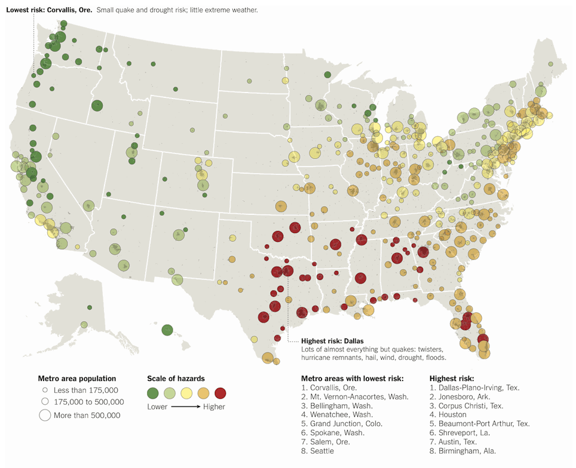

+++
author = "Yuichi Yazaki"
title = "等級シンボル・マップ(Graduated Symbol Map)"
slug = "graduated-symbol-map"
date = "2020-08-04"
description = ""
categories = [
    "chart"
]
tags = [
    "map",
]
image = "images/1_7DBQfNEPvNWGiIlMr2rLFw.png"
+++

離散データを階級分類して、シンボルの大きさという視覚的変数で表現する地図です。階級分類しないものは比例シンボル・マップと呼ばれます。

<!--more-->

シンボルの形状は円がよく利用されますが、円だけに限定されるものではなく、三角形や四角形も利用されます。円グラフが用いられる場合もあり、その場合はチャート・マップと呼ばれます。

サイズは、表現されるデータ値に比例しますが、それが存在する地理的領域に依存しないため、コロプレスマップで発生してしまうデータ値と地理的領域の大きさの混乱問題を回避することができます。

選択する階級分類数と階級分類の手法により、可視化される結果やその印象が大きく異なるため、作り手は探索的に色んな条件で試す必要があり、同時に最終的に作品が与える印象について責任を持つ必要があります。そして凡例として、階級分類数と階級分類の手法を示すのが望ましいです。

## 作例

自然災害を避けるためにはどこに住むべきか

[Where to Live to Avoid a Natural Disaster](https://archive.nytimes.com/www.nytimes.com/interactive/2011/05/01/weekinreview/01safe.html)

## 参考文献

- Isabel Meirelles — Design For Information