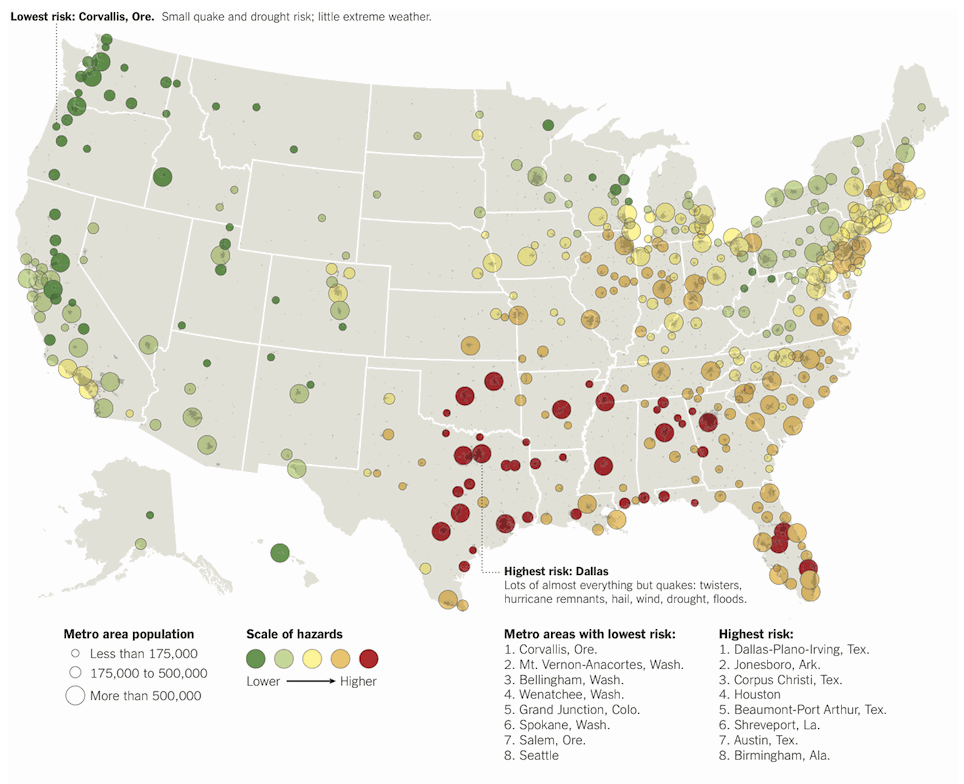

+++
author = "Yuichi Yazaki"
title = "段階的シンボル・マップ（Graduated Symbol Map）"
slug = "graduated-symbol-map"
date = "2020-08-04"
categories = [
    "chart"
]
tags = [
    "地図",
]
image = "images/1_7DBQfNEPvNWGiIlMr2rLFw.png"
+++

段階的シンボル・マップ（Graduated Symbol Map）は、**離散データを階級分類し、シンボルの大きさという視覚的変数で地図上に表現する手法**です。数量データをいくつかの階級（クラス）に分けて、各階級に対応するシンボルサイズを割り当てることで、地域ごとの値の大小を比較しやすくします。階級分類を行わずにデータ値に直接比例させるものは、比例シンボル・マップ（Proportional Symbol Map）と呼ばれ、区別されます。

<!--more-->



## 歴史的経緯

シンボルの大きさで数量を表す地図表現は、19世紀の統計地図学の発展とともに登場しました。初期の段階的シンボル・マップは、人口や生産量などの統計データを地図上に表すために用いられました。20世紀に入ると、地図学者たちが視覚変数（visual variables）の理論を体系化し、シンボルのサイズが数量表現に適した変数であることが明確に位置づけられました。特にJacques Bertinの視覚変数の理論（1967年）は、この手法の理論的基盤を強化しました。現在ではGISソフトウェア（ArcGIS、QGISなど）により、階級分類の手法を選択して自動的に段階的シンボル・マップを生成できるようになっています。

## データ構造

| 項目 | 内容 |
|------|------|
| 地点識別子 | 各データポイントの位置を示す名称・コード（例：都市名、施設ID） |
| 緯度（Latitude） | データポイントの地理的な緯度座標 |
| 経度（Longitude） | データポイントの地理的な経度座標 |
| 数量値 | 各地点に対応する数値データ（例：人口、売上、被害件数） |
| 階級（自動分類） | 数量値をもとに分類されたクラス（例：1〜100, 101〜500, 501〜1000） |

数量値が階級分類され、各階級に対応するシンボルサイズが割り当てられます。

## 目的

段階的シンボル・マップの主な目的は、地理的に分散したデータの数量的な大小を、シンボルのサイズを通じて視覚的に比較することです。階級分類を行うことで、データをグループ化し、全体的な傾向やパターンを読み取りやすくします。コロプレスマップで発生しがちな、データ値と地理的領域の大きさの混同を回避できる利点があります。

## ユースケース

- 各都市の人口規模の比較表示
- 自然災害の被害規模の地域別表示
- 店舗や施設ごとの売上規模の比較
- 投票数や得票率の選挙区別表示
- 医療施設の患者数や病床数の地域比較

## 特徴

- データを階級分類することで、読み取りやすさと比較のしやすさが向上します
- シンボルのサイズが地理的領域の面積に依存しないため、コロプレスマップの面積バイアスを回避できます
- シンボルの形状は円が最も一般的ですが、三角形や四角形なども利用されます
- 円グラフをシンボルとして用いる場合はチャート・マップと呼ばれることもあります
- 選択する階級数と分類手法（等間隔、自然分類、分位数など）により、可視化の結果や印象が大きく変わります

## チャートの見方

| 要素 | 説明 |
|------|------|
| シンボルの位置 | データポイントの地理的位置を示します |
| シンボルの大きさ | 階級分類されたデータ値の大小を表します。大きいほど値が大きいことを意味します |
| 凡例 | 各シンボルサイズが対応する階級と数値範囲を示します |
| シンボルの形状 | 円が一般的ですが、対象に応じて他の形状も使われます |

凡例を確認し、各シンボルサイズがどの数値範囲に対応するかを把握したうえで、地図全体の分布パターンを読み取ります。

## デザイン上の注意点

- 階級数の選択が重要です。多すぎるとサイズの違いが判別しにくくなり、少なすぎると情報が失われます。一般的に3〜7階級が推奨されます
- 階級分類の手法（等間隔、自然分類法（Jenks）、分位数法など）により印象が大きく異なるため、探索的に複数の条件で試すことが望ましいです
- 凡例には階級数と分類手法を明示し、読者が解釈できるようにします
- シンボルが密集する地域では重なりが生じるため、透明度の設定やオフセット表示を検討します
- 面積ではなく直径や半径でスケーリングする際は、知覚的な補正を考慮する必要があります

## 応用例

- 自然災害リスク・マップ：地域ごとの災害発生頻度や被害規模を階級分類したシンボルで表示し、リスクの高い地域を一目で把握できるようにした事例があります
- 大統領選挙結果の可視化：各州や郡の投票数を段階的シンボルで表現し、面積に左右されない選挙結果の把握に活用されています
- グローバルな健康指標の比較：各国の感染症発生件数や医療資源を段階的シンボルで比較した可視化事例があります

## 代替例

- **比例シンボル・マップ（Proportional Symbol Map）**：階級分類を行わず、データ値に直接比例したサイズのシンボルを表示する手法です
- **コロプレスマップ（Choropleth Map）**：地域の面積を色の濃淡で塗り分けて数量を表現する手法です
- **カルトグラム（Cartogram）**：地域の面積そのものをデータ値に応じて変形させる手法です
- **ドット密度マップ（Dot Density Map）**：ドットの密度で数量を表現する手法です

## まとめ

段階的シンボル・マップは、数量データを階級分類してシンボルのサイズで表現することで、地理的な分布パターンを把握しやすくする手法です。コロプレスマップの面積バイアスを回避できる利点がありますが、階級数や分類手法の選択が結果の印象に大きく影響するため、作成者は探索的に複数の条件を試し、最終的な表現が与える印象に責任を持つことが重要です。

## 参考・出典

```
- [Graduated symbols - ArcGIS Pro Documentation](https://pro.arcgis.com/en/pro-app/latest/help/mapping/layer-properties/graduated-symbols.htm)
- [Proportional symbol map - Wikipedia](https://en.wikipedia.org/wiki/Proportional_symbol_map)
- [Thematic map - Wikipedia](https://en.wikipedia.org/wiki/Thematic_map)
```
