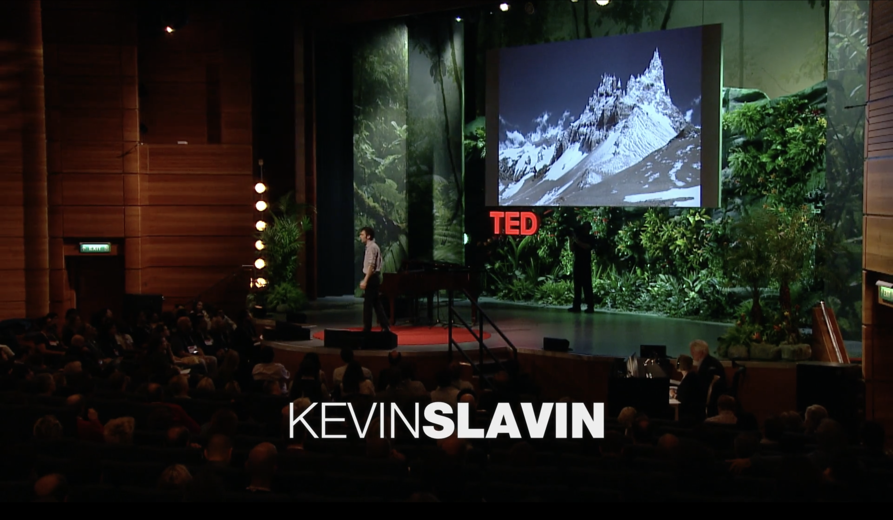

+++
author = "Yuichi Yazaki"
title = "地形を変えるアルゴリズム ― Kevin Slavin のTEDトークから"
slug = "high-frequency-trading"
date = "2025-09-20"
categories = [
    "consume"
]
tags = [
]
image = "images/how_algorithms_shape_02.png"
+++

2011年のTEDGlobalで登壇したケヴィン・スレイヴィンは、私たちの世界がアルゴリズムによってどのように形作られているかを語りました。その中でも特に印象的なのが「高速取引（High-Frequency Trading）のために山を削った」というエピソードです。

<!--more-->

## 山を削ってでも速さを求める金融市場

金融市場では、取引所に注文を届けるまでのわずか数ミリ秒が勝敗を分けます。そのため、ニューヨークとシカゴを結ぶ通信回線を極限まで短縮する計画が進められました。

このプロジェクトを担ったのが Spread Networks という企業です。Forbes の報道によれば、総工費はおよそ3億ドル。従来の回線が鉄道や道路に沿って大きく迂回していたのに対し、新ルートはアレゲニー山脈を突き抜けるように「できる限り直線」に敷設されました。その結果、通信時間は往復でおよそ16ミリ秒から13ミリ秒へと短縮されたといいます。わずか3ミリ秒の改善のために、山岳を突き抜ける大規模な工事が行われたという事実は衝撃的です。しかし高速取引の世界では、このわずかな差が巨額の利益につながるため、莫大な投資が正当化されてしまうのです。

この「山を削る」という比喩は、アルゴリズムが単なるコンピュータの中の存在ではなく、物理的な地形をも書き換える力を持つことを端的に示しています。

## データが風景を形づくる ― Michael Najjar「High Altitude」

このエピソードを思い起こさせる作品に、ドイツ出身のアーティスト Michael Najjar の写真シリーズ「High Altitude」があります。

彼はアルゼンチンの高山を実際に（とうはん）して撮影し、その稜線を 株価指数の時系列データに基づいて加工しました。日経平均やナスダック、リーマン・ブラザーズの株価までが、山のかたちとして可視化されています。

つまり、ナジャーの作品では「株価が山をつくる」。一方で、スレイヴィンのエピソードでは「アルゴリズムのために山が削られる」。
方向は逆ですが、どちらも 人間の経済活動やアルゴリズムが、風景や地形を変えてしまう という驚くべき現実を示しています。

## まとめ

スレイヴィンが語った「山を削るアルゴリズム」と、ナジャーが示した「山に刻まれた株価の稜線」。
両者は異なる文脈にありながらも、共通してデータやアルゴリズムが抽象を超えて現実世界の形を変化させる様子を示しています。

### 注意

実際にニューヨーク〜シカゴ間で最短ルートの光ファイバーが敷設されたことは、Forbes や学術研究でも裏付けられています。ただし「大規模に山体を切り崩した」かどうかまでは公開情報から確認できません。したがって、“山を削った”というのは、地形を突き抜ける最短ルートを選んだことの比喩と理解するのが妥当でしょう。

## 参考・出典

-[Kevin Slavin: How algorithms shape our world | TED Talk](https://www.ted.com/talks/kevin_slavin_how_algorithms_shape_our_world)  
-[Michael Najjar: High Altitude（公式サイト）](https://www.michaelnajjar.com/artworks/high-altitude/)  
-[High Altitude – bitforms gallery 展覧会ページ](https://www.bitforms.art/exhibition/michael-najjar-high-altitude)  
-[Spread Networks – Wikipedia](https://en.wikipedia.org/wiki/Spread_Networks)  
-[Chicago Booth Review: An Alternative to High-Frequency Trading](https://www.chicagobooth.edu/review/alternative-high-frequency-trading)  
-[Forbes: Wall Street’s Speed War](https://www.forbes.com/forbes/2010/0927/outfront-netscape-jim-barksdale-daniel-spivey-wall-street-speed-war.html)  
-[Budish, Cramton, Shim: The High-Frequency Trading Arms Race（Quarterly Journal of Economics, 2015）](https://academic.oup.com/qje/article/130/4/1547/1916146)