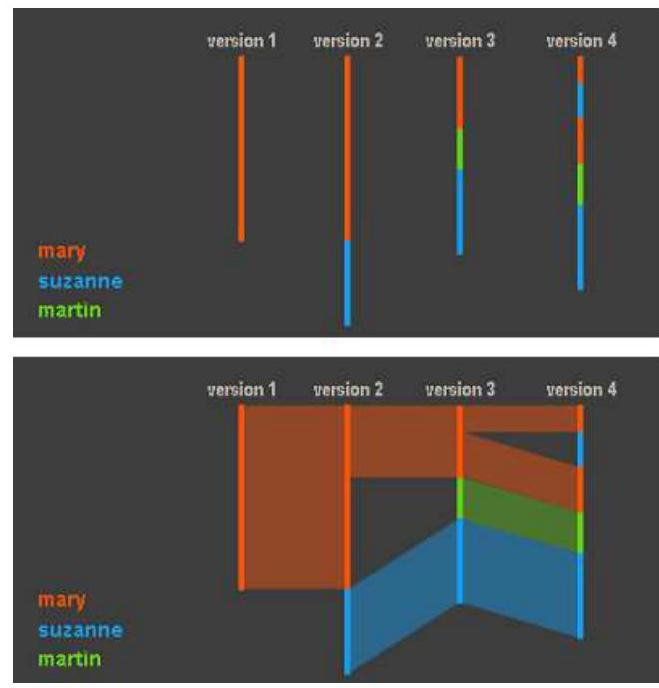
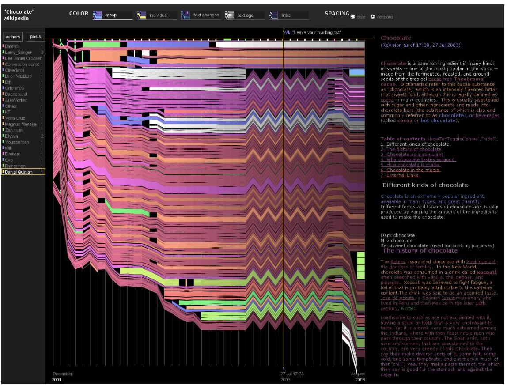
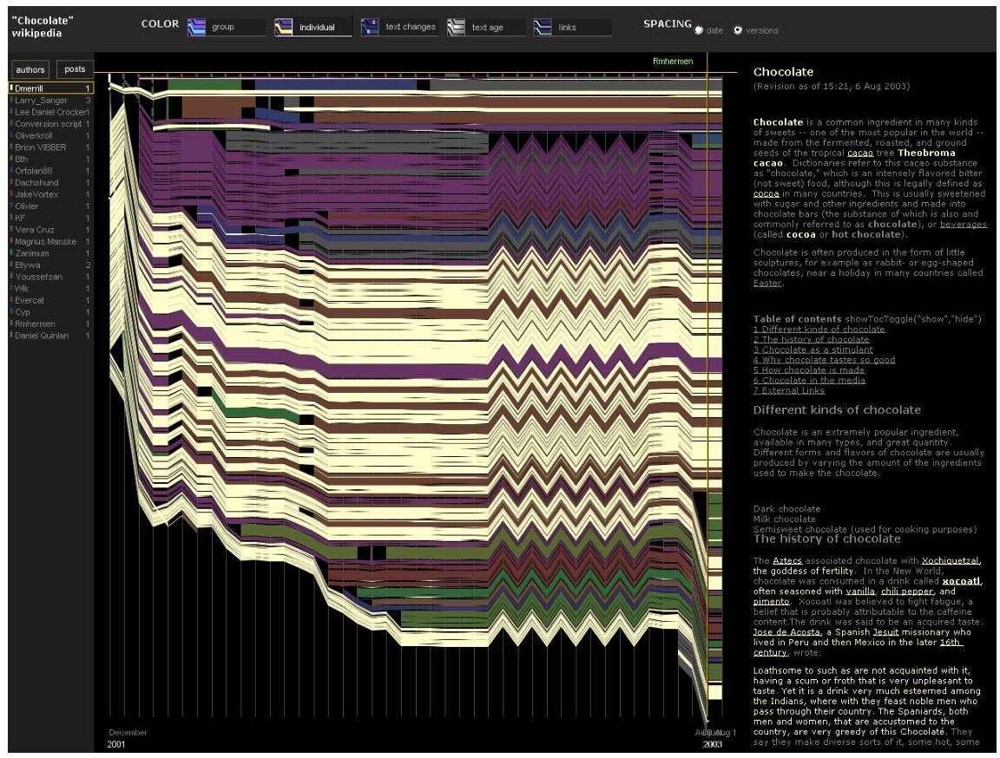
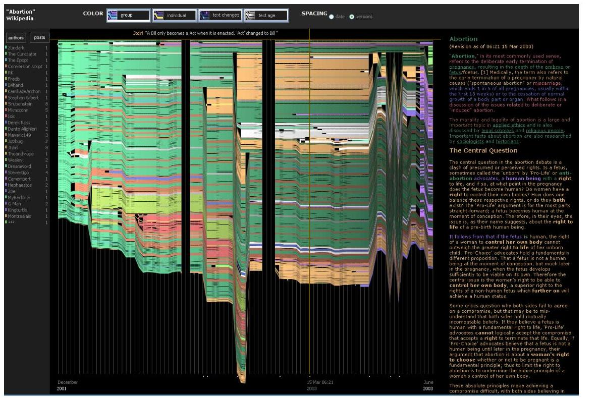
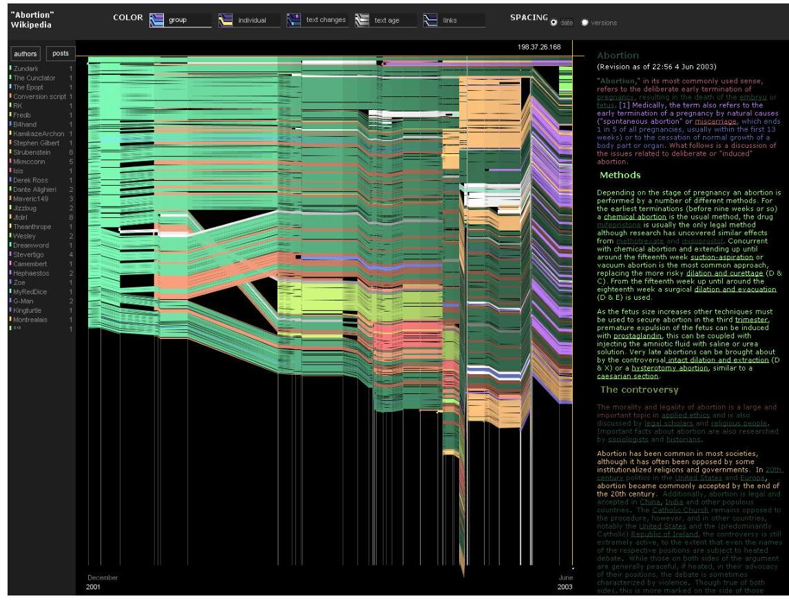

+++
author = "Yuichi Yazaki"
title = "History Flow: Visualizing Wikipedia's Invisible Battles"
slug = "history-flow"
date = "2025-10-02"
categories = [
    "consume"
]
tags = [
    "",
]
image = "images/chocolate-1.jpeg"
+++

Wikipedia is the world's largest encyclopedia, but it is also a living document that anyone can edit. Behind its articles are collaboration, conflict, vandalism, repair, and negotiation.

**History Flow** visualizes this hidden activity. Presented at CHI 2004 and later acquired by MoMA, it became an influential work in both visualization research and data art.

<!--more-->

## Background

History Flow was developed by a research team led by **Fernanda B. Viegas** and **Martin Wattenberg** at MIT Media Lab and IBM Research. In 2003, Wikipedia was only two years old and still widely doubted. The project asked how high-quality articles could emerge from such a chaotic editing process.

## How History Flow Works

History Flow draws a document's revision history as a flow.

- Horizontal axis: time or revision order
- Vertical axis: position in the text
- Color: author contribution

If a colored band persists, that author's text survived. If it breaks, text was deleted. Sharp zigzags often indicate edit wars.

The system used Java hash values to assign consistent colors to authors, while anonymous edits were shown in gray.

## Case Study 1: Chocolate

The Wikipedia article on **Chocolate** is one of the best-known examples. In the right half of the History Flow image, a jagged pattern appears.

This pattern records an edit war over a paragraph about "coulage," a chocolate sculpture technique. Two editors repeatedly inserted and removed the passage before it was ultimately deleted.

## Case Study 2: Abortion

The **Abortion** article shows another pattern: sudden black gaps, or gutters, caused by mass deletion vandalism.

When the timeline is scaled by real time rather than revision order, many of these gaps nearly vanish because vandalism was repaired within minutes. The study found that many major deletions were fixed extremely quickly.

## Patterns

The research identified several recurring dynamics:

- vandalism and rapid repair
- edit wars and revert patterns
- differences between anonymous and registered editors
- article instability and first-mover advantage

## Later Development

The team later explored **Chromogram**, a pixel-based visualization of editor and administrator activity. One striking discovery was bot activity appearing as rainbow-like patterns as bots edited pages alphabetically.

## Summary

History Flow made the social process of knowledge production visible. It showed how conflict, repair, automation, and collaboration shape Wikipedia behind the surface of a finished article.

## References

- [History Flow — Martin Wattenberg](https://www.bewitched.com/historyflow.html)
- [Studying Cooperation and Conflict between Authors with History Flow Visualizations](https://dl.acm.org/doi/10.1145/985692.985765)
- [Fernanda B. Viegas: Visualizing Wikipedia](https://web.archive.org/web/20180627195604/http://fernandaviegas.com/wikipedia.html)
- [IBM History Flow tool — Wikipedia](https://en.wikipedia.org/wiki/IBM_History_Flow_tool)
- [History Flow — MoMA Collection](https://www.moma.org/collection/works/110349)
