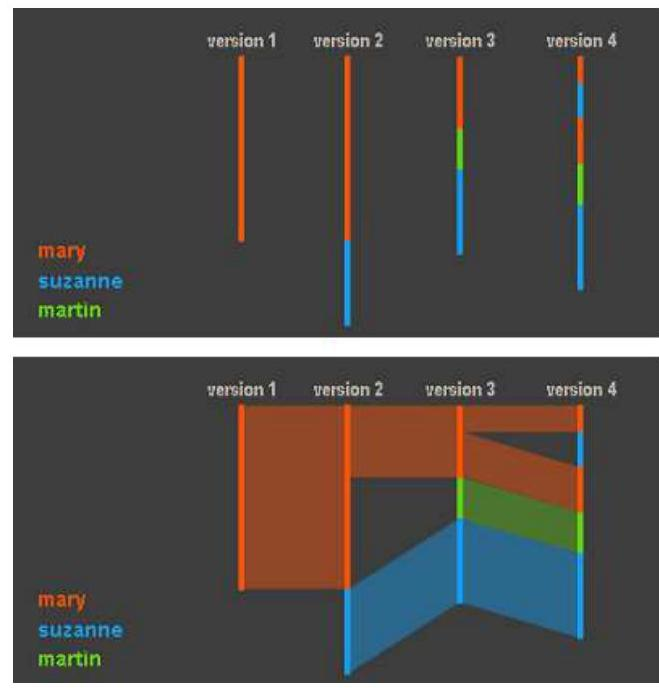
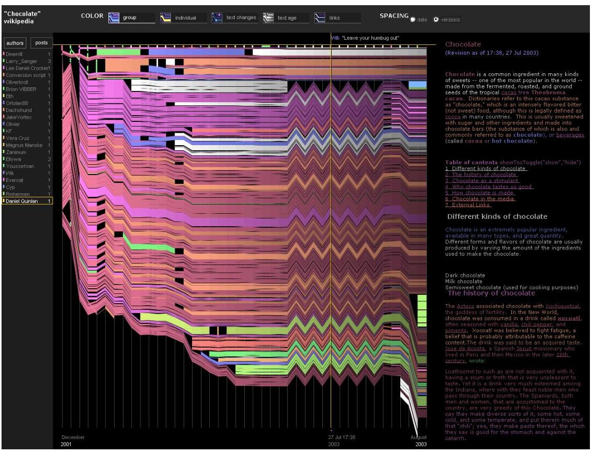
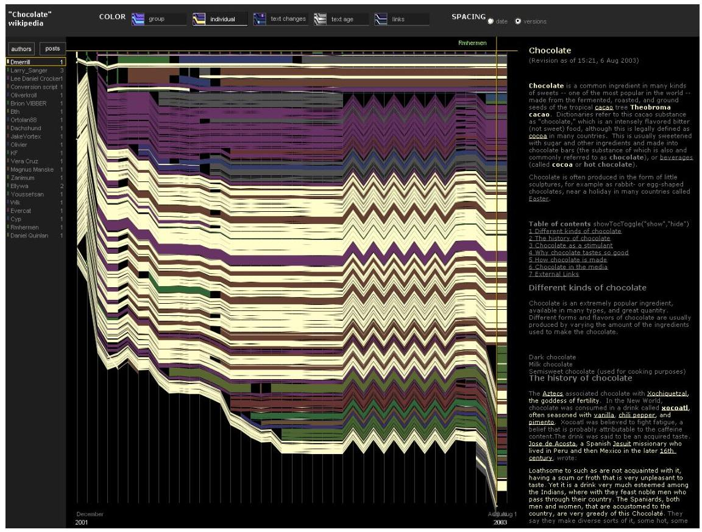
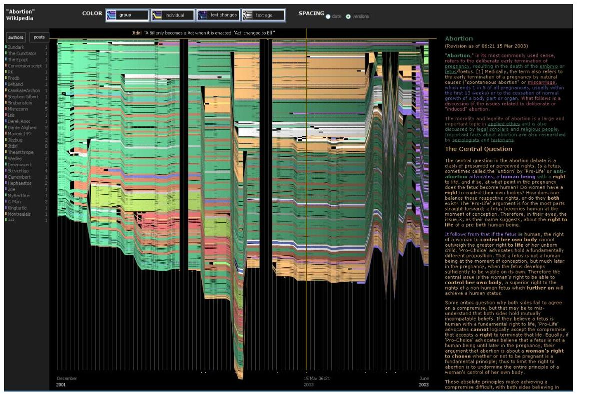
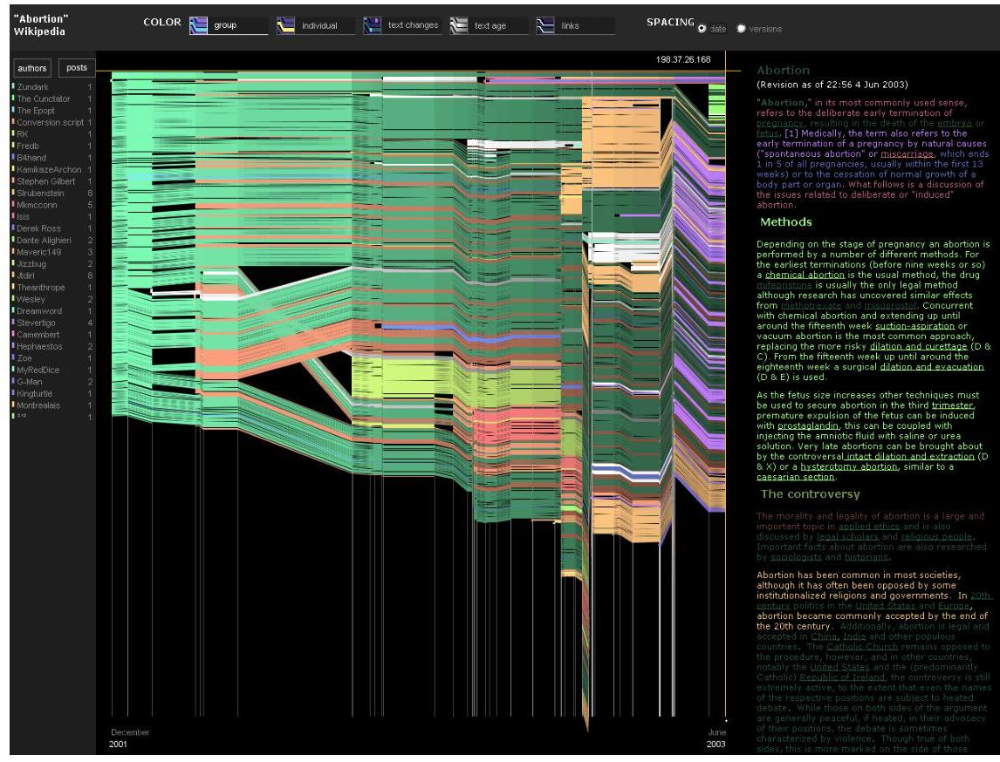

+++
author = "Yuichi Yazaki"
title = "Wikipedia の「見えない戦い」を描く ― History Flow 可視化の物語"
slug = "history-flow"
date = "2025-10-02"
categories = [
    "consume"
]
tags = [
    "",
]
image = "images/chocolate-1.jpeg"
+++

私たちが日常的に利用する Wikipedia は、世界最大の百科事典でありながら、誰でも自由に編集できるという特異な仕組みを持っています。その舞台裏では、協力や対立、破壊と修復といった人間的な営みが絶えず繰り広げられています。

この「見えないダイナミクス」を可視化したのが History Flow です。2004年の国際会議 CHI で発表され、ニューヨーク近代美術館（MoMA）にも収蔵されたこの可視化は、単なる学術研究を超えて、アート作品としても高く評価されています。

<!--more-->

## 誰が作ったのか？ ― 開発の背景

History Flow を開発したのは、Fernanda B. Viégas と Martin Wattenberg を中心とする研究チーム（MIT Media Lab と IBM Research）。2003年当時、Wikipedia は創設からわずか2年、まだ存在自体を疑う声も多く、「素人の寄せ集めで本当に百科事典が成立するのか？」と懐疑的に見られていました。

研究者たちは「なぜでたらめに見えるプロセスから高品質な記事が生まれるのか？」という疑問を出発点に、Wikipedia の膨大な編集履歴を分析するために History Flow を設計しました。

## History Flow の仕組み

History Flow は文書の改訂履歴を「流れ」として描きます。

- 横軸：時間（改訂の順序や日付）
- 縦軸：文書のテキスト位置
- 色：著者ごとの貢献部分

帯が長く残れば「その著者の文章が生き残った」ことを意味し、帯が途切れれば削除を、ジグザグに色が切り替われば「編集戦争」を示します。

色の割り当てには Java のハッシュ値を利用し、同じ著者は常に同じ色になるよう工夫されています。匿名編集は灰色で表されました。

また、インタラクションとして「特定の著者だけを強調表示する」機能も備えられ、研究ツールとしての完成度を高めました。

当初は線の骨格だけの可視化でしたが、試行錯誤の末に帯を塗りつぶし、著者ごとに色を割り当てることで直感的にわかりやすくなりました。

## ケーススタディ1： 「Chocolate」 - 編集戦争の痕跡

最も有名な事例のひとつが Wikipedia の 「Chocolate（チョコレート）」記事 です。History Flow の図をみると、右半分に鋭いジグザグ模様が現れています。

これは「coulage（クーラージュ）」というチョコレート彫刻技法の段落をめぐって起きた編集戦争の痕跡です。二人の編集者が互いに挿入・削除を12回も繰り返し、最終的にはその段落が完全に削除されることで決着しました。

ジグザグ模様は、意見の対立と論争の緊張感を視覚的に映し出しています。

## ケーススタディ2： 「Abortion」 - 荒らしと自浄作用

一方で、「Abortion（中絶）」記事 は別のパターンを示しました。

History Flow の図では、ページ全体が突然途切れる「黒い切れ目（gutters）」が現れます。これは記事の大半が削除される「mass deletion（大規模削除）」という典型的なバンダリズムです 。

ところが、時間軸を「実際の日時」に合わせて表示すると、この切れ目はほとんど見えなくなります。なぜなら、荒らしはわずか数分で修復されていたからです。統計的にも、大規模削除の半分は3分以内に修正され、下品な語を含む荒らしは中央値で2分以内に消去されていました。

「Abortion」記事は、Wikipedia の驚異的な 自浄作用 を象徴する例となりました。

## 典型的なパターン

Viégas らの研究は、70以上の記事を分析し、次のようなパターンを浮かび上がらせました。

- **バンダリズムと修復** 大規模な削除や悪ふざけの挿入は頻繁に起こるが、半数はわずか数分で修復された。特に下品な荒らしは中央値で2分以内に消されていた。
- **編集戦争（Edit Wars）** 複数人が交互に元に戻し続ける「ジグザグ模様」。Chocolate 記事はその代表例。
- **著者性と匿名性** 匿名編集の割合は記事ごとに大きく異なる。Microsoft 記事は匿名が多く、Mythology 記事はほとんど登録ユーザーによる編集だった。

- **コンテンツの不安定性** 記事は「完成」に近づくのではなく、常に変動し続ける。特に最初に書かれたテキストは生き残りやすい「first mover advantage」が観察された。

## 技術的な舞台裏

この可視化を成立させるためには、データ処理の工夫も必要でした。

- **差分アルゴリズム** ...単語の入れ替えや移動を追跡するために、Paul Heckel（1978）のアルゴリズムを採用。これにより「quick → big」や「post → pots」といった変化も正しく検出できました。
- **X軸の設計** ...バージョン番号で等間隔表示する方法と、実際の時間間隔に比例させる方法の2種類を提供。編集の「リズム」を明らかにできました。
- **ユーザーインターフェース** ...可視化とテキストビューを連動させ、マウス操作で特定の場所の本文を即座に確認できる仕組みを実装。

## 発展 ― Chromogram へ

2006年以降、研究チームは Chromogram という新しい可視化を試みます。これは、編集者や管理者の活動を時間軸上にピクセルで塗り重ねる手法です。

驚くべき発見のひとつは、「虹のような模様」として現れたボットの活動でした。ボットがアルファベット順に記事を巡回・編集していた痕跡が、視覚的に浮かび上がったのです。これは Wikipedia の進化における自動化の重要性を示す象徴的な発見となりました。

## 可視化の意義

History Flow の意義は、単に「面白い図を描いた」ということではありません。

- 荒らしがすぐに修復される「自浄作用」を実証
- 編集戦争や合意形成のパターンを直感的に示した
- ボットや匿名編集といった Wikipedia 独自の文化を浮き彫りにした
- そして、一般の人々に「知識がどのように作られていくのか」という舞台裏を鮮やかに伝えた

こうした点から、History Flow はデータビジュアライゼーションの傑作であると同時に、文化的にも意義深い作品といえるでしょう。

## 参考・出典

- [History Flow (Martin Wattenberg 公式サイト)](https://www.bewitched.com/historyflow.html)
- [Studying Cooperation and Conflict between Authors with History Flow Visualizations (CHI 2004 論文)](https://dl.acm.org/doi/10.1145/985692.985765)
- [Fernanda B. Viégas: Visualizing Wikipedia](https://web.archive.org/web/20180627195604/http://fernandaviegas.com/wikipedia.html)
- [IBM History Flow tool - Wikipedia](https://en.wikipedia.org/wiki/IBM_History_Flow_tool)
- [History Flow – MoMA Collection](https://www.moma.org/collection/works/110349)

