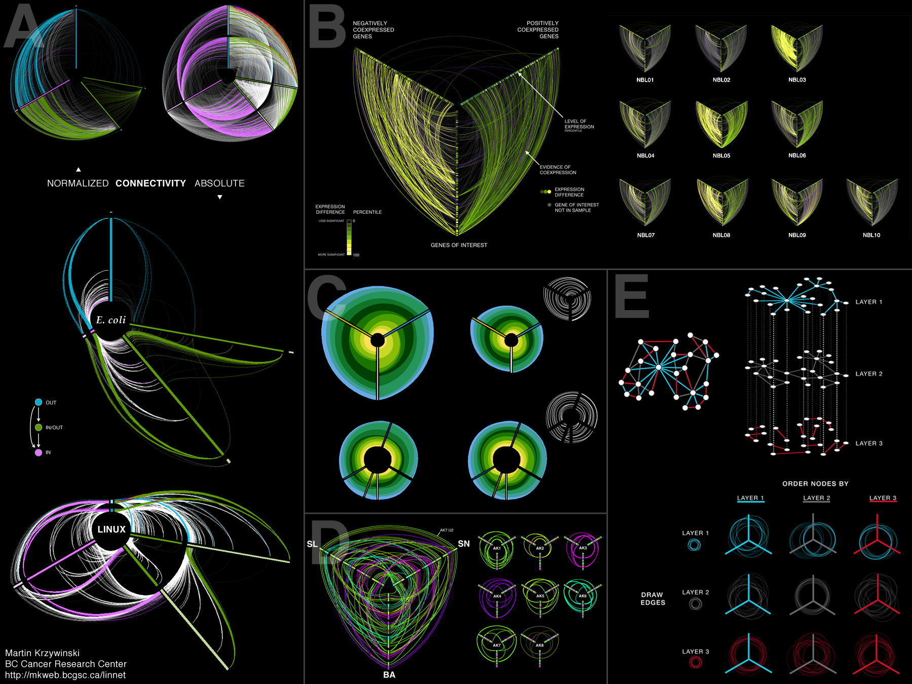

+++
author = "Yuichi Yazaki"
title = "Hive Plot"
slug = "hive-plot"
date = "2025-10-11"
categories = [
    "chart"
]
tags = [
    "",
]
image = "images/cover.png"
+++

A hive plot visualizes network data by placing nodes on predefined axes according to explicit rules. Unlike force-directed diagrams, it avoids random-looking layouts and makes network structure more systematic and comparable.

<!--more-->

## Purpose

The purpose is to make complex networks more interpretable by controlling node placement. Nodes are assigned to axes by category, role, or metric, and edges show relationships among them.

## Design Notes

- Define axis rules clearly.
- Use consistent node ordering along axes.
- Avoid too many edge crossings.
- Use color to reinforce categories.

## Summary

Hive plots are useful when a network should be read through defined structural dimensions rather than through a force-directed layout. Their clarity depends on meaningful axis design.
