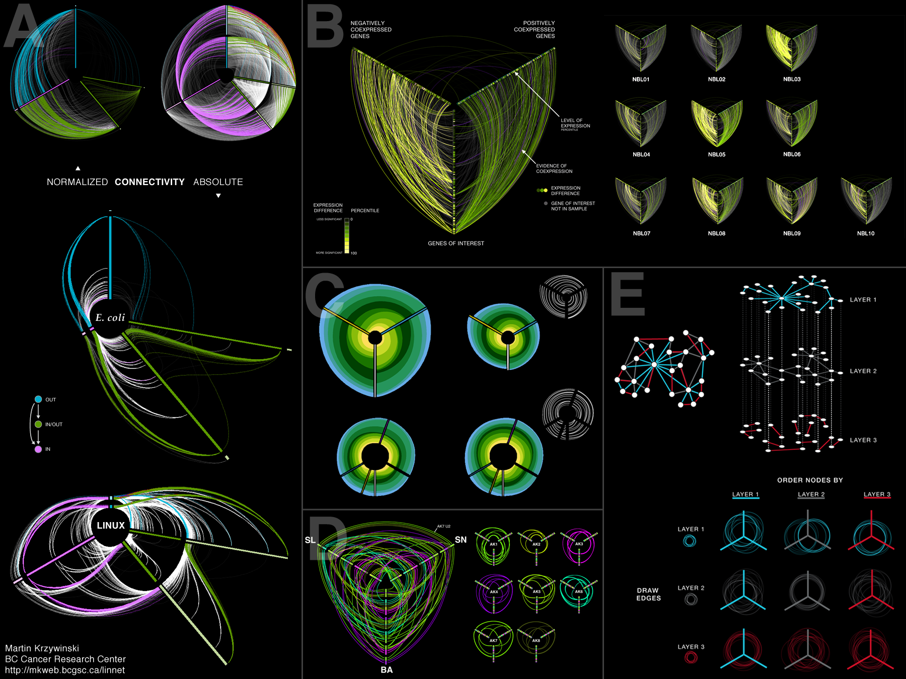
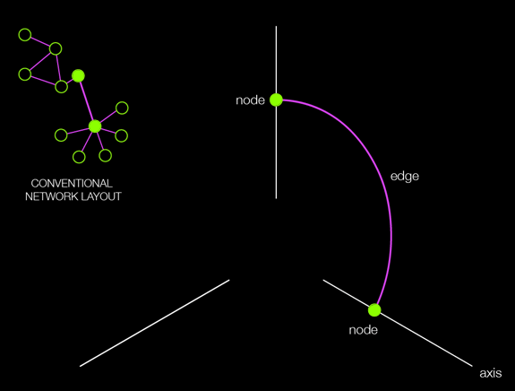

+++
author = "Yuichi Yazaki"
title = "Hive Plot — ネットワーク構造を「秩序」で見る新しい可視化手法"
slug = "hive-plot"
date = "2025-10-11"
categories = [
    "chart"
]
tags = [
    "",
]
image = "images/cover.png"
+++

複雑なネットワークは、従来の力学的配置（force-directed layout）では「ヘアボール（Hairball）」のように絡まり、構造的な洞察を得にくいとされてきました。  
これに対し、Martin Krzywinski（BC Cancer Research Center）は **Hive Plot（ハイブプロット）** という方法を提案し、ネットワークを「意味のある軸上に秩序立てて配置」することにより、構造的パターンを明確に読み取れるようにしました。

<!--more-->

Hive Plotは、ネットワークノードを一つ以上の軸（通常3軸）上に配置し、ノードの特性（次数、クラスタ係数、中心性など）によって座標を決定します。エッジはこれらの軸を横断して描かれるため、ネットワークの階層性や連結の特徴が視覚的に整理されます。

## チャートの見方

Hive Plotは、ネットワークの **構造的特徴を数量化された基準に基づいて配置する** ことが特徴です。以下は、図中の要素の読み方です。

| 図要素 | 意味 | 読み取り方 |
|:--|:--|:--|
| 軸（Axis） | ノードを配置する基準となる指標軸（例：次数、クラスタ係数、中心性など） | 各軸は1つの特性を示す。例えば、上軸は「高次数ノード」、左軸は「低クラスタ係数」など。 |
| ノード（Node） | 個々の要素（遺伝子、サーバー、ユーザーなど） | 軸上の位置が特性値に対応。外側ほど値が大きい場合が多い。 |
| エッジ（Edge） | ノード間の関係（相互作用、通信、共発現など） | 軸を跨いで接続し、関係の強さや方向性を示す。 |
| 色（Color） | 特定の属性やモジュールを区別 | 同系色は同じクラスタやサブネットを示す場合が多い。 |
| 正規化／絶対（Normalized / Absolute） | スケール調整の違い | 正規化図は比較分析、絶対図は全体構造の把握に向く。 |

たとえば、E. coli や Linux のネットワーク図では、「IN／OUT／IN-OUT」の3軸構成により、入力中心ノード・出力中心ノード・双方向ノードが明確に分けられています。  
また「Hive Plot Matrix」では、軸に異なる構造指標を割り当て、マトリクス的に比較することで、ネットワーク間の特徴差を定量的に比較することができます。

## 背景と意義

Hive Plotの発想は、「美しさ」ではなく「比較可能性」を目的としたネットワーク可視化にあります。力学モデルに依存したレイアウトはノードの初期条件やパラメータによって結果が大きく変わりますが、Hive Plotは **数値的ルールに基づく再現可能な配置** を可能にします。

この設計思想により、

- 異なるネットワーク間の比較（例：E. coli と Yeast の相互作用構造）
- 同一ネットワーク内での属性ごとの視点比較（例：次数 vs クラスタ係数）

が容易になります。

さらに、Hive Plotは **BioFabric** などの後続技術にも影響を与え、ネットワーク構造を線ではなく「秩序ある構成要素」として再構築する流れを生みました。

## まとめ

Hive Plotは、「複雑さの中の秩序」を明示するための手法です。ノードやエッジの位置が **意味をもつ** ことにより、従来のヘアボール的な混沌を超え、定量的で再現可能な構造分析を可能にしました。科学研究やソフトウェア解析、社会ネットワークなど、多様な分野で応用が進んでいます。

## 参考・出典

- [Hive Plot — Linear Layout for Network Visualization](https://hiveplot.com/)
