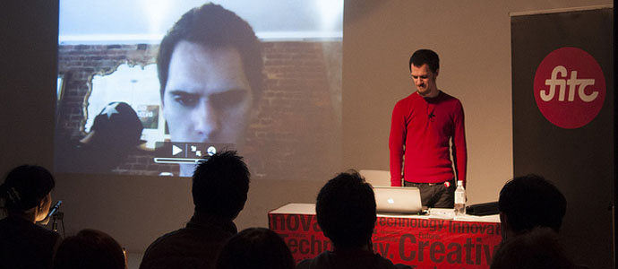
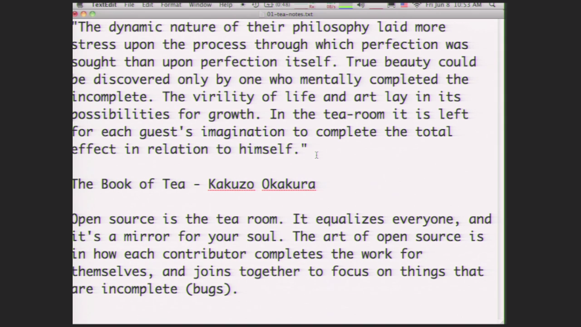

+++
author = "Yuichi Yazaki"
title = "すべてを明け渡すことではじめて完成する、茶道としてのオープンソース"
slug = "how-to-give-everything-away"
date = "2014-01-14"
categories = [
    "article"
]
tags = [
    "fitc","オープンソース"
]
image = "images/thumb_ph_vizjp.png"
+++

去年（2013年）クラスカで行われたFITC Tokyoに参加してきて、最も印象深かった話の一つが、Kyle McDonaldの 'How to Give Everything Away'（あらゆるものを公開する方法）という話でしたので、ご紹介させてください。

- [FITC2013](http://fitc.ca/event/tokyo/)
- ['How to Give Everything Away'（あらゆるものを公開する方法）Kyle McDonald | FITC2013](http://fitc.ca/presentation/how-to-give-everything-away-3/)

公式サイトでは 'give away' を「公開する」と訳してるんですが「プレゼントしてしまう」とか、英英辞書ひくと「うっかり誰かが優位性を持つことができるように」というニュアンスもあるようです。言葉の並びをみると差し出すことによって自分から遠ざける（ざかる）というニュアンスもありそうです。

そして、何を 'give away' するのかとして具体的には、アイデアを共有すること、自分の書いたソースコードをすべてccライセンスで公開すること、個人情報を含むキータイプすべてを自動的にtweetすること、が語られます（一つすごく面白いエピソードがあるのですが話の筋から逸脱するのでそれは機会を改めます）。アイデアもコードも個人情報もさらけ出すことで、自分のプライベート領域にあるものをパブリック領域にさらけ出し、そのことによってプライベートとは何か、パブリックとは何かを考察したいという動機があったようです。  
講演を聞いていて、具体的な事例ばかりが語られたものの、そこには貫く一本の個人的な生き方の物語、フィロソフィーのある話だな…と理解しつつ、その行き着く先がよくわからなかったので、イベント後の二次会の飲みの席で本人に聞いてみました。

「すべてを 'give away' するということは、その結果、自分はemptyになってしまうということだと思うけど、その先には何があるの？」と質問してみたところ、'You're complete when you're empty.' という返事が返って結構驚きました。自分は空っぽになることで初めて完成するんだということ。

そこで思い出したのが、彼の同様の内容の話を、アメリカはミネアポリスで半年前に開かれたカンファレンスで観ていたのだけど、その時出てきた茶室の話。このFITCの時に出てこなかったんですよね（遠慮だったのか配慮だったのかは不明だけども）。

- [Eyeo2012 - Kyle McDonald](https://vimeo.com/50239840)

（道教や禅の）「哲学は、完全そのものより、完全を追求する過程により重きを置くほどダイナミックなものであった。不完全を完成させた者のみが、真の美を見出すことができる。人生や芸術の力は、それが成長する可能性を秘めている点にこそあるというのだ。茶室では自己との関係において全体の効果を完成させることが、客の想像に任されている」岡倉天心「茶の本」IBCパブリッシング刊より引用。

続けて本人曰く「オープンソースは、茶室です。それは誰もが等しい存在であり、魂の鏡です。オープンソースの芸術は、各投稿者が自分自身の作業を如何に完成させるかであり、不完全なもの（バグ）に如何に協業で立ち向かうかにあるのです。」

茶道とオープンソースが結びついて語られたのが新鮮でした。時には自分の中に隠しておきたいこともあるけどそれでも公開するんだというようなことを言ってました。

ここからは少し個人的な解釈です。

彼は世界的に活躍しているまだ20代のアメリカ人メディアアーティストで、ややGitHubやオープンソースというものに傾倒しすぎている物の見方かもしれませんが、気付かせてくれるものはあります。「すべてを 'give away' する」ことと「空っぽになることで初めて完成する」ことの結びつきが少し弱いように感じたのですが、「茶の本」を読むと一つの地続きな思想が見えてきます。  
それは例えば、老子は「真に不可欠なものは虚ののみ存在する」として、部屋の実体は屋根と壁に囲まれた空虚な部分に見出されるのであって、部屋と壁そのものではないとか、水さしは水が大事であって水さしの形や素材にあるのではないといったようなニュアンスです。

福岡伸一さんの「動的平衡」も思い出されます。「絶え間なく動き、入れ替わりながらも全体として恒常性が保たれていること。」こそが生き物の生き物たる条件なんだといいます。

John Lennonのアルバム 'Some Time in New York City'に収録されているオノ・ヨーコの曲に"We're All Water"というのがあります。

> あなたは水  
> 私も水  
> 私たちはそれぞれの容器に入った水  
> だからこんなに簡単に出会える  
> いつの日かみんな一緒に蒸発しましょう  
> たとえ水がなくなってしまっても、  
> 私たちはたぶん容器を指さして言うでしょう  
> 「私たちはあそこにいる、あの容器は私です」と  
> 私たちは容器の番人
> 
> オノ・ヨーコ "We're All Water"

加えて、自分の外に出していないものは自分が死んでしまったら誰からも知ることのないまま存在しなくなってしまうということとか、他人から認知される自己こそが自己のすべてであるというようなニュアンスもつけ加えられるかもしれません。

情報の出し入れや扱いから派生する、アイデアや特許を巡る紛争や権力闘争。そういったものから一旦離れて、なすべきことに集中できる茶室のような場所…として彼がゆび指すのがGitHubです。おぉ…。

具体的なエピソードとして語ってくれた話で終わらせたいと思います。あるコーダーがccライセンスでコードを公開していて、掲示板に大量の質問と少しの回答が載せられていたのだけど、そのうち質問しか載らなくなり、第三者のある人がこのコーダーは亡くなったんだと告げたとのこと。それ以降は来訪者同士で回答を教え合うようになりました。オープンにしておいたことで、何がどう作られているのかをリバースエンジニアリングして引き継ぐこともできるし、これを使うときに彼のことを少し思い出すのかもしれないですね。
