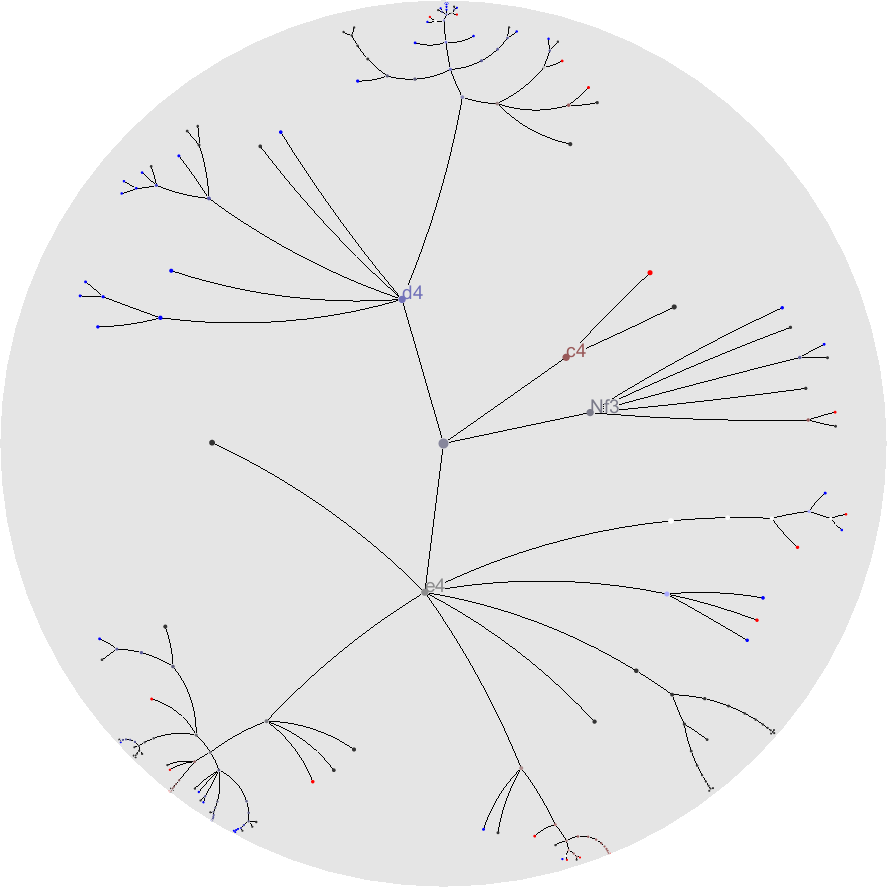
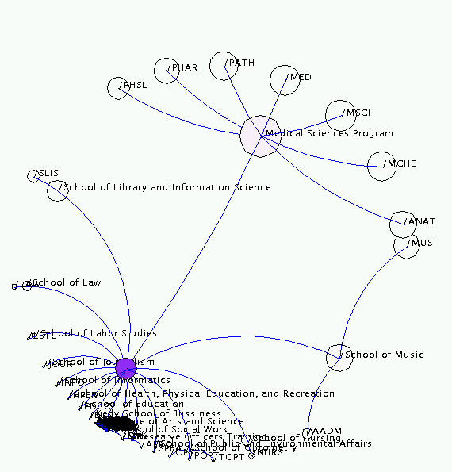
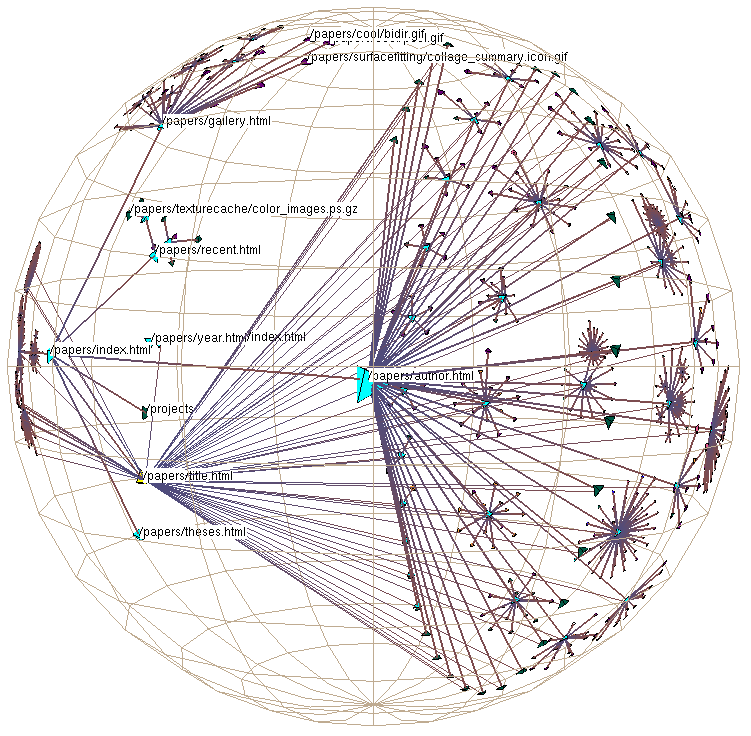

+++
author = "Yuichi Yazaki"
title = "Hyperbolic Tree"
slug = "hyperbolic-trees"
date = "2025-10-11"
categories = [
    "chart"
]
tags = [
    "",
]
image = "images/thumb_ph_vizjp.png"
+++

A hyperbolic tree visualizes hierarchical data in a circular hyperbolic space. Elements near the center are enlarged, while elements toward the edge are compressed. This makes it possible to see both a focus area and surrounding context, making it a classic focus-plus-context technique.

<!--more-->

## Purpose

The purpose is to navigate large hierarchies without losing the broader structure. Users can bring a node into focus while keeping related branches visible around it.

## Use Cases

- Large file systems
- Website maps
- Taxonomies
- Knowledge graphs with tree-like structure

## Design Notes

- Use interaction; static hyperbolic trees are harder to read.
- Keep labels legible near the focus.
- Provide orientation cues so users do not get lost.

## Summary

Hyperbolic trees are powerful for interactive navigation of large hierarchies. Their strength is combining detail and context in one view.
