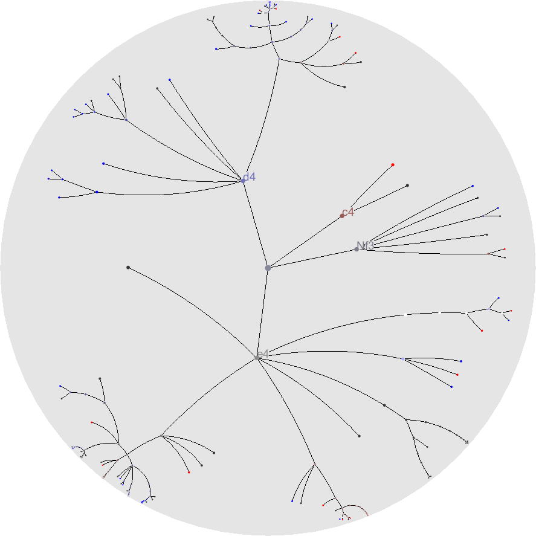
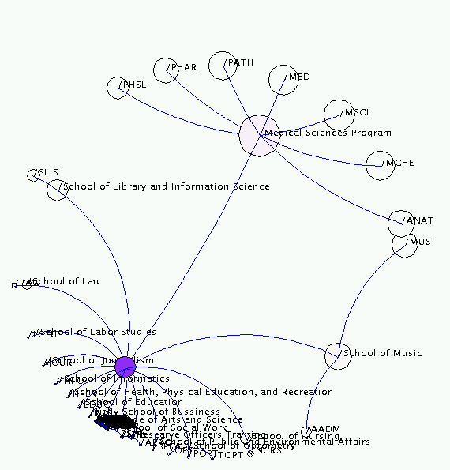
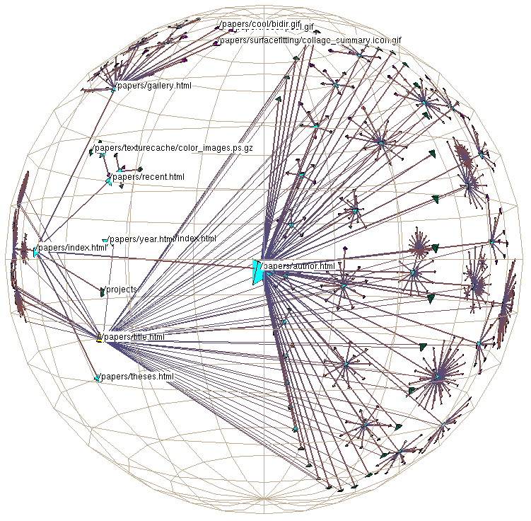

+++
author = "Yuichi Yazaki"
title = "ハイパーボリック・ツリー（Hyperbolic Tree）"
slug = "hyperbolic-trees"
date = "2025-10-11"
categories = [
    "chart"
]
tags = [
    "",
]
image = "images/thumb_ph_vizjp.png"
+++

ハイパーボリック・ツリー（Hyperbolic Tree）は、階層構造データ（ツリー構造）を円形のハイパーボリック空間上に可視化する手法です。通常のツリーダイアグラムでは、階層が深くなるにつれて描画領域が不足しやすくなりますが、ハイパーボリック幾何学を応用することで、中心に近い要素を拡大し、周辺に向かうほど圧縮する形で広範な階層を一度に表示できます。このため、情報の全体像を把握しつつ、部分的な詳細にも焦点を当てる「フォーカス＋コンテキスト（Focus + Context）」可視化の代表的な例とされています。

<!--more-->

## 歴史的経緯

ハイパーボリック・ツリーは、1990年代半ばに研究者Tamara Munznerらによってスタンフォード大学およびXerox PARCで開発されました。特に1995年の論文「Hyperbolic Tree: A Visualization for Browsing Large Hierarchies」において、その理論的背景と実装手法が提示されました。当時は大規模な情報構造（例えばファイルシステムやウェブサイト階層）のナビゲーションを課題としており、従来のツリー図に代わる新しいインタフェースとして注目を集めました。その後、Javaアプレット版「Hyperbolic Browser」としてウェブ上でも広く公開され、視覚化研究やユーザインタフェース設計に大きな影響を与えました。

## データ構造

扱うデータは典型的なツリー構造（ノードとエッジの階層的関係）です。各ノードが親子関係を持ち、ルートから枝分かれしていく構成です。ハイパーボリック空間上では、ユークリッド平面の代わりに「双曲面（Poincaré disk model）」を用い、ノードを円盤内に配置します。この幾何学的圧縮により、中心部分のノードは大きく、外周部は小さく描かれますが、全体の関係性は保持されます。

## 目的

主な目的は、大規模な階層構造をスクロールやズームを行わずに一度に視覚的に理解できるようにすることです。ユーザーは特定のノードを中心に移動することで関心領域を拡大しつつ、周囲の文脈を失わずに探索できます。

## ユースケース

- 企業組織図や製品分類ツリーの可視化  
- ファイルシステムやウェブサイト階層のナビゲーション  
- 辞書・語彙関係などの意味ネットワークの探索  
- ソフトウェア構造（クラス・モジュール階層）の可視化  
- Webサイトやフォルダ階層の可視化  
- 系統樹や生物分類の表示（Tree of Lifeプロジェクトなど）  
- 大規模ネットワークや知識グラフのブラウジング  
- ハイパーボリック埋め込みを利用したグラフ学習モデル（Hyperbolic Graph Embedding）  

## 特徴

| 特徴 | 説明 |
|------|------|
| 幾何モデル | ハイパーボリック（双曲）空間を利用 |
| 表示領域 | 中心部は拡大、外周は圧縮 |
| 操作性 | ドラッグによる中心移動で動的に焦点を切り替え |
| 利点 | 広い階層を一画面で表示可能 |
| 欠点 | 幾何的歪みにより直感的距離感が失われやすい |

通常のツリーレイアウトでは、ノード数が増えるほど枝が指数的に増加し、全体を一画面で表現するのが難しくなります。これに対してハイパーボリック・ツリーは、負の曲率を持つ「双曲空間」にツリーを埋め込み、中心から外側に向かってノードを配置します。この空間では、同じ半径でも円周の長さが指数的に広がるため、多数のノードを円盤内に収められるという利点があります。

可視化の際は、双曲平面を **ポアンカレ円板モデル（Poincaré disk model）** に写像して表現します。中心には注目ノード（focus）があり、周囲にコンテクスト（context）として関連ノードが縮小されながら配置されます。ユーザーは任意のノードをクリックして再中心化（re-centering）することで、ツリーを動的に探索できます。

## チャートの見方

中央に最も注目しているノード（ルートまたは選択ノード）が配置され、その周囲に子ノードが放射状に展開されます。ユーザーがノードをクリックまたはドラッグすると、そのノードが新たな中心に移動し、全体が再配置されます。視覚的には「ズーム」しているように見えますが、実際にはハイパーボリック変換による幾何学的な再描画です。

ハイパーボリック・ツリーの典型的な表示では、以下のような構造になっています。

- **中央（Focus Node）**：現在の注目ノード。  
- **周辺ノード（Context Nodes）**：関連する親・子ノード。距離が遠いほど小さく表示される。  
- **リンク（Edges）**：ノード間の階層関係を示す線。双曲空間上では曲線として描かれる。  
- **再中心化操作**：任意のノードをクリックすると、そのノードが新たな中心となり、周囲が再配置される。  

この「フォーカス＋コンテクスト（focus+context）」のアプローチにより、ユーザーは全体構造を見失うことなく、部分構造をズーム的に探索できます。

## デザイン上の注意点

- ノード間の重なりを避け、階層が深いほど小さく表示するバランス調整が重要です。  
- 色や線の太さによって、階層レベルや重要度を示すと理解しやすくなります。  
- 中心移動時のアニメーションを滑らかにすることで、ユーザーの認知負荷を下げます。  

## 応用例

- **Walrus Visualization Tool**（CAIDA, 2000年代初頭）：インターネットトポロジーの可視化にハイパーボリック・ツリーを採用。  
- **WebTree**：ウェブサイト階層を探索するためのブラウザ型インタフェース。  
- **情報アーキテクチャ設計**：情報構造の俯瞰ツールとして研究・教育に利用。  

## 代替例

- **サークルパッキング（Circle Packing）**：階層を円で表す手法。  
- **サンバースト（Sunburst）**や**アイシクル（Icicle）チャート**：階層を角度や長さで表現する手法。  
- **ツリーマップ（Treemap）**：面積分割による階層可視化。  
これらはいずれもツリー構造を異なる形で表現する手法であり、ハイパーボリック・ツリーは「対話的階層ブラウジング」に特化しています。

## まとめ

ハイパーボリック・ツリーは、限られた画面空間で広大な階層データを探索するために開発された革新的な可視化手法です。数学的に洗練された双曲空間の原理を応用し、フォーカス＋コンテキスト型インタフェースの代表例として現在も情報視覚化の研究・実装に多くの影響を与えています。

## 参考・出典

- [CAIDA Walrus Visualization Tool](https://www.caida.org/catalog/software/walrus/)
- [Xerox PARC Hyperbolic Browser Project](https://www.parc.com/technology/project/hyperbolic-browser/)
- [Hyperbolic tree — Wikipedia](https://en.wikipedia.org/wiki/Hyperbolic_tree)
- [Hyperbolic Trees — InfoVis CyberInfrastructure (Indiana University)](https://iv.cns.iu.edu/sw/hyptree.html)
- [Hyperbolic Tree — DataVizProject](https://datavizproject.com/data-type/hyperbolic-tree/)
- [H3: Laying Out Large Directed Graphs in 3D Hyperbolic Space — Tamara Munzner (Stanford University)](https://graphics.stanford.edu/papers/h3/html.nosplit/)
- [Hypertree.js — Nicolas Garcia Belmonte](https://philogb.github.io/jit/static/v20/Docs/files/Visualizations/Hypertree-js.html)
- [The Green Tree of Life — Hyperbolic Tree Viewer (UC Berkeley)](https://ucjeps.berkeley.edu/TreeofLife/hyperbolic2.php)

