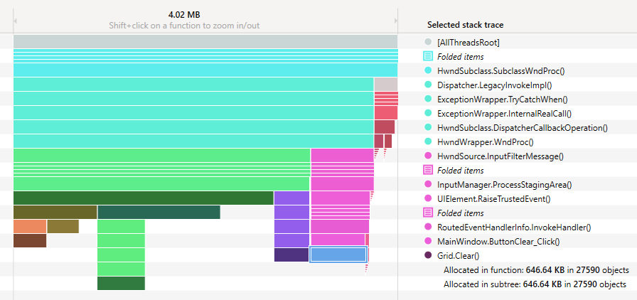
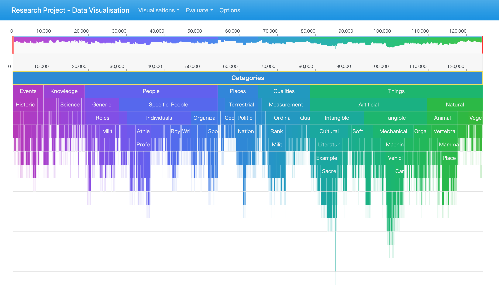
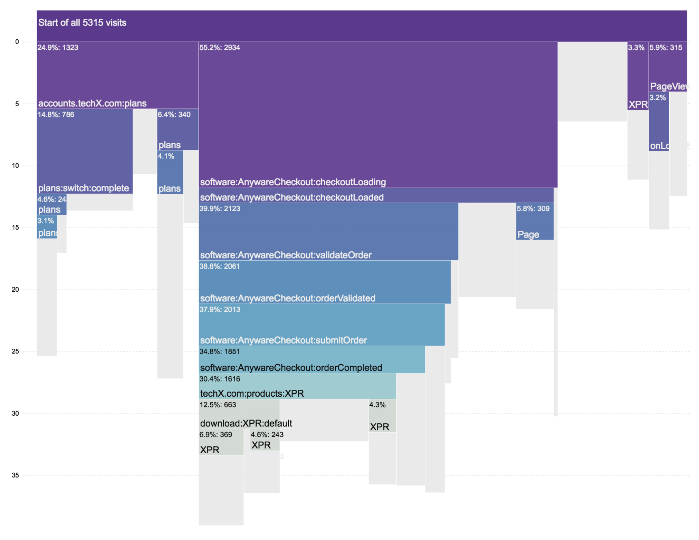
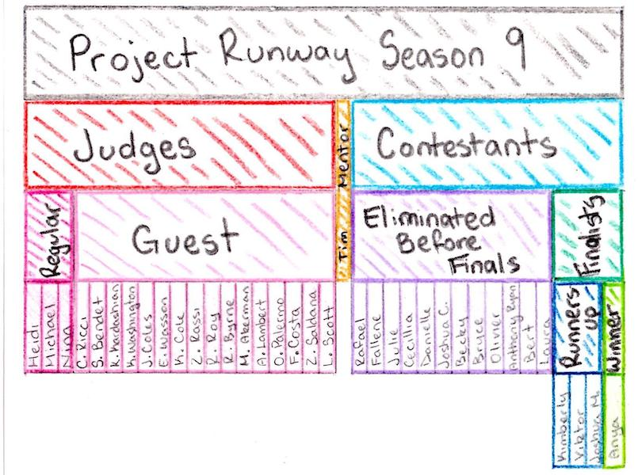

+++
author = "Yuichi Yazaki"
title = "つららチャート（Icicle Chart）"
slug = "icicle-chart"
date = "2020-08-09"
description = ""
categories = [
    "chart"
]
tags = [
    "map",
]
image = "images/MonashUniversity_IcicleChart.png"
+++

1983年にKruskal and Landwherによって開発されました。彼らの論文「Icicle Plots：Better Displays for Hierarchical Clustering」で発表されました。つららに似ていることからこのような命名になったとのことです。

<!--more-->

- [Icicle Plots: Better Displays for Hierarchical Clustering](https://www.cs.middlebury.edu/~candrews/showcase/infovis_techniques_s16/icicle_plots/icicleplots.html)
- [Icicle Plots](https://www.cs.middlebury.edu/~candrews/showcase/infovis_techniques_s16/icicle_plots/icicleplots.html)

## 作例

### dotMemory分析チャート

[dotMemory: a Memory Profiler & Unit-Testing Framework for .NET by JetBrains](https://visualizing.jp/icicle-chart/a%20Memory%20Profiler%20&%20Unit-Testing%20Framework%20for%20.NET%20by%20JetBrains)

### メルボルン モナッシュ大学での研究に使われたチャート

[Interactive Visualisation of Hierarchical Quantitative Data: an Evaluation](https://deepai.org/publication/interactive-visualisation-of-hierarchical-quantitative-data-an-evaluation)

### Core Flow

[CoreFlow: Extracting and Visualizing Branching Patterns from Event Sequences CoreFlow-EuroVis17.pdf](https://www.zcliu.org/coreflow/CoreFlow-EuroVis17.pdf)

### 手描きのつららチャート

[Icicle Chart – Lamar Elimbo](https://www.lamartalkscode.com/data-viz-inspiration/img007/)

