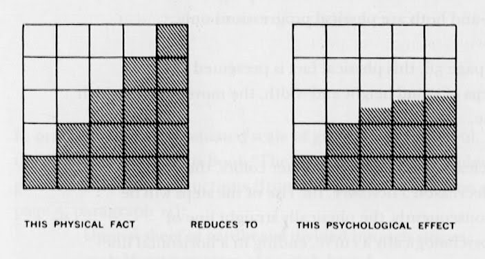
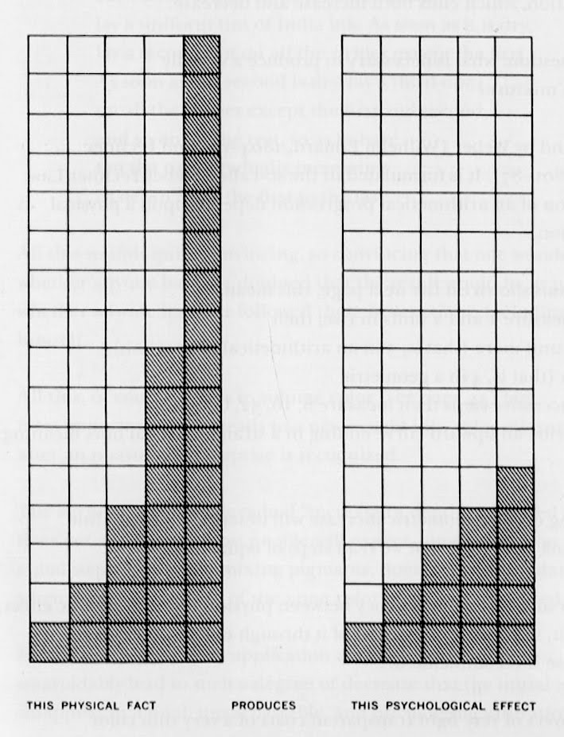

+++
author = "Yuichi Yazaki"
title = "色の変化、その物理的事実と心理的効果の違い"
slug = "interaction-of-color-weber-fechner-kaw"
date = "2020-07-21"
categories = [
    "technology"
]
tags = [
    "",
]
image = "images/Weber-Fechner-law_all_1.jpg"
+++

[配色の設計 ―色の知覚と相互作用（”Interaction of Color”）](https://amzn.to/3VyWTC7)

ジョセフ・アルバースさんによる色彩の研究成果をまとめた書籍「配色の設計 ―色の知覚と相互作用（”Interaction of Color”）」は、彼のキャリアの晩年、勤めていたイェール大学から出版されています。

この中で、**「ウェーバー - フェヒナーの法則」（Weber-Fechner Law）**を紹介しています。これは、

**「等差数列的な変化を視覚的にとらえるためには、物理的には等比級数的に増えてゆかねばならない」**（翻訳書より抜粋）

ことを示した法則です。等差数列と等比数列を補足します。

- 等差数列（Arithmetical progression）…「はじめの数に、一定の数を足し算し続けて、その結果出来た数列」
- 等比数列（Geometric progression）…「はじめの数に、一定の数を掛け算し続けて、その結果出来た数列」

書籍中では、1.白い紙の上で、薄い黄色を塗り重ねていった場合、2.赤に黒を段階的に足していった場合の二例について、実際の結果が掲載されています。

これを概念的に示しているのが下の二画像です。横軸が時系列（重ね塗りした回数）になり、縦軸は少しややこしいですが左図がの場合は物理的事実、右図の場合は心理的効果の大きさ、という解釈になるかと思います。

<figure>

<figcaption>

等差数列（arithmetical progression）で物理的に描かれたもの（左）は、過小評価、実際よりも削減されて知覚される（右）。

</figcaption>

</figure>

<figure>

<figcaption>

等比数列（Geometric progression）で物理的に描く（左）ことで、やっと等差数列（arithmetical progression）のように知覚される（右）。

</figcaption>

</figure>

実際の色の変化と、人間の知覚が、線形（等差数列）ではないことを示しています。

ジョセフ・アルバースさんによるこの書籍（配色の設計 ―色の知覚と相互作用）は1963年の出版。

参照している「ウェーバー - フェヒナーの法則」（Weber-Fechner Law）は1860年の初出。

近い内容を示す、[「スティーヴンスのべき法則」(Stevens’ Power Law)]() は1975年の論文であり、「ウェーバー - フェヒナーの法則」よりもずっとあと、この書籍よりも少し後のことでした。

