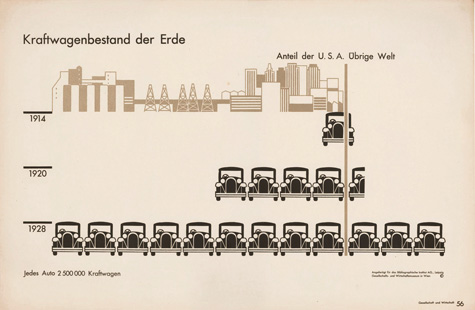

+++
author = "Yuichi Yazaki"
title = "アイソタイプ・チャート（Isotype Chart）"
slug = "isotype-chart"
date = "2025-10-11"
categories = [
    "chart"
]
tags = [
    "",
]
image = "images/thumb_ph_vizjp.png"
+++

アイソタイプ・チャートは **ピクトグラムを用いて数量を視覚的に比較する図表** です。社会統計や人口データなどを、よりわかりやすく・親しみやすく表現するために用いられます。  
その起源は1920年代にオーストリアの社会学者 **オットー・ノイラート（Otto Neurath）** と、デザイナーの **ゲルト・アルンツ（Gerd Arntz）** によって開発された「ISOTYPE（International System Of Typographic Picture Education）」にあります。

<!--more-->

## チャートの見方

アイソタイプ・チャートでは、各カテゴリ（例：男女・職業・年齢層など）に対応するピクトグラムを **個数で数量を表す** のが特徴です。  
棒グラフや円グラフのように長さや角度ではなく **同一サイズのアイコンを繰り返すことで値の差を直感的に理解** できます。

| 要素 | 内容 |
|------|------|
| 可視化の目的 | カテゴリ別の数量の比較 |
| 表現方法 | ピクトグラム（配置・色・個数） |
| スケール | 名義スケール・線形スケール |
| 座標系 | 直交座標系（X軸・Y軸を用いる） |
| デザイン上の留意点 | 扱うテーマに沿ったピクトグラムを選ぶこと |

たとえば図中の例では、縦軸と横軸をもつグラフ上に、人型のピクトグラムを並べ **人数の差を視覚的に比較** しています。  
このように **1アイコン = 一定数量（例：1人、10人など）** を意味するよう設定し、テーマに適した図柄（人・家・車など）を選ぶことで、意味がより伝わりやすくなります。

## 背景と特徴

ISOTYPEは「視覚による教育（Visual Education）」を理念としており、文字に頼らず **誰にでも理解できる普遍的な情報伝達手段** を目指しました。
この考え方は、現代の情報デザインやアイコン表現の基礎ともなっています。
ノイラートとアルンツは、ウィーン社会・経済博物館の展示や出版物でこの手法を確立し、後に多くの統計図表や教育資料に応用されました。

## まとめ

アイソタイプ・チャートは **数量を“数える”ことで見せる** という点に特徴があります。  
棒グラフよりも情緒的で親しみやすく、テーマ性を活かしたビジュアル表現が可能です。  
社会統計・教育資料・公共デザインなど、幅広い分野で活用されています。

## 参考・出典

- [Isotype Revisited — Home](https://isotyperevisited.org/)
- [Isotype: international picture language — Exhibition (Isotype Revisited)](https://isotyperevisited.org/exhibition/)
- [Isotype Collection (Isotype Revisited)](https://isotyperevisited.org/isotype-collection/)
- [University of Reading — Isotype Collection (Collections & Archives)](https://www.reading.ac.uk/typography/collections-and-archives)
- [Gerd Arntz Web Archive — Isotype](https://gerdarntz.org/isotype.html)
- [Isotype (picture language) — Wikipedia](https://en.wikipedia.org/wiki/Isotype_%28picture_language%29)
- [Dataviz Catalogue — Pictogram Chart](https://datavizcatalogue.com/methods/pictogram.html)
- [University of Vienna — Isotype: Origin, development, and legacy](https://isotype.univie.ac.at/en/)