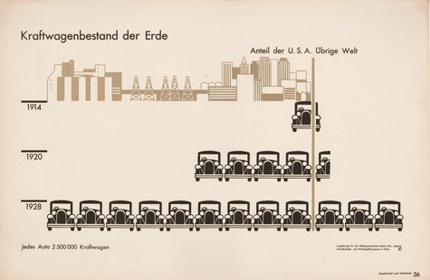

+++
author = "Yuichi Yazaki"
title = "アイソタイプ・チャート（Isotype Chart）"
slug = "isotype-chart"
date = "2025-10-11"
categories = [
    "chart"
]
tags = [
    "",
]
image = "images/thumb_ph_vizjp.png"
+++

アイソタイプ・チャート（Isotype Chart）は、**ピクトグラム（絵文字記号）を用いて数量を視覚的に比較する図表**です。同一サイズのアイコンを繰り返し並べることで、カテゴリ間の数量差を直感的に「数える」ことで理解できるよう設計されています。1920年代にオーストリアの社会学者オットー・ノイラート（Otto Neurath）とデザイナーのゲルト・アルンツ（Gerd Arntz）によって開発されました。

<!--more-->



## 別名

なし

## 歴史的経緯

アイソタイプ（ISOTYPE: International System Of Typographic Picture Education）は、1920年代のウィーンで誕生しました。社会学者・哲学者であるオットー・ノイラートは、社会・経済データを一般市民にわかりやすく伝えるための視覚言語の必要性を提唱し、ウィーン社会・経済博物館（Gesellschafts- und Wirtschaftsmuseum）の展示で「ウィーン・メソッド（Vienna Method of Pictorial Statistics）」として実践しました。

グラフィックデザイナーのゲルト・アルンツが約4,000点に及ぶピクトグラムを制作し、視覚言語としての体系化に貢献しました。1930年代以降、ノイラート夫妻はオランダ、そしてイギリスに活動拠点を移しましたが、この手法は「ISOTYPE」と改名され、教育・出版・公共デザインの分野で国際的に普及しました。

アイソタイプの理念は、現代のインフォグラフィクスやアイコンデザインの基礎にもなっており、データビジュアライゼーションの歴史において重要な位置を占めています。現在、その資料の多くはイギリスのレディング大学（University of Reading）に収蔵されています。

## データ構造

アイソタイプ・チャートのデータは、カテゴリと数量の組み合わせというシンプルな構造です。

| 列名 | データ型 | 説明 |
|------|----------|------|
| カテゴリ | 名義 | 比較する項目名（国名、職業、年齢層など） |
| 数量 | 数値（離散的） | 各カテゴリの値（人口、個数、件数など） |
| アイコン種別（任意） | 名義 | カテゴリに応じたピクトグラムの種類 |

1つのアイコンが表す単位数量（例：1アイコン = 100人）を事前に定義し、数量をアイコンの個数で表現します。

## 目的

アイソタイプ・チャートの主な目的は、専門知識を持たない一般の人々に対して、数量の比較をわかりやすく・親しみやすく伝えることです。棒グラフや折れ線グラフに比べて情緒的・直感的な理解を促し、テーマの性質をアイコンの形状で視覚的に伝えることもできます。「視覚による教育（Visual Education）」を理念とし、文字に頼らない普遍的な情報伝達を目指しています。

## ユースケース

- **社会統計の発信**：人口構成、労働統計、健康データなどを市民向けに視覚化
- **教育資料**：小学校から大学まで、統計リテラシーの教材として活用
- **公共デザイン**：行政の広報資料、博物館の展示パネル、インフォグラフィクス
- **ジャーナリズム**：ニュース記事やレポートでのデータの視覚的補足
- **マーケティング**：製品の市場シェアやユーザー数の比較を訴求力のあるビジュアルで表現

## 特徴

| 特徴 | 内容 |
|------|------|
| 表現対象 | カテゴリ別の数量の比較 |
| 表現方法 | 同一サイズのピクトグラムを繰り返し配置 |
| メリット | 直感的に理解しやすい。テーマに応じたアイコンで親しみやすさを演出できる |
| デメリット | 大きな数量差の表現には不向き。端数の表現が難しい |
| 座標系 | 直交座標系（X軸・Y軸を用いる場合）またはフリーレイアウト |

## チャートの見方

アイソタイプ・チャートでは、各カテゴリに対応するピクトグラムを**個数で数量を表す**のが基本です。棒グラフのように長さや角度ではなく、**同一サイズのアイコンを繰り返すことで値の差を直感的に理解**できます。

- **アイコンの個数**：多いほど数量が大きいことを示します。1アイコンが表す単位（例：1人、10人、1,000人）は凡例で明示します
- **アイコンの種類**：扱うテーマに沿った図柄（人型、家、車、食物など）を選ぶことで、何についてのデータかが一目でわかります
- **配置の方向**：横に並べる場合と縦に積む場合があります。棒グラフと同様に、カテゴリ間の数量を比較します
- **部分アイコン**：端数を表すために、アイコンの一部（半分や4分の1）を表示する場合がありますが、正確な読み取りは難しくなります

## デザイン上の注意点

- **アイコンサイズの統一**：すべてのアイコンを同一サイズにすることが鉄則です。サイズを変えると面積の知覚バイアスが生じ、アイソタイプの利点が失われます
- **1アイコンあたりの単位の選定**：単位数量が大きすぎると差が見えにくく、小さすぎるとアイコンが多くなりすぎます。データの範囲に応じて適切な単位を選びます
- **テーマに合ったアイコン選択**：人口データなら人型、交通データなら車、農業なら作物のアイコンなど、テーマの意味を強化するアイコンを選びます
- **凡例の明示**：「1アイコン = ◯◯」の対応関係を必ず記載します
- **端数の処理**：半端な値は部分アイコンや四捨五入で対応しますが、精度を求める場面には適しません
- **カテゴリ数の制限**：カテゴリが多すぎるとチャートが煩雑になるため、5〜8カテゴリ程度に抑えるのが望ましいです

## 応用例

- **教科書・教育資料**：各国の人口比較、産業別就業者数などを子どもにもわかりやすく表現
- **インフォグラフィクス**：ニュースサイトや雑誌で、統計データをピクトグラムで視覚的に伝える手法として広く使われています
- **ダッシュボード**：ユーザー数や達成率をアイコン列で表示する「ピクトグラムチャート」として、BIツールでも実装されています
- **公共サイン・ユニバーサルデザイン**：アイソタイプの理念は、空港や交通機関のピクトグラムサインの発展にも影響を与えています

## 代替例

| チャート名 | 特徴 | 適用場面 |
|-------------|-------|-----------|
| 棒グラフ（Bar Chart） | 棒の長さで数量を正確に比較 | 正確な定量比較が必要な場合 |
| ワッフルチャート（Waffle Chart） | 格子状のマスの塗りつぶしで割合を表現 | 構成比・割合の視覚化 |
| ドットプロット（Dot Plot） | 点の個数や位置で数量を表現 | 分布やカウントの表示 |
| 円グラフ（Pie Chart） | 扇形の角度で構成比を表現 | 全体に対する各項目の割合 |

## まとめ

アイソタイプ・チャートは、数量を「数える」ことで見せるという独自のアプローチを持つ図表です。オットー・ノイラートとゲルト・アルンツが提唱した「視覚による教育」の理念に基づき、文字や数字に依存せず誰にでも理解できる普遍的な情報伝達を目指しています。棒グラフよりも情緒的で親しみやすく、テーマ性を活かしたビジュアル表現が可能であり、社会統計・教育資料・公共デザイン・インフォグラフィクスなど幅広い分野で活用され続けています。

## 参考・出典

```
- [Isotype (picture language) — Wikipedia](https://en.wikipedia.org/wiki/Isotype_%28picture_language%29)
- [Isotype Revisited — Home](https://isotyperevisited.org/)
- [Isotype: international picture language — Exhibition (Isotype Revisited)](https://isotyperevisited.org/exhibition/)
- [Isotype Collection (Isotype Revisited)](https://isotyperevisited.org/isotype-collection/)
- [University of Reading — Collections and Archives](https://www.reading.ac.uk/typography/collections-and-archives)
- [Gerd Arntz Web Archive — Isotype](https://gerdarntz.org/isotype.html)
- [Pictogram Chart — The Data Visualisation Catalogue](https://datavizcatalogue.com/methods/pictogram.html)
- [Isotype: Origin, development, and legacy — University of Vienna](https://isotype.univie.ac.at/en/)
```
