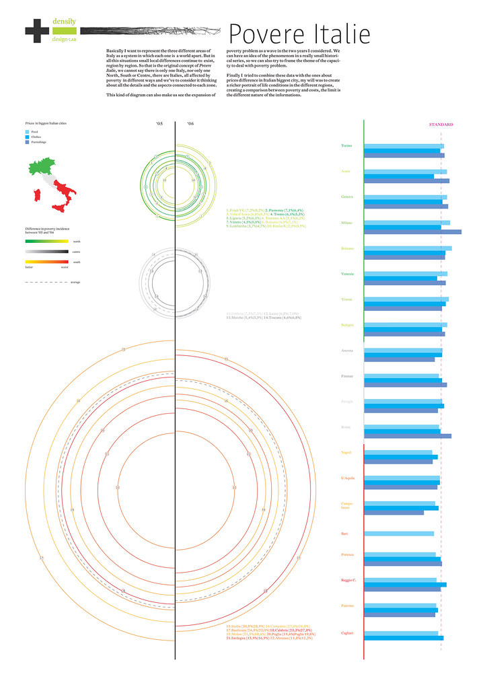
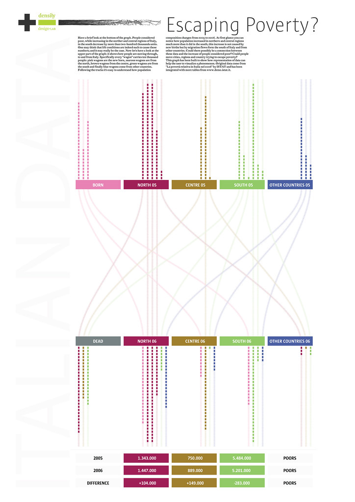
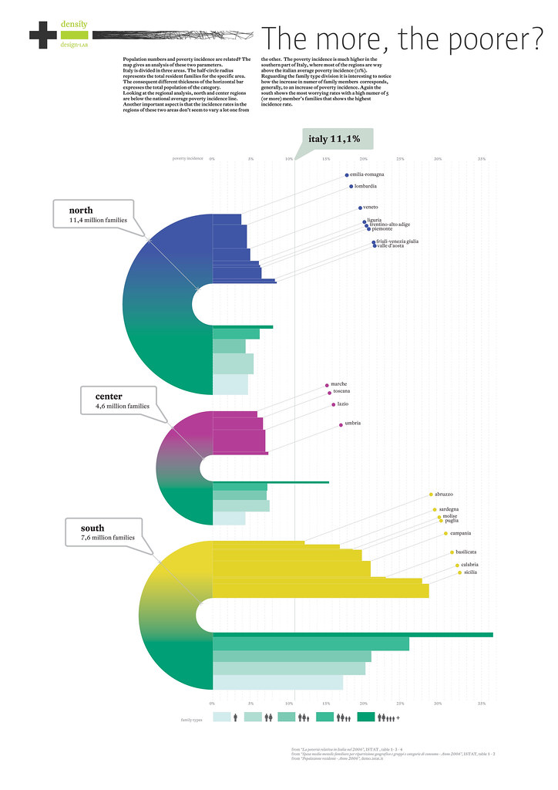
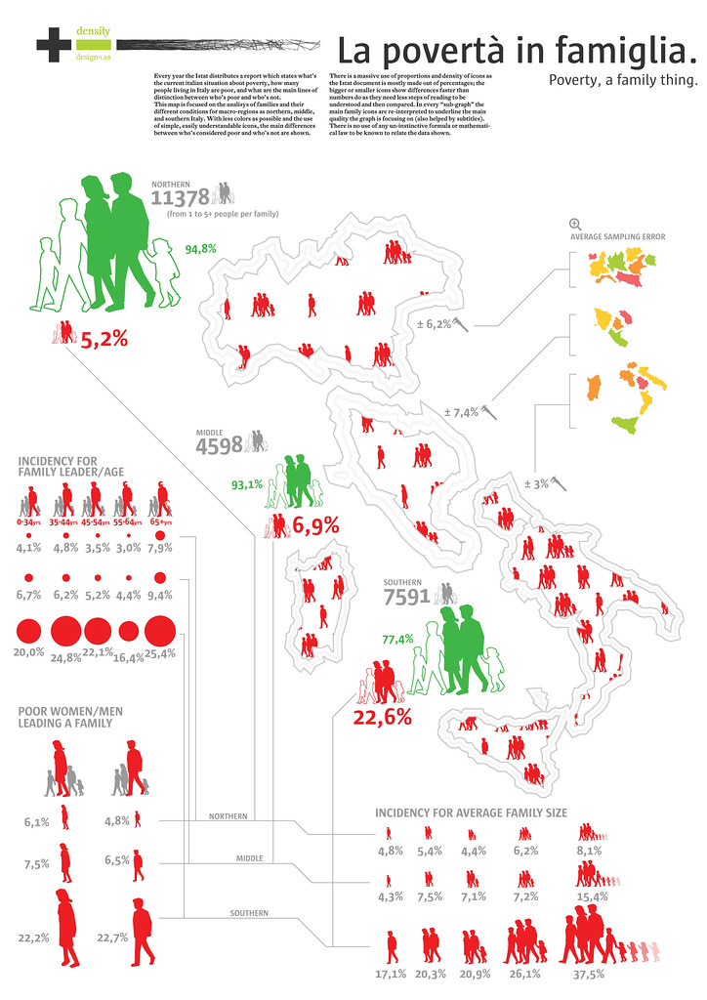

+++
author = "Yuichi Yazaki"
title = "デザイン教育における貧困の可視化 ― Italian social condition – Poverty 課題"
slug = "italian-social-condition–poverty"
date = "2025-10-04"
description = ""
categories = [
    "chart"
]
tags = [
    "",
]
image = "images/cover.jpg"
+++

「Italian social condition – Poverty」は、ミラノ工科大学 Politecnico di Milano の DensityDesign Lab による2008–2009年度の演習課題です。テーマはイタリア社会における「貧困」。学生たちは統計資料や社会調査を基に、地域格差・世帯構成・教育水準・年齢といった多面的な要因を視覚化しました。

単なるデータ分析ではなく、デザイン教育の文脈において「社会課題をどのように読み取り、可視化を通じて理解を深められるか」という点が重視されています。課題文では「もし自分が貧困層に属していたら」という想像力を出発点に、社会構造を自らの眼で再構築することが求められていました。

<!--more-->

## 学生の代表的な作例

この課題からは数多くのポスターが制作されました。現在 Flickr 上で確認できる代表例は以下の通りです。

- [Davide Passini 作例 (Flickr)](https://www.flickr.com/photos/densitydesign/3031632605/)

- [Gabriela Cistino 作例 (Flickr)](https://www.flickr.com/photos/densitydesign/2988128330/)

- [Pietro Righi Riva 作例 (Flickr)](https://www.flickr.com/photos/densitydesign/2987259431/)

- [Mario Porpora 作例 (Flickr)](https://www.flickr.com/photos/densitydesign/2987255835/)

- [Giulia Baldini 作例 (Flickr)](https://www.flickr.com/photos/densitydesign/2987241555/)

- [Simone Magini 作例 (Flickr)](https://www.flickr.com/photos/densitydesign/2988106310/)

これらの作例は、データの背後にある社会的現実を「読む」だけでなく、「見せる」ための実践知を体現しています。

## 図解の特徴と見方

この課題から生まれた作例は、複雑な社会データを直感的に理解できるよう工夫されています。

- **属性ごとの分岐** 家族構成や教育水準、年齢などのカテゴリを扇形や樹状図で示し、それぞれがどの程度貧困に直結するかを視覚化。
- **地域格差の強調** 北部・中部・南部イタリアを比較し、特に南部から多くの太いラインが伸びるデザインにより、格差の深刻さを強調。
- **複数指標の同時表現** 実線／点線や色／太さなど、異なるビジュアル属性を用いて「シェア」と「発生率」を並列的に伝達。

こうした図解の仕組みによって、単なる数値の列では見えにくい「誰が、どこで、なぜ貧困に陥りやすいのか」が視覚的に一目で理解できるようになります。

## 教育的意義

この演習の価値は、学生が「データ」と「デザイン」を結びつける訓練を実地で経験できる点にあります。

- **統計の読み解き**公的データを調査し、指標を解釈することで、社会科学的リテラシーを身につける。
- **表現技法の探求** グラフィックの変数を使い分けて複雑な関係性を整理し、情報を明確に伝える方法を学ぶ。
- **批判的視点の育成** 「貧困をどう可視化すれば社会に伝わるか」という課題を通じ、デザインの社会的役割を自覚する。

このように教育的文脈の中で課題を位置づけることで、学生は単なるデータ処理者ではなく「社会に働きかけるデザイナー」としてのスキルを磨いていきます。

## まとめ

- 本課題は DensityDesign Lab による2008–2009年度の演習で、イタリアの貧困をテーマとした情報デザイン教育の実践。
- 図解は「属性 × 地域 × 貧困指標」を複層的に可視化し、南北格差の深刻さを直感的に示す。
- 学生はデータ分析と可視化を通じて、社会構造を理解するだけでなく、デザインによる社会的介入の可能性を体験した。

## 参考・出典

- [DensityDesign – Italian Social Condition (課題文ページ)](https://densitydesign.org/course_projects/first-exercise/)
