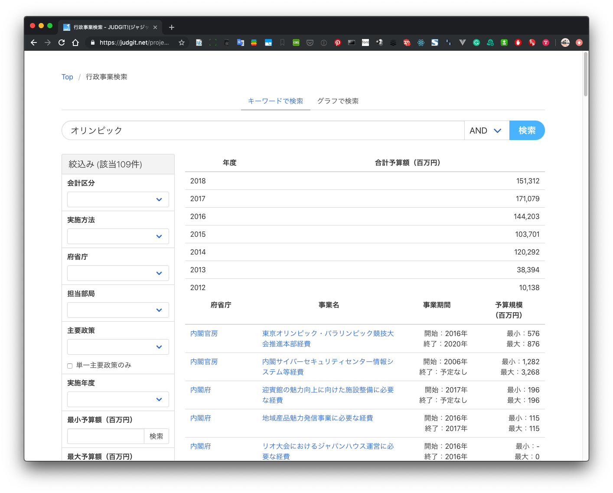
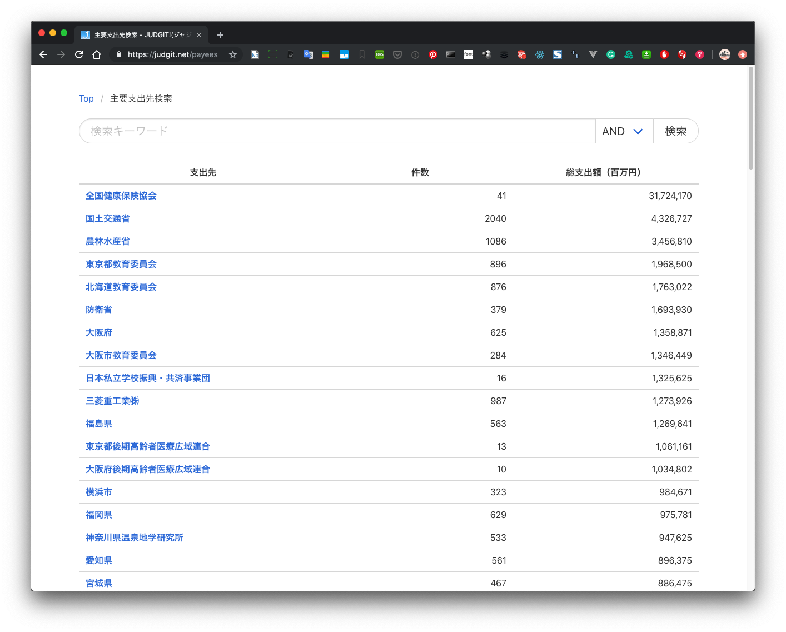
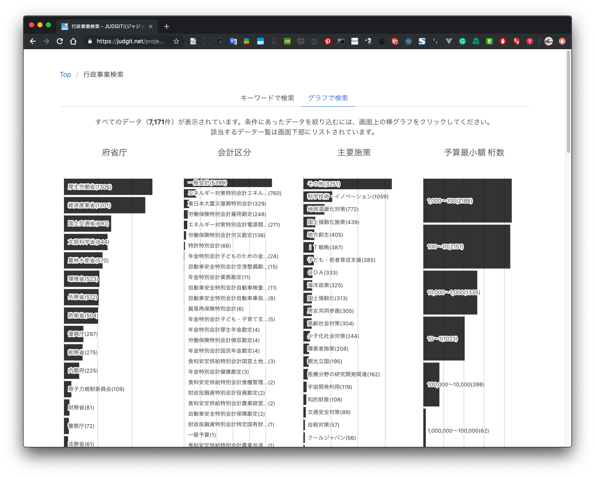
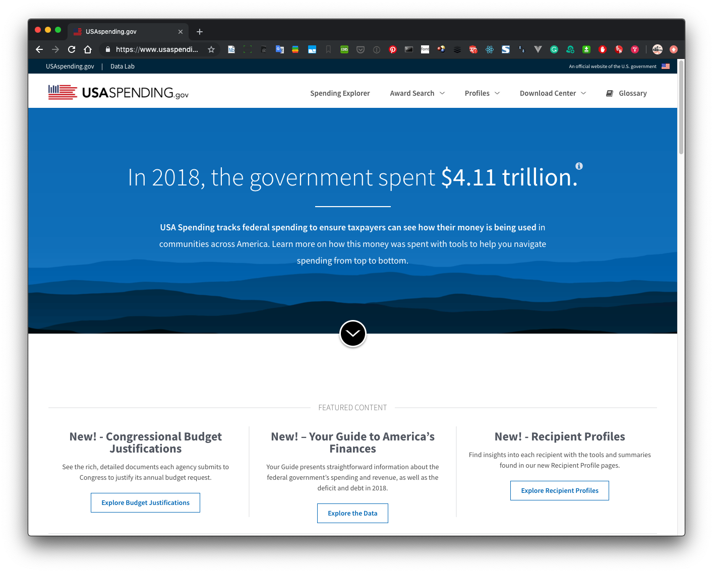
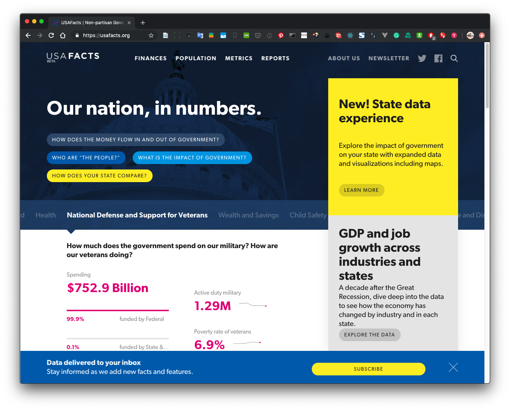
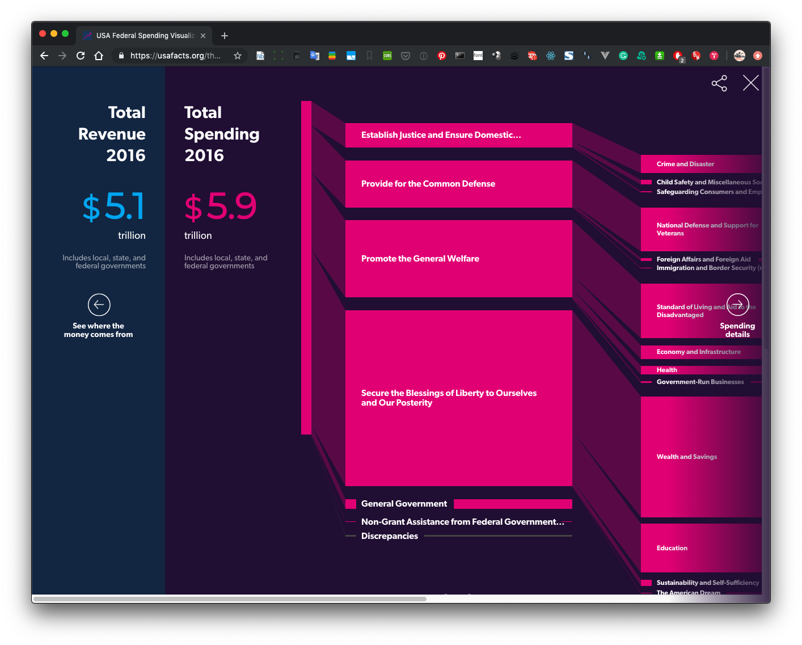
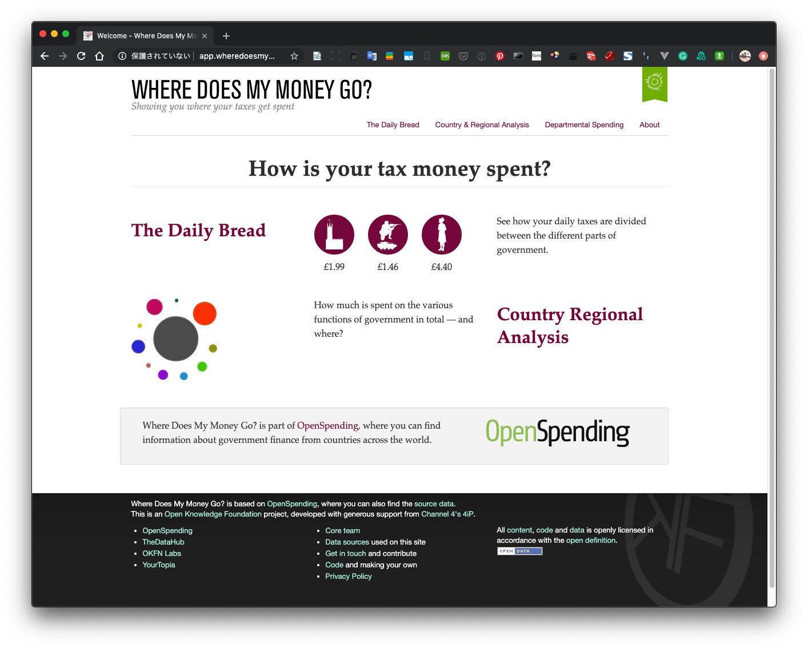
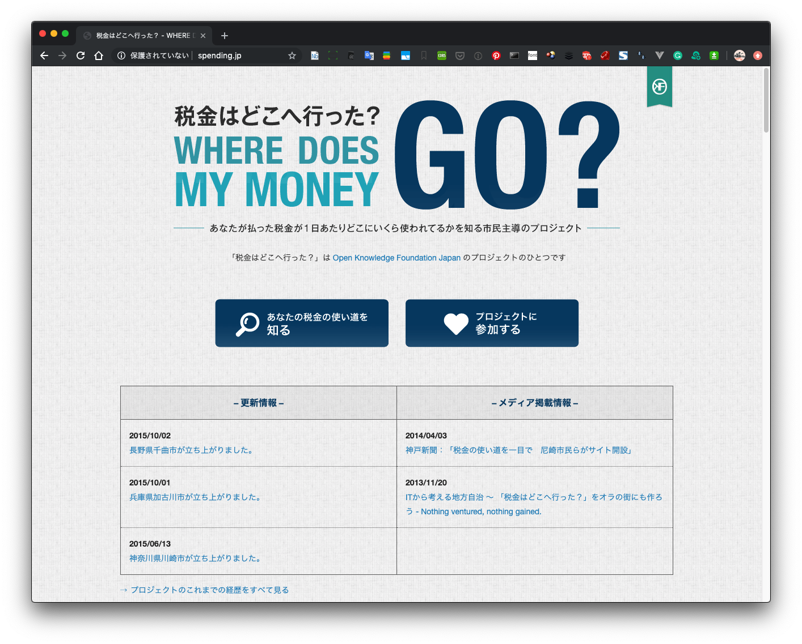

+++
author = "Yuichi Yazaki"
title = "国の事業予算の使いみちを全文横断検索できるサービス「JUDGIT!」"
slug = "judgit-overview"
date = "2019-08-25"
categories = [
    "article"
]
tags = [
    "",
]
image = "images/fi_JudgitOverview.png"
+++

※[Yahoo!ニュース個人掲載記事](https://news.yahoo.co.jp/byline/yazakiyuichi/20190815-00138538/)の転載です。

これまで検索が難しかった国の事業予算の使いみちを、全文横断で検索できるサービス「[Judgit](https://judgit.net/)」が登場した。これまで個別にExcelファイルを一ファイルづつ見ていくしかなかったところへ、どんな事業でどの省庁からどの企業へいくら支払われたのか、通常のウェブ検索の感覚で利用することができる。

仮説や切り口を持っている人のための**フリーワード検索**と**メタデータ検索**、仮説や切り口が思いつかないけど、データからなにか気づきや仮説自体を見つけられないかという人のための**クロスフィルター検索**の三種類の検索モードが用意されている。

報道機関による**ネガティブ・チェック機能**のためだけでなく、民間の企業や組織へ、どんな事業へいくら支払われているか**ポジティブ・チェック機能**にもなる。

海外でも同様の事例はある。代表的な事例として、アメリカとイギリスの事例を取り上げる。JUDGIT!と比較して、機能的には大きな違いはないが、特徴は異なる。**アメリカの事例**では、連邦政府や元MS CEOによる主導で、誰から得たお金を誰へ支払っている、という組織や人種が表立って登場していない。**イギリスの事例**は民間NPO主導で、数値をそのまま出すにとどまらず、自分の世帯年収（納税額）から換算した、自分に近い市民一人あたりどのくらいの金額が何に使われているのかを示すことによって、自分ゴト化を促している。

日本において、連綿と続く大小問わず**報道機関**の使命感ある営み、**中央政府**側のオープンデータ施策、行革、現在のデジタル・トランスフォーメーションにつながるデータ整備の流れ、**民間**のシビック・テックやガブ・テック系の活動や事例の増加という流れ、そういった個別の流れが織りなす時代の潮流の中の一つに、このJUDGIT!も位置づけられるのではないか。

以下、個別に詳細をみていこう。

## 国の事業予算の使いみちを、全文横断検索。

これまで検索が難しかった国の事業予算の使いみちを、全文横断で検索できるサービス「JUDGIT!」が登場した。これまで個別にExcelファイルを一ファイルづつ見ていくしかなかったところへ、どんな事業でどの省庁からどの企業へいくら支払われたのか、通常のウェブ検索の感覚で利用することができる。

国の各省庁が行う約5,000事業のほぼ全てについて「目的」「内容」「成果」「予算の支払い先」などを、一般の検索サイトと同様に誰もが調べることができる。

事業仕分けを開発・スタートした政策シンクタンクである**[構想日本](http://www.kosonippon.org/)**、ジャーナリズムNPOである**[ワセダクロニクル](http://www.wasedachronicle.org/)**、開発を主導した日本大学 情報科学科 **[尾上洋介研究室(vdslab)](https://vdslab.jp/)**と、データの可視化が専門の**[Visualizing.JP](https://visualizing.jp/)**によるプロジェクトだ（ディスクレイマー：筆者はVisualizing.JPの主宰者として本プロジェクトに関わっている）。

## フリーワード検索、メタデータ検索、クロスフィルター検索の三種類の検索モードが用意されている。

仮説や切り口を持っている人のための**フリーワード検索**と**メタデータ検索**、仮説や切り口が思いつかないけど、データからなにか気づきや仮説自体を見つけられないかという人のための**クロスフィルター検索**の三種類の検索モードが用意されている。

### フリーワード検索

フリーワード検索は、探したい事柄はあるが、それがどこの省庁で扱っているのか、どんな企業が受注しているのか、そういった予断なく探したい人のためのものだ。

フリーワード検索が行えるのは、[トップページの検索欄](https://judgit.net/)および「[行政事業](https://judgit.net/projects)」（やわらかい言葉でいえばプロジェクト・ベース）検索ページだ。

行政事業レビューシート全体からフリーワードで検索を行う。

### メタデータ検索

メタデータ検索は、探したい事業の輪郭がわかっている人のためのものだ。

メタデータ検索が行えるのは「[主要支出先](https://judgit.net/payees)」（支払先）「[府省庁別](https://judgit.net/ministries)」（支払元）「[主要施策別](https://judgit.net/categories)」検索ページだ。

検索対象をメタデータに限定することで、見つけやすさを向上させることができる。たとえば「主要支出先」ページで「オリンピック」と検索すると、支出先名称に「オリンピック」が含まれているもののみがヒットする。

### クロスフィルター検索

クロスフィルター検索は、仮説や切り口が思いつかないけど、データ自体からなにか気づきや仮説自体を見つけられないかという人のためのものだ。

クロスフィルター検索が行えるのは[「行政事業」検索ページ内の「グラフで検索タブ」](https://judgit.net/projects#chart)だ。

棒グラフにて、府省庁・会計区分・主要施策・予算最少額の傾向を把握できる。同時に棒グラフ自体が、絞り込むためのユーザー・インターフェイスになっている。クリックすると、その内容でフィルターされた結果が、棒グラフでその場で確認できる。

試しに「府省庁」→「主要施策」で絞り込んでみて、一旦リセットし、今度は「主要施策」→「府省庁」で絞り込んでみてほしい。前者は「府省庁」ごとの事業の傾向をまず把握し、そこから詳細を探索することができる。後者はその「主要施策」がどういった府省庁で行われているのかを把握し、そこから詳細を探索することができる検索の仕方だ。静止画のチャートはたいてい何らかの方法で集計されてしまっている。その集計のくびきからデータを解き放ち、見る人に集計の切り口や順番を委ねることができるのがこの見せ方の特徴だ。

## ネガティブ・チェックとしてだけでなく、ポジティブ・チェックにも活用できる。

報道機関によるネガティブ・チェック機能のためだけでなく、民間の企業や組織へ、どんな事業へいくら支払われているかポジティブ・チェック機能にもなる。

### 報道機関によるネガティブ・チェックに

良くも悪くも、世に炎上のネタはつきない。その際、関連する事業や組織への受注状況を手早く調べることができる。見つかるはずのものが見つからない場合はデータクレンジングやデータソースの問題である可能性もあるので、[事務局へ連絡を](https://judgit.net/contact)。

コストパフォーマンスという言葉があるように、費用と成果のバランスが大事なのであって、国の予算が支払われたこと自体が悪ではない。ただ、数値やデータを参照しないままでは、見えない幽霊と格闘するようなものなので、そうでなくてエビデンスの一つとして活用してほしい。これをルサンチマン生成システムにしないためには、活用のされ方にかかっている。少なくとも、ルサンチマン生成を助長するようなサービスの作りにはなっていないはずだ。

もちろんここで掲載されているデータや情報でワンストップで取材が完結するものではなく、情報ソースの一つとしてという前提。ホテルのルームサービスのようにすべてを肩代わりしてくれるものでは、そもそもない。

### 事業者によるポジティブ・チェックに

一方で、ポジティブ・チェックに活用することもできる。どういうことか。

たとえば、大企業に所属している方であれば自社名で検索してみると、自分の知らなかった事業を自社で受注していることを知ることができる。

もしくは自社の事業ドメインで、どんな事業に国からいくらくらいの規模の予算がついているのかを検索することもできる。

これらの情報を自らの事業へ活用することが可能で、たとえば、これまで情報の非対称性から入札に慣れた事業者のみが定常的に落札していた案件に、健全な競争原理を支援することにつながる。

### 報道機関や事業者以外の市民にも

JUDGIT!自体は無料のサービスで、誰でも利用することができる。ただ、たとえばいきなり一般の方が自分の時間を使って自ら調べるということも、ゴールがないので考えづらい。

報道機関や事業者、デザイナーやエンジニアによる創作が広がっていくことによって、生のデータベースの周囲に、二次コンテンツ圏とよべるものが広がっていけば、そこにあるストーリーを一般の方が楽しむ、ということは考えられるし、そこを支援できたらと運営団体としても、個人的にも考えている。

## 海外での事例

海外でも同様の事例はある。以下、代表的な事例として、アメリカとイギリスの事例を取り上げる。

JUDGIT!と比較して、機能的には大きな違いはないが、特徴は異なる。アメリカの事例では、連邦政府や元MS CEOによる主導で、誰から得たお金を誰へ支払っている、という組織や人種が表立って登場していない。イギリスの事例は民間NPO主導で、数値をそのまま出すにとどまらず、自分の世帯年収（納税額）から換算した、自分に近い市民一人あたりどのくらいの金額が何に使われているのかを示すことによって、自分ゴト化を促している。

### アメリカの事例

[USAspending.gov](https://www.usaspending.gov/)

アメリカ連邦政府公式の決算情報を公開しているサイト。Spending Explorerから、お金の使いみちを、施策別、省庁別、購買サービス・商品別に、ツリーマップ形式で見ていくことができるほか、フリーワード・メタデータ検索であるAward Search、組織や団体を切り口にみていくProfilesが用意されている。

[USAFacts | Non-partisan Government Data](https://usafacts.org/)

元マイクロソフトCEOのスティーブ・バルマー氏が自費を投入して構築したサイト。お金の入と出、人口動態、（その結果、国がどういう状態かという）メトリックス、アニュアルレポートで構成されている。お金の入と出がシンプルなチャートで表現されている。

[スティーヴ・バルマーがつくる、「米政府の財政データ」を視覚化する美しきウェブサイト｜WIRED.jp](https://wired.jp/2017/06/05/usafacts-smart-design/)

初めてプロジェクトが公にされたのはおそらく2016年11月の下記報道で、サービス公開自体はトランプ政権発足後だが、以前の問題意識から数年前から取り組んでいだようだ。

[Steve Ballmer’s Plan to Make America Great Involves Excel Spreadsheets - Bloomberg](https://www.bloomberg.com/news/articles/2016-11-07/steve-ballmer-s-plan-to-make-america-great-involves-excel-spreadsheets)

特徴的なのは、どんな分野から入と出があるかは示されているが、誰から誰へという組織や人種が登場しないこと。そもそもマクロなお金の使い道をざっくり認識するためのものとして詳細を省いたともいえるし、「誰」が扱われた瞬間、議論が別な方向で進んでいくことを抑制しているとも受け取れそうだ。

### イギリスの事例

[Welcome - Where Does My Money Go?](http://app.wheredoesmymoneygo.org/)

政府側のサービスとしてではなく、民間NPO団体主導で同様のサービスが2009年に作られた。NPO団体Open Knowledge Foundationが2009年に初めて公開した、政府予算の使いみちを可視化したサイト。

当初のヴァージョンは、支払った税金のうち、一世帯あたりいくら支払ったものが何に使われているかを示すことによって「自分ゴト化」を促すつくりになっていた。

上記サイトのソースコードを元に日本版が盛んに作られた。今でも日本語でみることができる。

[税金はどこへ行った？ - WHERE DOES MY MONEY GO? -](http://spending.jp/)

現在は活発な活動にはなっておらず、データの更新状況自体は各自治体版ごとにマチマチのはずだ。最終的に173基礎自治体まで広がったこのムーブメントは、日本における初期のシビック・テック活動の中心の一つであった。

イギリス版に話を戻すと、現在のヴァージョンは、おそらくデータフォーマットが共通化していることで全世界を横断検索できるOpenSpendingというサイトと、そのイギリス版という位置づけのWhere Does My Money Go?というというサイトの二層構成になっている。

## 日本におけるここまでの流れ

日本において、連綿と続く大小問わず報道機関の使命感ある営み、中央政府側のオープンデータ施策、行革、現在のDX（デジタル・トランスフォーメーション）につながるデータ整備の流れ、民間のシビック・テックやガブ・テック系の活動や事例の増加という流れ、そういった個別の流れが織りなす時代の潮流の中の一つに、このJUDGIT!も位置づけられるのではないか。

そんなふうに筆者が認識できたのは、オープンデータ伝道師として著名な庄司昌彦さんがFacebookにこんな投稿をされているのを読んだからだ（公開範囲を限定した投稿を、許可を得て転載）。

> とても良い。課題はまだまだあるけど、こういうことができるようになったのはほんとうに感慨深い。
> 
> ここまでくるには長い長い道のりがあったといえる。行政事業レビューはまさに構想日本の事業仕分けから始まったものだし、民主党政権時代にそれを取り入れパフォーマンスを批判されながらも裏側でオープンガバメント・オープンデータ的要素を取り入れてくれた蓮舫議員などの貢献も大きい。そして、民主党政権の代名詞ともいえる事業仕分けを行政事業レビューとして改良し維持発展してくれた自民党の行革系の方々がいて、「税金はどこへ行った」などのシビックテック系の活動があって、調達情報や法人番号などの裏側のデータ整備やデータ連携を進めた電子政府関係の方々の仕事があって、そして、このサイトを作った人たちの仕事があって…。

出典:[https://www.facebook.com/mshouji/posts/10157480939181823](https://www.facebook.com/mshouji/posts/10157480939181823)
