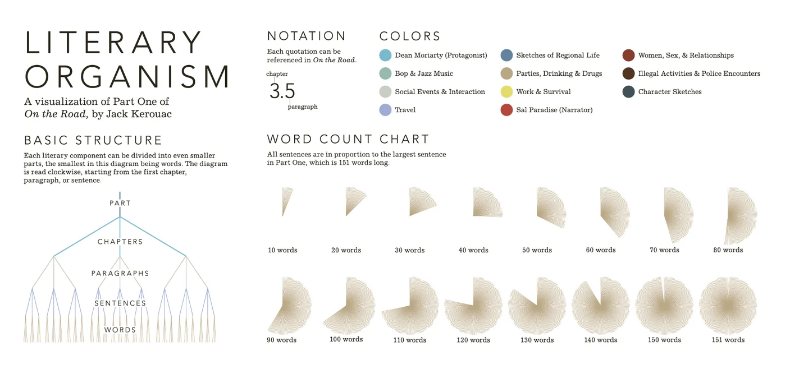

+++
author = "Yuichi Yazaki"
title = "Stefanie Posavec's Visualization of On the Road"
slug = "literary-organism"
date = "2025-10-03"
description = ""
categories = [
    "consume"
]
tags = [
    "言葉","オリジナルのビジュアル変換"
]
image = "images/cover.png"
+++

This work is part of **Writing Without Words**, a project by graphic designer **Stefanie Posavec**. Posavec sought to transform text from something only read into something also seen, treating style, rhythm, theme, and structure as data.

The piece introduced here, **Literary Organism**, visualizes Jack Kerouac's *On the Road* as a literary body.

<!--more-->

## About *On the Road*

- Author: Jack Kerouac (1922-1969)
- Original title: *On the Road*
- Subject: the travels of Sal Paradise and Dean Moriarty across the United States by car, bus, and hitchhiking

The novel is closely associated with the Beat Generation, road narratives, jazz-like prose rhythm, and postwar counterculture.

## How to Read It

### 1. Basic Structure

The text is decomposed hierarchically:

**Part -> chapter -> paragraph -> sentence -> word**

The form radiates outward from the center, and the story can be followed clockwise.

### 2. Notation

Sentences and paragraphs are indexed by chapter and paragraph number. For example, `3.5` means the fifth paragraph of chapter 3.

### 3. Colors

Colors indicate themes and content categories, including Dean Moriarty, bop and jazz music, social events, travel, regional life, parties, work and survival, Sal Paradise, relationships, illegal activity, and character sketches.

### 4. Sentence Length

Each sentence is represented by a wedge proportional to word count. The longest sentence has 151 words, and the legend marks the scale in 10-word increments.

## Process and Intent

Writing Without Words began as Posavec's MA research. She collected and drew much of the data by hand, emphasizing the labor and human presence behind the visualization.

The project uses quantitative data, but its aim is not detached measurement. It creates an emotional and structural encounter with literature.

## Summary

Posavec's literary visualization opens another way to experience *On the Road*. The rhythm, themes, and movement of the novel become visible, turning reading into a form of looking.

## References

- [Writing Without Words — Stefanie Posavec](https://www.stefanieposavec.com/archive/writing-without-words)
- [TextArc — W. Bradford Paley](https://history.siggraph.org/artwork/w-bradford-paley-textarc/)
- [Writing Without Words — Archive of Digital Art](https://digitalartarchive.at/database/work/3358/)
