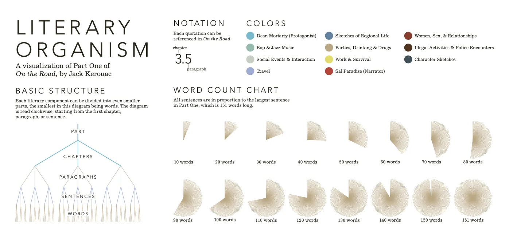

+++
author = "Yuichi Yazaki"
title = "Stefanie Posavec による「路上(On the Road)」の可視化"
slug = "literary-organism"
date = "2025-10-03"
description = ""
categories = [
    "consume"
]
tags = [
    "言葉","オリジナルのビジュアル変換"
]
image = "images/cover.png"
+++

この作品は、グラフィックデザイナー Stefanie Posavec（ステファニー・ポサベック） によるプロジェクト Writing Without Words の一環として制作されたものです。

Posavec は、テキストを「読む」だけでなく「見る」体験に変換することを目指し、文体・リズム・テーマをデータとして可視化しました。本記事で紹介する **Literary Organism** はその代表例で、ジャック・ケルアックの小説「路上」(原題 "On the Road") を「文学的有機体(Literary Organism)」として表現しています。

<!--more-->

## 「路上」とは？

- 著者：ジャック・ケルアック（1922–1969）
- 原題：On the Road
- 内容：主人公サル・パラダイスとディーン・モリアーティが、車やヒッチハイクでアメリカを横断する放浪の旅を描く小説。

### 日本でのイメージ
- ビート・ジェネレーションの代表作として「反体制的・自由な青春の象徴」
- 「ロードムービー的冒険」としての旅の物語
- ジャズの即興演奏のようなリズムを持つ文体
- 1960年代以降、日本の若者文化やカウンターカルチャーに大きな影響を与えた作品

## 図解の見方

### 1. 基本構造
- テキストは PART（部） → CHAPTERS（章） → PARAGRAPHS（段落） → SENTENCES（文） → WORDS（単語） へと階層的に分解。
- 中心から外へ放射状に広がり、時計回りに読むことで物語の流れを追うことができます。

### 2. 記法（Notation）
- 図上の文や段落は「章番号.段落番号」で対応。
- 例：3.5 → 第3章の第5段落。

### 3. 色分け（Colors）

内容やテーマに応じた色の凡例（英語＋日本語併記）：

- **Dean Moriarty (Protagonist)** / 主人公ディーン・モリアーティ … 青緑
- **Bop & Jazz Music** / ボップとジャズ音楽 … 水色
- **Social Events & Interaction** / 社会的出来事と交流 … 灰色
- **Travel** / 旅 … 薄紫
- **Sketches of Regional Life** / 地域生活のスケッチ … 薄青
- **Parties, Drinking & Drugs** / パーティ・酒・ドラッグ … 黄土色
- **Work & Survival** / 労働と生存 … 黄色
- **Sal Paradise (Narrator)** / 語り手サル・パラダイス … 赤
- **Women, Sex, & Relationships** / 女性・性愛・人間関係 … 赤茶
- **Illegal Activities & Police Encounters** / 非合法行為と警察との遭遇 … 茶色
- **Character Sketches** / 人物描写 … 黒青

### 4. 文の長さ（Word Count Chart）

- 各文は「語数」に比例した扇形で表現。
- 最長は151語で、10語ごとに凡例が用意されており、文体のリズムを視覚的に捉えられます。

## 制作背景と意図（Posavec の説明より）

- プロジェクト Writing Without Words は、Posavec が MA（修士課程）で制作した研究成果。
- **対象データ** ：文の長さ、テーマ、品詞、句読点、文構造など。
- **制作方法** ：コンピュータではなく手作業でデータ収集・描画を行い、グラフィックデザインの「労働性」と「人間的な介在」を重視。
- **目的** ：定量的データに基づく客観性を持ちながら、作品に感情的なつながりを宿すこと。

## まとめ

Posavec の「文学を視覚化する試み」は、単なるデータ可視化にとどまらず、文学鑑賞の新しい扉を開いています。
「路上」が持つリズム・テーマ・旅のスピリット が、図解を通して「読む」から「見る」へと変換されるとき、私たちは物語をもう一度違う角度から体験することができるのです。

## 参照リンク

- [Writing Without Words — Stefanie Posavec](https://www.stefanieposavec.com/archive/writing-without-words)
- [TextArc – W. Bradford Paley (SIGGRAPH Archive)](https://history.siggraph.org/artwork/w-bradford-paley-textarc/)
- [Writing Without Words — ADA | Archive of Digital Art](https://digitalartarchive.at/database/work/3358/)

