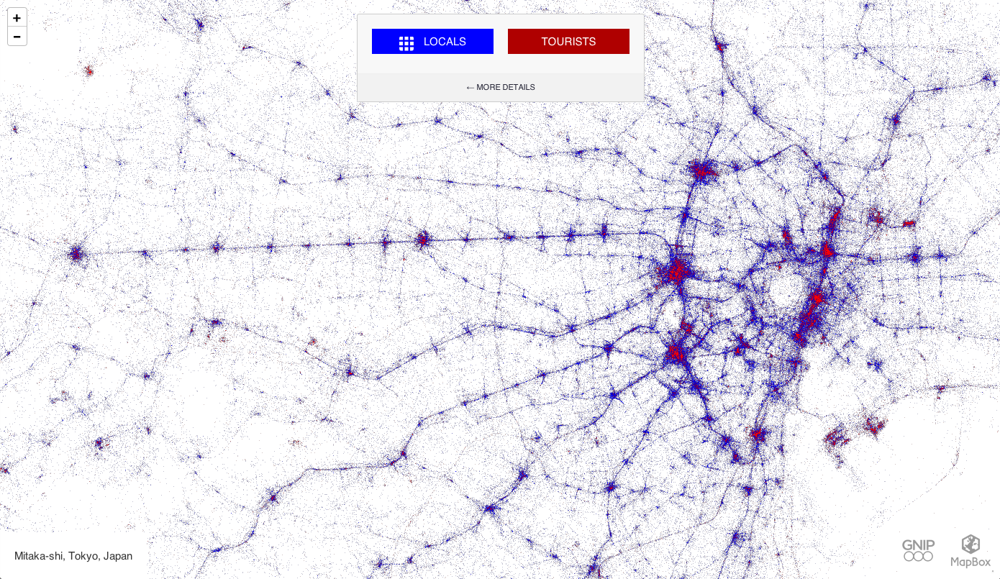
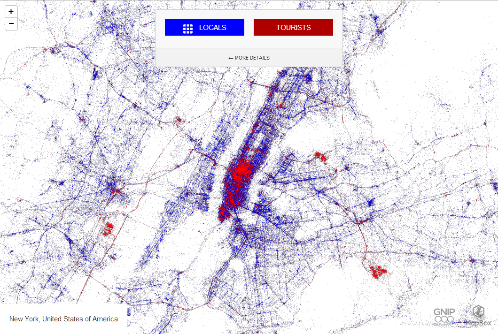
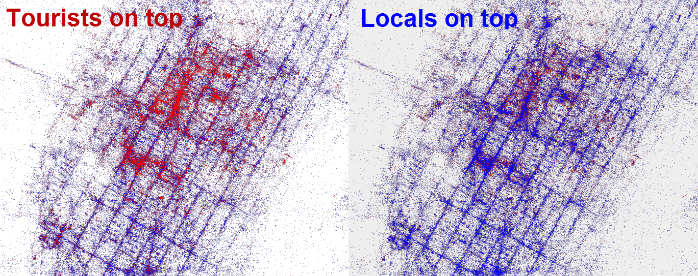

+++
author = "Yuichi Yazaki"
title = "Comparing the Behavior of Locals and Tourists Through Tweets"
slug = "locals-and-tourists"
date = "2025-11-20"
categories = [
    "consume"
]
tags = [
    "",
]
image = "images/tokyo.png"
+++

This work is part of the "Locals & Tourists" project by data artist Eric Fischer, created with support from Mapbox and the Twitter data provider Gnip.

> Note  
> The original online version at `labs.mapbox.com/labs/twitter-gnip/locals/` currently fails to render the map. At the time, the interface allowed users to switch interactively among cities around the world. As of 2024-2025, the work is mainly accessible through archived images and screenshots.

Using a large volume of geotagged tweets from around 2011 to 2013, the project compared the behavior of locals and tourists in cities around the world. The image shown here is the view around Tokyo.

<!--more-->

## Overview

On the map, blue points represent locals and red points represent tourists. By looking at the density and distribution of the points, the viewer can see everyday activity zones and tourist zones within a city. The original interface allowed comparisons among Tokyo, New York, London, San Francisco, and many other cities.

## How to Read It

The visualization removes most basemap detail and draws only tweet locations on a pale map. The information comes from color and spatial distribution.

- **Blue points (Locals)**  
  These are tweets by users who tweeted continuously in the city for more than one month. In the Tokyo view, blue points often form linear patterns along railways and commuting corridors, revealing everyday movement patterns.

- **Red points (Tourists)**  
  These are tweets by users who were local to another city and stayed in the target city for less than one month. In Tokyo, red points cluster around places such as Asakusa, Shibuya, Shinjuku, Akihabara, Ginza, and Tokyo Disney Resort.

- **Density and pattern**  
  Dense point clusters indicate active tweeting locations. Comparing blue and red reveals whether a place is used by both residents and visitors, or whether it is mainly a tourist hotspot.

## Background

According to Mapbox's blog, the project used roughly three billion tweets, mainly geotagged tweets from September 2011 to May 2013. Fischer classified users using location and time: long-term presence indicated locals, while short-term presence by people local elsewhere indicated tourists.

This made it possible to create a global visualization of local and tourist spatial distributions. The Tokyo view is one example. Comparing it with other cities reveals differences in tourism concentration, business districts, transportation infrastructure, and urban form.

Related projects using the same interface included "Languages of Twitter" and maps of phone brands, making this series a representative example of urban visualization using social media data.

## Color and Category

| Color | Category | Classification idea |
|---|---|---|
| Blue | Locals | Users tweeting continuously in the same metropolitan area for more than one month |
| Red | Tourists | Users tweeting in the city for less than one month and local to another city |
| White background | Basemap | Minimal geographic context so tweet distribution forms the city shape |

## Summary

"Locals & Tourists" visualizes how cities are used through social media traces. The Tokyo view contrasts local activity along rail and daily movement corridors with tourist activity around well-known destinations. Comparing multiple cities suggests uses in tourism policy, urban planning, and place branding.

## References

- [Mapbox Labs - Locals & Tourists](https://labs.mapbox.com/labs/twitter-gnip/locals/)
- [Mapbox Blog - Visualizing 3 Billion Tweets](https://blog.mapbox.com/visualizing-3-billion-tweets-f6fc2aea03b0)
- [Wikimedia Commons - Locals and Tourists (Tokyo)](https://commons.wikimedia.org/wiki/File:Locals_and_Tourists_(Tokyo)_as_an_interactive_web_map_(9083255893).png)
