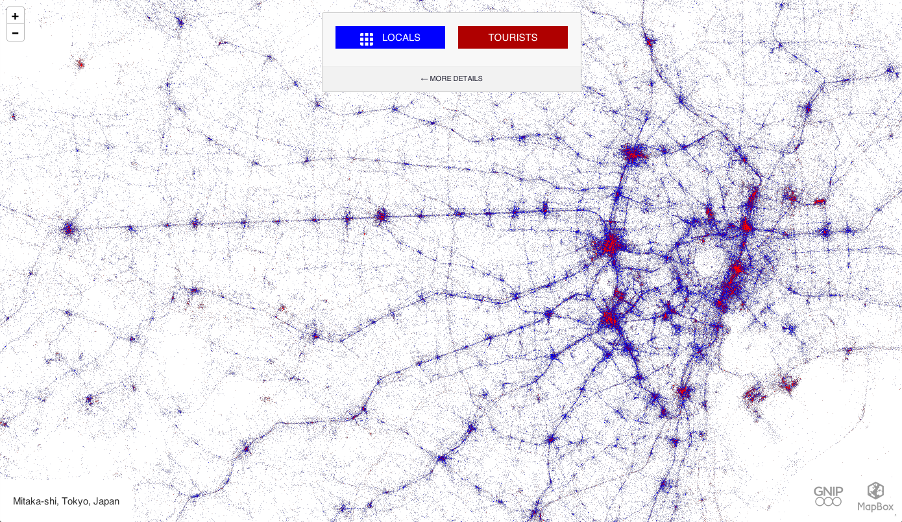
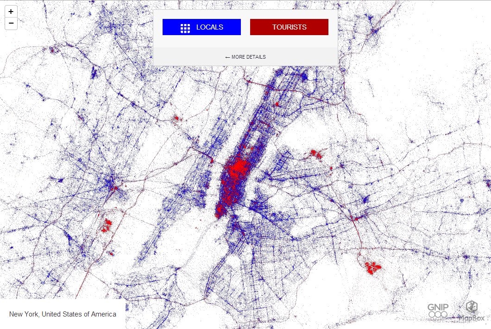
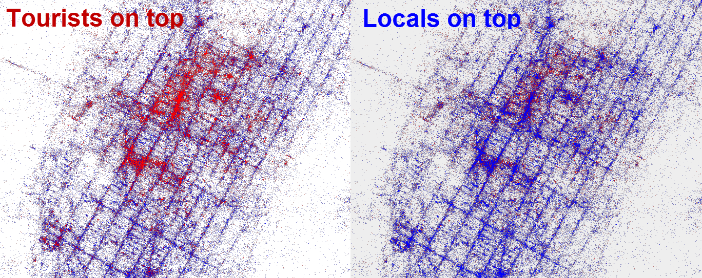

+++
author = "Yuichi Yazaki"
title = "Locals & Tourists"
slug = "locals-and-tourists"
date = "2025-11-20"
categories = [
    "consume"
]
tags = [
    "",
]
image = "images/tokyo.png"
+++

この作品は、Mapbox と Twitter データ提供会社 Gnip の協力により、データアーティスト Eric Fischer 氏が制作した「Locals & Tourists」プロジェクトの一部です。

> 注意
> **現在、公式のオンライン版（labs.mapbox.com/labs/twitter-gnip/locals/）はエラーが発生しており、地図が描画されない状態となっています。**
> 当時はインタラクティブに世界中の都市を切り替えて閲覧できましたが、2024〜2025年時点では動作しないため、現在はアーカイブ画像やスクリーンショットでしか内容を確認できません。

2011年から2013年ごろの膨大なジオタグ付きツイートを用いて「世界中の都市」を対象に、各都市での地元住民（Locals）と観光客（Tourists）の行動を比較できるインタラクティブ地図として公開されています。表示画像はそのうちの「東京周辺」のビューです。

<!--more-->

## 概要

地図上の **青い点が Locals**、**赤い点が Tourists** を表し、点の密度と分布から、都市内の生活圏と観光圏を一望できるのが特徴です。インターフェイス上では都市を切り替えながら閲覧でき、東京以外にも、ニューヨーク、ロンドン、サンフランシスコなど世界各地の都市を比較できます。

## チャートの見方

この可視化は、ほぼベースマップの要素を排し、白地図の上にツイートの位置だけを点で描いた「ドットマップ」です。色と分布を見ることで情報を読み解きます。

- **青の点（Locals）**  
  - ある都市で「1か月以上」にわたり継続的にツイートしている利用者が、その都市で投稿したツイートです。  
  - 東京版では、鉄道路線や通勤・通学の動線に沿って青い点が筋状に伸び、日常生活の移動パターンを示しています。 

- **赤の点（Tourists）**  
  - 普段は別の都市でローカルとみなされている利用者が、その都市に「1か月未満だけ」滞在して投稿したツイートです。  
  - そのため、浅草、渋谷、新宿、秋葉原、銀座、東京ディズニーリゾート周辺など、観光・ショッピング・イベント拠点に赤い点が集中的に現れます。

- **点の密度とパターン**  
  - 点が密集している場所ほどツイート活動が活発であり、生活の「幹線」となる交通軸や、観光客が集中する「ホットスポット」が浮かび上がります。
  - 青と赤のバランスを見ることで、「地元民もよく行く観光地」なのか、「観光客だけが集まる場所」なのか、といった性格の違いを読み取ることができます。

このように、凡例は単純ですが、都市の構造や人の流れを多面的に読み取れるチャートになっています。

## 背景知識

Mapbox の公式ブログによると、このプロジェクトでは **約30億件のツイート** が使われており、2011年9月から2013年5月ごろまでのジオタグ付きツイートが解析対象とされています。

Fischer 氏は、位置情報と時間情報を用いて、「長期滞在者＝Locals」「短期滞在者＝Tourists」というルールでユーザーを分類し、その結果を世界地図上に重ね合わせました。こうして、各都市についてローカルとツーリストの空間分布を比較できる「世界規模の可視化」が実現しています。

東京版はその中の一例であり、他都市と並べて見ることで次のような比較が可能です。

- ニューヨークやロンドンのように観光とビジネスが集中する都市との違い
- 観光客が特定のエリアに偏る都市と、広く分散する都市の違い
- 鉄道・道路インフラとツイート分布の関係

また、このシリーズには、同じインターフェイス上で Twitter の言語分布を可視化した「Languages of Twitter」、スマートフォン機種ごとの利用分布を表した「Phone brands」などの関連プロジェクトもあり、ソーシャルメディアデータを用いた都市可視化の代表的事例とされています。

## 表：色とカテゴリの対応

| 色 | カテゴリ | 判定の考え方（要約） |
|----|----------|----------------------|
| 青 (Locals) | 地元住民（ローカル） | 同じ都市圏で1か月以上継続的にツイートしているユーザー |
| 赤 (Tourists) | 観光客・来訪者 | その都市では1か月未満しかツイートしておらず、別の都市でローカルとみなされるユーザー |
| 背景の白 | ベースマップ | 地形や道路は最小限に抑え、ツイートの分布自体を都市の「かたち」として見せる |

## まとめ

「Locals & Tourists」プロジェクトは、東京だけでなく世界中の都市を対象に、SNS データから都市の使われ方を描き出した大規模な可視化シリーズです。東京版のビューはその一部であり、鉄道網に沿ったローカルの活動と、観光地に集中するツーリストの動きを対比して見せてくれます。複数都市を並べて比較することで、観光政策や都市計画、ブランド戦略など、さまざまな分野への応用が考えられる作品だといえます。

## 参考・出典

- [Mapbox Labs – Locals & Tourists](https://labs.mapbox.com/labs/twitter-gnip/locals/)
- [Mapbox Blog – Visualizing 3 Billion Tweets](https://blog.mapbox.com/visualizing-3-billion-tweets-f6fc2aea03b0)
- [Wikimedia Commons – Locals and Tourists (Tokyo)](https://commons.wikimedia.org/wiki/File:Locals_and_Tourists_(Tokyo)_as_an_interactive_web_map_(9083255893).png)
