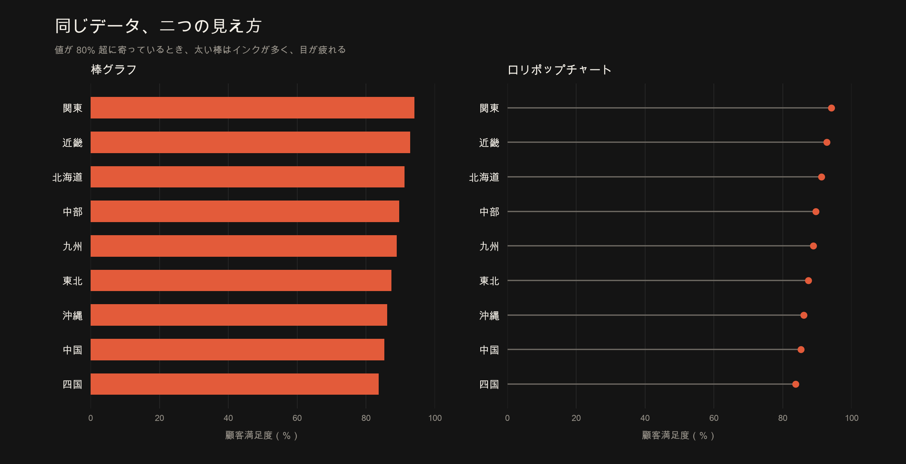
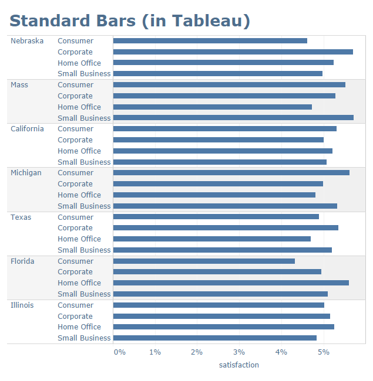
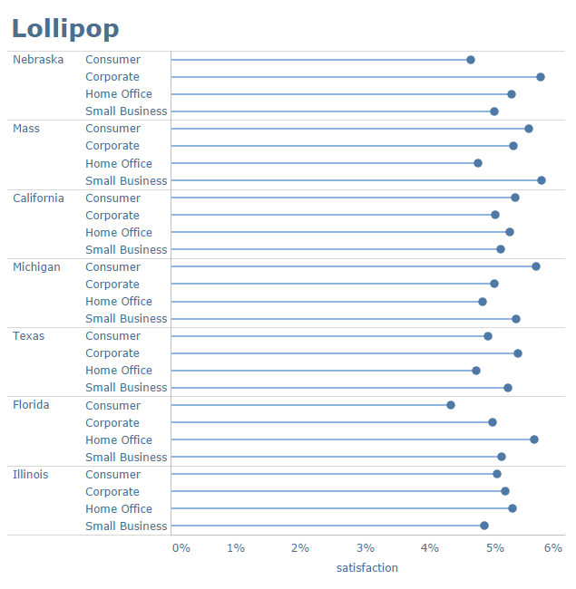
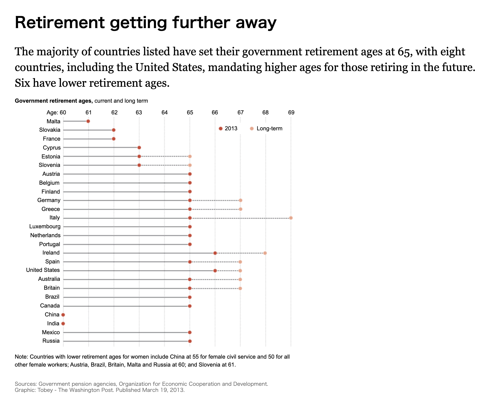
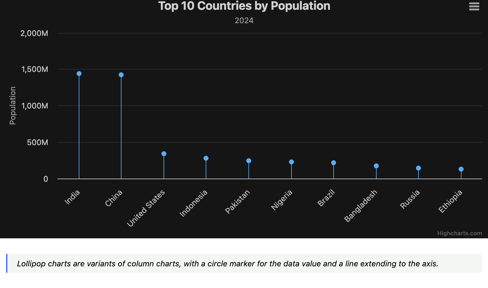

+++
author = "Yuichi Yazaki"
title = "ロリポップチャートは、誰が何のために作ったのか"
slug = "lollipop-chart"
date = "2026-08-18"
description = "名前を付けて広めたのは Andy Cotgreave（2011）。目的は「値が高く、棒が長く並ぶ棒グラフ」のインク過多と見にくさを減らすこと。形そのものは Cleveland のドットチャートに先行例がある。"
categories = [
    "chart"
]
tags = [
    "",
]
image = "images/cover.png"
+++

ロリポップチャート（Lollipop Chart）は、棒グラフの太い棒を細い線（スティック）に置き換え、値の位置を円（キャンディ）で示すチャートです。機能は棒グラフと同じで、カテゴリごとの量を比較します。

いまこの名前で呼ばれるようになったきっかけは、2011年3月、当時 The Data Studio（InterWorks）にいた **Andy Cotgreave** の一連のブログです。彼が解こうとしていた問題は、新しいデータ構造の発明ではなく、**値がどれも高く、長い棒が何本も並ぶ棒グラフが「見づらい」**ことでした。

ただし、ゼロ基準から点まで線を伸ばす表現は、Cotgreave より四半世紀前に **William S. Cleveland** がドットチャートの一種として書いています。正確に言うと、Cotgreave は「発明者」というより、**名前を付け、用途を定め、Tableau コミュニティ経由で普及させた人**です。

<!--more-->

値が 80% を超えて並ぶ架空の満足度データ。左の棒グラフはインクが多く、右のロリポップは値の位置を円で示す。

## 別名

- Lollipop Plot
- 棒グラフとドットプロットのハイブリッド（説明用の呼び方）

数学のグラフ理論にある lollipop graph（完全グラフに道を付けた形）は別物です。Stephen Few も、Cotgreave がこの用語をデータ可視化に転用した時点では、その数学用語を知らなかったと書いています。

## 歴史的経緯

### 1984–1985：Cleveland のドットチャート

統計学者 William S. Cleveland は、1984年の論文 *Graphical Methods for Data Presentation: Full Scale Breaks, Dot Charts, and Multibased Logging*（*The American Statistician*）で、ラベル付き数値を示す手法として **dot chart（ドットチャート）** を提案しました。棒グラフの代替であり、量は点の位置で読む、というのが本筋です。

翌1985年、Cleveland と Robert McGill の *Graphical Perception and Graphical Methods for Analyzing Scientific Data*（*Science*）には、いまのロリポップにかなり近い記述があります。

> When the baseline for the graph is zero [...], the dotted lines can end at the data dots; the data can be visually decoded by judging the positions of the data dots along the horizontal scale **or by judging the lengths of the dotted lines**.
>
> （基準線がゼロのとき、点線はデータ点で止めてよい。点の位置でも、点線の長さでも値を読める）

逆に、ゼロ（または意味のある基準）がないときは、線を点で止めず、プロット領域全体に通すべきだ、とも書いています。点で止めると、線の長さが意味のない量を符号化してしまうからです。

つまり1980年代すでに、

- **ゼロ基準あり** → 点まで線を伸ばしてよい（長さでも読める）
- **ゼロ基準なし** → 線は点を越えて全体に通す（位置だけで読む）

という使い分けが、一次文献にあります。後者はいわゆる Cleveland のドットプロット、前者は見た目としてロリポップに近いものです。

### 2004頃：Few は「名前が付く前」から警告していた

Stephen Few は 2017年の記事で、この形は Cotgreave が名付ける前から現場にあり、自分は 2004年から *Show Me the Numbers* の講座で使わないよう教えてきた、と書いています。Excel のドロップラインなどで、点までしか届かない線が簡単にできてしまう、というのが彼の見立てです。これは Few 自身の回想なので、講座資料そのものまでは確認できていません。ただし「名前の誕生」と「図法の誕生」を分けて考える材料にはなります。

### 2011年3月：Cotgreave が名前を付け、用途を書いた

2011年3月10日、Cotgreave は *Lollipop charts: the search for the perfect mark (part one)* を公開します。続く3月17日の *Lollipop charts: part two* が、いまも読める一次資料です。当時は Tableau 6 のデュアル軸で、細い棒と円を重ねて作っていました。

Part two の書き出しは、目的をはっきり述べています。

> I explained how I stumbled across the lollipop chart as a way of displaying data **when the values are all very high**.
>
> （値が高いとき、つまり棒がみな長いときに使う見せ方として、ロリポップに行き当たった）

2012年、Applied Visual Analytics の Ben Jones は、当時まだ残っていた Part one から特徴を引用しています。

1. すべてのカテゴリの値が高い（棒が長い／高い）ときに使える
2. 軸ラベルとの対応を保ったまま、データインク比を大きく下げられる
3. 見せた人は「きれい」かつ「読みやすい」と感じた
4. 次元を足してスモールマルチプルにしても成立する

2017年、Stephen Few がロリポップを「形の崩れた棒グラフ（malformed bar graph）」と呼んだあと、Cotgreave は *Lollipop charts, revisited* で当時の問題設定を再掲します。

> Problem: A bar chart with many bars of a long length are unpleasant to look at.

太い棒はインクが多すぎる。細い線だけだと輪郭が弱い。ロリポップはそのあいだの妥協だ、というのが本人の説明です。Few が使った「値の幅が大きく、本数の少ない棒グラフ」は、自分が解こうとした状況ではなかった、とも書いています。

同じ記事の脚注で、Cotgreave は発明者かどうかにも触れています。

> Did I invent lollipop charts? Alberto Cairo credited me with their invention in his book *The Truthful Art*, and I’m not going to argue against that!

Cairo の *The Truthful Art*（2016）の本文は、もう少し慎重です。「発明した」ではなく、**この呼び方を付けたのは Cotgreave だと思う**、と書いています。

> I think that it was Tableau’s visualization designer and data analyst Andy Cotgreave who came up with this term.

整理すると、

| 何が起きたか | 誰 | いつ |
|---|---|---|
| ゼロ基準なら点まで線を伸ばしてよい、と書いた | Cleveland | 1984–1985 |
| 「ロリポップチャート」と名付け、高い値が並ぶ棒グラフの代替として普及させた | Cotgreave | 2011 |
| その呼び名を著書で紹介した | Cairo | 2016 |
| 棒グラフの劣化形だと批判した | Few | 2017（講座では2004から、と本人談） |

### その後の定着

名前が付くと、ツールに載ります。

- Tableau 公式ブログ（2017）は、Cotgreave のチュートリアルを直接の起点として紹介しています。
- R の `ggalt::geom_lollipop()`（Bob Rudis）は、ヘルプに *“the creation of Andy Cotgreave going back to 2011”* と書いています。
- Highcharts は専用シリーズ `lollipop` を持ち、公式ドキュメントの用途説明は Cotgreave とほぼ同じです。値がレンジの約90%に寄っているとき、モアレを避け、見た目の攻撃性を下げる、とあります。

## データ構造

棒グラフと同じです。カテゴリと、1つの数値。

| カテゴリ | 値 |
|----------|------|
| 国A | 92 |
| 国B | 88 |
| 国C | 85 |

値が2点ある（前年と今年、男性と女性など）なら、ロリポップではなくレンジプロット／ダンベルチャートの領域です。

## 目的

Cotgreave 自身の目的は、次の一点に尽きます。

**値が高いカテゴリが多数並ぶとき、太い棒のインクと圧迫感を減らしつつ、ラベルと値の対応は残す。**

冒頭の比較図が、その問題設定そのものです。棒は長さで量を伝えますが、値が上限付近に寄ると、画面の大半が塗りつぶされます。ロリポップは棒を線に削り、円で値の位置を残します。

彼が Part two で書いた利点は、見た目だけではありません。

> I’ve started using this technique regularly as it engages users, and improves the data-ink ratio without sacrificing interpretation.
>
> （ユーザーが食いつき、解釈を犠牲にせずデータインク比が上がる）

Cairo は Few の記事へのコメントで、別の言い方もしています。棒が8〜9本を超えると忙しく見えることがあり、ロリポップは棒のあいだの余白を増やせる。円の中心で値を示すのはやや不正確だが、円を小さくするか、円の端で値を示す工夫はできる。細い棒だけでもよいが、先端の円があると値の位置を探しやすい、という立場です。

## ユースケース

向くのは、Cotgreave / Highcharts が書いた条件に近いときです。

- 値がレンジの上限付近に集まり、棒がどれも長い（例：達成率 80〜95%）
- カテゴリ数が多く、太い棒だと画面がインクで埋まる
- スモールマルチプルで、同じ形を繰り返したい
- 棒の先端にラベルやアイコンを置きたい（Tableau では円を Shape に替える例もある）

向かないのは、Few と Andy Kriebel が指摘した条件です。

- 値の幅が大きく、本数が少ない（普通の棒グラフで足りる）
- 軸がゼロから始まっていない（スティックの長さが量を偽る）
- 長さのごく小さな差を精密に比べたい（棒の端面のほうが読みやすい）

## 特徴

| 視点 | 内容 |
|------|------|
| 強み | 高い値が並ぶときのインクを減らせる。点で値の位置を示し、線でラベルとつなぐ |
| 弱み | 値は円の中心。円の外側まで線が伸びると、長さとしては過大に見える |
| 適したデータ | ゼロ基準の単一数値、カテゴリ多数、値が高めに寄っている |
| 不向き | 非ゼロ基準、積み上げ、ごく近い値の精密比較 |

Few の批判の核はここです。棒グラフは「長さ」と「端面の位置」の両方で値を符号化している。ロリポップは線を細くして長さを弱め、先端を丸くして端面を曖昧にする。円の中心が値なのに、円の半分は値の先にはみ出す。

2011年の Part two コメント欄でも、似た指摘はすぐに出ています。Joe Mako は、線を点で止めると線そのものが模様になり、目が線を追ってしまう。線を領域全体に通せば背景になり、点同士の比較に戻る、と書いています。これは Cleveland の「ゼロがないなら線は通す」と同じ論理です。

## チャートの見方

| 要素 | 内容 |
|------|------|
| カテゴリ軸 | 項目名。ラベルが長いなら横向きロリポップが読みやすい |
| 数値軸 | 原則ゼロから始める。棒グラフと同じ |
| 線（スティック） | ゼロから値までの長さ。棒の代用 |
| 円（キャンディ） | 値の位置。読むべきは円の中心 |

Highcharts の公式ドキュメントも、よくある誤読を先に潰しています。値は棒の端ではなく、**点の中心**である、と。

## デザイン上の注意点

- **ゼロ基準を守る。** 棒グラフと同じ制約です。
- **円は小さく。** Cairo も Few も、大きい円は精度を落とすと見ています。
- **線は円より薄く。** Cotgreave 自身、線と円を同じ濃度にすると円が負ける、と Part two で書いています。
- **並べ替える。** 2011年のコメントで Naomi Robbins 系の指摘が出ています。アルファベット順はまれにしか最適ではない。
- **近い値の比較には棒を残す。** Tableau 公式（2017）も、未ソートで長さが近いときはロリポップのほうが比べにくい、としています。

## 実用例

### 1. Cotgreave 2011：顧客満足度（高い値が並ぶ）

最初の公開例は、Tableau の顧客満足度を州×セグメントで並べた図です。作り方は 2011年の Part two に書かれています。オリジナル画像は本人が「もう残っていない」と書いており、下は [2017年の再訪記事](https://web.archive.org/web/20180210195912/https://gravyanecdote.com/visual-analytics/lollipop-charts-revisited/) で本人が再掲した図です。値が全体に寄っており、太い棒だとインクが多い、という自分の問題設定そのものです。

[Andy Cotgreave, *Lollipop charts, revisited*（2017）](https://web.archive.org/web/20180210195912/https://gravyanecdote.com/visual-analytics/lollipop-charts-revisited/) より。本人が「My eyes! They hurt!」と添えた棒グラフ。

[同記事](https://web.archive.org/web/20180210195912/https://gravyanecdote.com/visual-analytics/lollipop-charts-revisited/) より。同じデータをロリポップにしたもの。本人は「Easy on the eye」と書いています。

### 2. Washington Post 2013：各国の公的退職年齢

Washington Post は各国の政府退職年齢を、点と線で示しました（[*Retirement getting further away*](https://www.washingtonpost.com/wp-srv/special/business/retirement-getting-further/index.html)、Graphic: Tobey）。[Andy Kriebel（VizWiz）](https://www.vizwiz.com/2012/07/tableau-tip-ill-take-you-to-candy-shop.html) が 2012年7月にこれをロリポップとして紹介し、Cotgreave の Part two にクレジットを付けています。下に掲載したのは、同紙が 2013年3月19日に出している版です。

[The Washington Post, *Retirement getting further away*（2013）](https://www.washingtonpost.com/wp-srv/special/business/retirement-getting-further/index.html) より。Graphic: Tobey。濃い赤が2013年、薄い点が長期の退職年齢。

ただし Kriebel は、[同じ紹介記事](https://www.vizwiz.com/2012/07/tableau-tip-ill-take-you-to-candy-shop.html) で重要な留保を書いています。図の軸は 60歳から始まっている。ゼロまでスティックを伸ばすと、マルタとオーストリアの差が「5倍」に見えてしまう。ゼロから始まらないならスティックは外し、ドットプロットにせよ、という指摘です。実際この図は、2点を線で結ぶレンジプロット／ダンベルに近い使い方でもあります。ジャーナリズムで「ロリポップに見える図」でも、Cleveland の条件（ゼロ基準があるか）を満たしていないことがあります。

### 3. The Guardian 2012：運動不足の国

2012年7月18日、Guardian Data Blog は *The Lancet* のデータで「最も身体活動が少ない国」を Tableau Public で示しました。[Which are the laziest countries on earth?](https://www.theguardian.com/news/datablog/2012/jul/18/physical-inactivity-country-laziest) が元記事です。[Ben Jones](http://appliedviz.blogspot.com/2012/07/lazy-countries-without-lollipops.html) はこれを Cotgreave 流のロリポップと見なし、インクが多すぎると判断してドットプロットに組み替えています。普及の早さと、直後から「棒の代替としていつも良いか」が争点になったことが、この一件にまとまっています。当時の Tableau 埋め込みは、いまは図として保存しにくい状態です。

### 4. ツールへの実装（Highcharts）

Highcharts は専用シリーズ `lollipop` を持ち、[公式デモ](https://www.highcharts.com/demo/highcharts/lollipop) の用途説明は Cotgreave とほぼ同じです。値がレンジの上限付近に寄っているとき、モアレを避け、見た目の攻撃性を下げる。作り方は [Lollipop series のドキュメント](https://www.highcharts.com/docs/chart-and-series-types/lollipop-series) にあります。ggplot2 では `geom_segment()` + `geom_point()`、または [`ggalt::geom_lollipop()`](https://search.r-project.org/CRAN/refmans/ggalt/html/geom_lollipop.html) が定番です。Rudis のパッケージ文書は、2011年の Cotgreave を作成者として明示しています。

[Highcharts, Lollipop series デモ](https://www.highcharts.com/demo/highcharts/lollipop) より。公式の説明は「円が値で、線は軸まで伸びる柱グラフの変種」。

## 代替例

| チャート | 使うとき |
|----------|----------|
| 棒グラフ | ゼロ基準の量比較が本筋で、本数が多くない |
| Cleveland ドットプロット | 非ゼロ基準、または点の位置だけを読ませたい |
| レンジプロット／ダンベル | 2点の差を見せたい（前年と今年など） |
| 細い棒グラフ | インクを減らしたいが、円の不正確さは避けたい |

ロリポップは「分布のドットプロット」ではなく、棒グラフ側の親戚です。2点間の差を線で結ぶ図は、レンジプロットの領域です。

## まとめ

ロリポップチャートは、新しい量の符号化というより、**棒グラフの見た目を削るための妥協**です。

- Cleveland（1984–85）は、ゼロ基準があるなら点まで線を止めてよい、と書いた。
- Cotgreave（2011）はそれにキャンディ状の円を重ね、**「値が高い棒が何本も並ぶときの見にくさ」**を解く手法として命名した。
- Cairo はその呼び名を広め、Few は棒グラフより不正確だと批判した。

使うなら、本人が設定した問題に戻るのがいちばん安全です。値が高く、棒が長く、インクが多すぎる。そのときに限って、棒の代替として検討する。軸がゼロから始まらないなら、名前がロリポップでも、中身はドットプロットに戻した方がよい、というのが一次情報から出る実務上の結論です。

## 参考・出典

- Andy Cotgreave, “Lollipop charts: part two” (2011-03-17)
- [Andy Cotgreave, “Lollipop charts, revisited” (2017-05-19)](https://web.archive.org/web/20180210195912/https://gravyanecdote.com/visual-analytics/lollipop-charts-revisited/)
- [William S. Cleveland, “Graphical Methods for Data Presentation…” (The American Statistician, 1984)](https://doi.org/10.1080/00031305.1984.10483224)
- [Cleveland & McGill, “Graphical Perception…” (Science, 1985)](https://www.science.org/doi/10.1126/science.229.4716.828)
- [Alberto Cairo, *The Truthful Art* (2016), p.28 付近](http://ptgmedia.pearsoncmg.com/images/9780321934079/samplepages/9780321934079.pdf)
- [Stephen Few, “Lollipop Charts: ‘Who Loves You, Baby?’” (2017-05-17)](https://www.perceptualedge.com/blog/?p=2642)
- [The Washington Post, “Retirement getting further away” (2013-03-19)](https://www.washingtonpost.com/wp-srv/special/business/retirement-getting-further/index.html)
- [Andy Kriebel, VizWiz, Washington Post 退職年齢の再現 (2012-07)](https://www.vizwiz.com/2012/07/tableau-tip-ill-take-you-to-candy-shop.html)
- [The Guardian, “Which are the laziest countries on earth?” (2012-07-18)](https://www.theguardian.com/news/datablog/2012/jul/18/physical-inactivity-country-laziest)
- [Ben Jones, “Lazy Countries without the Lollipops” (2012) ※ Part one の特徴リストの引用元](http://appliedviz.blogspot.com/2012/07/lazy-countries-without-lollipops.html)
- [Tableau, “Viz Variety Show: When to use a lollipop chart…” (2017-01-05)](https://www.tableau.com/blog/viz-whiz-when-use-lollipop-chart-and-how-build-one-64267)
- [Highcharts, Lollipop series](https://www.highcharts.com/docs/chart-and-series-types/lollipop-series)
- [ggalt::geom_lollipop ヘルプ（Cotgreave 2011 への帰属）](https://search.r-project.org/CRAN/refmans/ggalt/html/geom_lollipop.html)
- [Data Viz Project, Lollipop Chart](https://datavizproject.com/data-type/lollipop-chart/)
