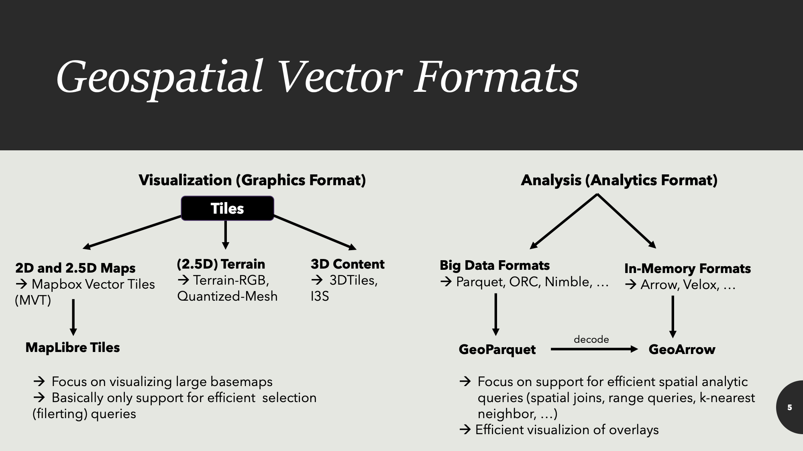

+++
author = "Yuichi Yazaki"
title = "What Is MapLibre Tile (MLT)?"
slug = "mapLibre-tile"
date = "2026-01-28"
categories = [
    "chart"
]
tags = [
    "地図"
]
image = "images/cover.png"
+++

MapLibre Tile (MLT) is a new vector tile format for the MapLibre ecosystem. It builds on the context established by Mapbox Vector Tile (MVT), but is redesigned with modern large-scale geospatial data and next-generation GPU rendering, including WebGPU, in mind. Official MapLibre materials describe support for MLT sources in MapLibre GL JS and MapLibre Native through `encoding: "mlt"` in a style JSON source.

<!--more-->

This article first reviews what vector tiles are, then summarizes the differences between MLT and MVT and how MLT is used in MapLibre.

## What Are Vector Tiles?

Vector tiles divide a map into zoom levels and tile coordinates `(z, x, y)`, but instead of serving each tile as an image, they serve geometric features: points, lines, polygons, and their attributes.

- Raster tiles contain images such as PNG or JPEG. They are fast to draw, but their style is hard to change after delivery.
- Vector tiles contain roads, buildings, points of interest, boundaries, and attributes. The client applies style rules, so color, line width, labels, and visibility can change dynamically.

MVT has been the representative vector tile specification used by many renderers, including MapLibre.

## What to Look For

1. **Lines and labels remain crisp while zooming**  
   Vector tiles can change what features and labels are shown at different zoom levels while preserving crisp rendering.

2. **The same data can have different visual styles**  
   Because data and style are separated, a map can be redesigned by changing style rules rather than regenerating all data.

3. **Rendering cost moves to the client**  
   Download size, decoding, filtering, and polygon tessellation can become bottlenecks. MLT is designed to reduce this preprocessing cost.

4. **Complex attributes are increasingly important**  
   Modern geospatial data often has nested attributes, lists, 3D coordinates, and measured values. MLT is designed with these future requirements in view.

## MVT Basics

MVT stores tiled vector data efficiently with Protocol Buffers. Its strength is its ecosystem: tools, renderers, debuggers, and production experience. But the format reflects assumptions from roughly a decade ago. With larger datasets and GPU-centered rendering, more work has to be done through schema design and optimization.



## What MLT Tries to Improve

MLT is designed around several ideas:

- **Column-oriented layout**: improves compression and filtering by organizing data by columns rather than only by features.
- **Separation of storage and in-memory formats**: supports efficient transfer while allowing faster runtime processing.
- **GPU-friendly design**: supports moving expensive work such as polygon tessellation earlier in the pipeline.
- **Richer types**: anticipates complex attributes, 3D coordinates, and measured values.

## MVT and MLT Compared

| Aspect | MVT | MLT |
|---|---|---|
| Basic idea | Established vector tile format | Redesigned for next-generation rendering |
| Storage model | Feature-oriented | More column-oriented |
| Decoding and processing | Mature ecosystem, but heavy data can be costly | Designed for faster compression, decoding, and filtering |
| Polygon preparation | Runtime tessellation can be a bottleneck | Supports pre-tessellated storage concepts |
| Attribute types | Mostly simple types | Designed with complex and future types in mind |

## MapLibre Support

MapLibre documents MLT as a supported vector source encoding. A style can specify `encoding: "mlt"` in a vector source.

```
{
  "version": 8,
  "sources": {
    "basemap": {
      "type": "vector",
      "url": "https://example.com/tiles/style-or-tileset.json",
      "encoding": "mlt"
    }
  },
  "layers": [
    {
      "id": "roads",
      "type": "line",
      "source": "basemap",
      "source-layer": "transportation"
    }
  ]
}
```

MapLibre GL JS release notes and examples also describe MLT support, making it a practical part of the MapLibre stack rather than only a specification proposal.

## Why MLT Now?

The assumptions behind vector tiles are changing. Data volume is growing, browsers can use the GPU more effectively, and rendering stacks increasingly benefit from data structures that are easier to transfer and process in parallel. MLT responds to this shift by treating the format itself as part of the performance solution.

## Summary

Vector tiles serve map features instead of images, allowing dynamic styling. MVT made this approach mainstream. MLT is MapLibre's attempt to modernize the format for larger data, faster decoding, better filtering, and GPU-friendly rendering. Its use through `encoding: "mlt"` positions it as a concrete evolution of the MapLibre ecosystem.

## References

- [Announcing MapLibre Tile: a modern and efficient vector tile format](https://maplibre.org/news/2026-01-23-mlt-release/)
- [Sources - MapLibre Style Spec](https://www.maplibre.org/maplibre-style-spec/sources/)
- [Releases - maplibre/maplibre-gl-js](https://github.com/maplibre/maplibre-gl-js/releases)
- [Display a map with MLT - MapLibre GL JS](https://www.maplibre.org/maplibre-gl-js/docs/examples/display-a-map-with-mlt/)
- [MapLibre Tile Specification](https://github.com/maplibre/maplibre-tile-spec)
- [Mapbox Vector Tile specification](https://github.com/mapbox/vector-tile-spec)
- [Mapbox Vector Tile Specification](https://mapbox.github.io/vector-tile-spec/)
