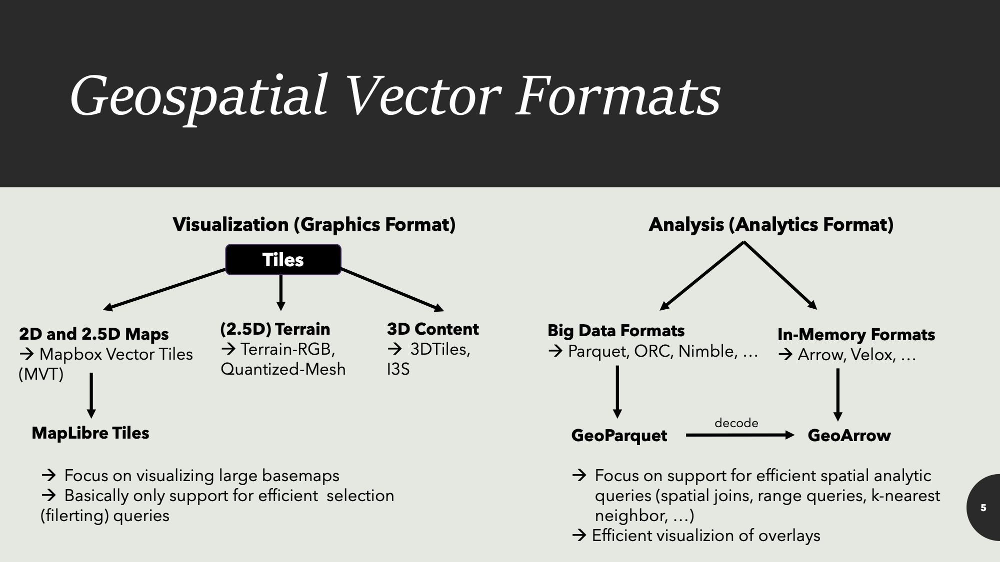

+++
author = "Yuichi Yazaki"
title = "MapLibre Tile（MLT）とは"
slug = "mapLibre-tile"
date = "2026-01-28"
categories = [
    "chart"
]
tags = [
    "地図"
]
image = "images/cover.png"
+++

MapLibre Tile（MLT）は、Mapbox Vector Tile（MVT）をベースにしつつも **現代の巨大な地理空間データ**と **次世代GPUレンダリング（WebGPUなど）** を強く意識して再設計された、MapLibreエコシステム向けの新しいベクタタイル形式です。公式発表では、**MapLibre GL JS と MapLibre Native がMLTソースをサポート** し、スタイルJSONの `sources` で `encoding: "mlt"` を指定して利用できる、と説明されています。

<!--more-->


本記事では、まず「ベクタタイルとは何か」を押さえた上で、MLTとMVTの違い、そしてMapLibre上での利用状況を、一次情報をもとに整理します。  

## ベクタタイルとは
ベクタタイルとは、地図を「ズームレベル（z）」と「タイル座標（x, y）」のグリッドに分割し、**各タイルを“画像”ではなく“ベクタデータ（点・線・面＋属性）”として配信する方式**です。

- ラスタータイル：タイルの中身は画像（PNG/JPEGなど）です。描画は速い一方、色や線幅などの表現を後から変えるのが難しいです。
- ベクタタイル：タイルの中身は「道路（線）」「建物（面）」「POI（点）」などの地物の形状と属性です。クライアント（ブラウザ/アプリ）がスタイルを当てて描画するため、**色・太さ・ラベルなどを動的に変更**できます。

ベクタタイルの実装で広く使われてきた代表的な仕様が **MVT（Mapbox Vector Tile）** で、MapLibreを含む多くのレンダラがMVTを前提に発展してきました。

## 見るときのポイント

見るときのポイントを、観察手順としてまとめます。

1. **ズームしても線がにじまず、文字や色が切り替わるかを見る**

   ベクタタイル地図は、拡大しても線が滑らかに保たれやすく、ズーム段階で「道路の階級」「地名の表示/非表示」などが切り替わります。これはタイルが“地物の集合”で、スタイルがズームに応じて適用されているためです。

2. **同じデータでも“見た目”が変えられることに注目する**

   ベクタタイルは、データ（道路・建物など）とスタイル（色・太さ・ラベル）が分離されています。スタイルを変えるだけで、同じ地物でも強調点や印象が変わります。  
   つまり、地図の「見た目の設計」は、データの取得だけでなく、**スタイル設計（ルール設計）**が本体になります。

3. **“重い処理”がどこで起きているかを意識する**

   ベクタタイルはクライアント側で描画するため、以下の処理がボトルネックになりがちです。  
   - タイルのダウンロードサイズ  
   - デコード（バイナリ→メモリ表現）  
   - フィルタリング（どの地物を描くかの絞り込み）  
   - テッセレーション（特にポリゴンをGPU描画用の三角形に分割）  
   MLTは、この“描画前処理”のコストを下げることを主目的に設計されています。

4. **“地物の属性が複雑”なデータに強いかを見る**

   近年は、属性が単純な文字列/数値だけではなく、ネストした構造（配列・構造体）を持つデータも増えています。MLTはこうした複雑な属性型や3D/測線参照（m値）などを扱う方向を強く意識しています。

## MVT（Mapbox Vector Tile）の基本

MVTは、タイル化されたベクタデータを **Protocol Buffers** で効率よく格納する仕様として広く普及しました。

長年の運用実績と、周辺ツール（タイル生成、配信、レンダラ、デバッガ）が豊富であることが強みです。一方で、設計が約10年前の前提に強く依存し、現代の巨大データやGPU中心の処理モデルに対しては、限界や回避策（スキーマ最適化など）が増えやすい、と整理されています（MLT論文の問題意識）。



## MLT（MapLibre Tile）のねらい

MLTは、MVTを参照しつつも、以下の方向で再設計されています。

- **列指向（column-oriented）レイアウト**の採用  
  レコード（地物）ごとではなく、列（属性）単位で格納しやすい構造を取り入れています。目的は、圧縮と処理（フィルタなど）を高速化することです。
- **ストレージ形式とインメモリ形式を分離**  
  ネットワーク転送・保存に適した形式と、実行時処理に適した形式を分け、変換を高速に行う設計です。
- **GPUフレンドリー**  
  特にポリゴンの描画準備（テッセレーション）を、タイル生成時（オフライン）に前倒しできる仕組みを用意し、クライアントの負荷を下げる方針です。
- **複雑な型、3D座標、m値（線形参照）などの拡張**  
  次世代のデータソースの要件を取り込む方向が示されています。

## MVTとMLTの違い
| 観点 | MVT | MLT |
|---|---|---|
| 基本思想 | 広く普及した現行のベクタタイル仕様 | MVTの制約を踏まえ、次世代レンダリングを前提に再設計 |
| 格納の考え方 | レコード寄り（地物単位で扱いやすい） | 列指向を強く意識（圧縮・フィルタ・GPU転送を意識） |
| デコード/処理 | 実装資産は多いが、巨大データでは負荷が出やすい | 圧縮率・デコード速度・処理速度の改善を主張 |
| ポリゴン描画準備 | 実行時テッセレーションがボトルネックになりやすい | 事前テッセレーション格納をサポートする設計 |
| 属性型の表現 | シンプルな型中心 | 複合型（ネスト、リスト等）や3D/m値などを視野 |

## MapLibreでの実装状況
MapLibreでは、公式情報として次が確認できます。

- **MapLibre GL JS と MapLibre Native は、MLTソースをサポート**しています。  
  スタイルJSONの vector source に `encoding: "mlt"` を指定して利用します（公式アナウンス、公式スタイル仕様の sources ドキュメント）。
- **MapLibre Style Spec の sources の `encoding`** は、`mvt` と `mlt` を列挙し、既定値は `mvt` と説明されています。  
  また、SDKサポートの欄で、`mlt` の対応バージョンが記載されています（GL JS / Native 各プラットフォーム）。

実際の設定イメージは次の通りです（フェンスなし、インデント付きJSON）。

```
  {
    "version": 8,
    "sources": {
      "basemap": {
        "type": "vector",
        "url": "https://example.com/tiles/style-or-tileset.json",
        "encoding": "mlt"
      }
    },
    "layers": [
      {
        "id": "roads",
        "type": "line",
        "source": "basemap",
        "source-layer": "transportation"
      }
    ]
  }
```

さらに、MapLibre GL JS のリリースノートでも、`encoding: 'mlt'` によるMLTサポート追加が明記されています。公式ドキュメントには「MLTを使った地図表示」のサンプルも用意されています。

## 背景知識（なぜ今MLTなのか）

ここ数年で、ベクタタイルに求められる前提が変わってきています。

- **データ量が増え続けている**  
  センサー、AI抽出、統合地図データなどにより、地物数も属性量も増えています。従来の前提（軽量な属性、2D中心）では苦しくなります。
- **ブラウザ側のGPU活用が現実味を帯びた**  
  WebGPUなどにより、CPU中心の処理モデルから、GPUで並列に処理する方向が見えています。  
  そのため、データ構造も「GPUへ渡しやすい形」「前処理を減らす形」に寄せるメリットが大きくなります。
- **“スキーマ最適化で凌ぐ”から、“形式で解決する”へ**  
  MVTでは、タイルスキーマ側の工夫（レイヤごとの最適化など）で性能を稼ぐことがよくありますが、MLTは形式自体で圧縮・処理を最適化する方向を掲げています。


## まとめ

ベクタタイルは、地図をタイル分割しつつ「画像」ではなく「地物データ」を配信する方式で、スタイルを動的に当てられることが強みです。その代表仕様であるMVTは広く普及しましたが、近年の巨大データ・GPU中心の描画モデルに対しては、形式の前提が古くなりつつあります。

MLTは、この課題に対して、列指向・高速デコード・高速フィルタリング・GPU転送しやすい構造、さらにポリゴンの事前テッセレーションなどを視野に入れて再設計された形式です。MapLibreでは公式に `encoding: "mlt"` を通じてMLTを利用できる状態になっており、今後のレンダリングスタック（特にWebGPU）を見据えた現実的な進化として位置づけられます。


## 参考・出典

- [Announcing MapLibre Tile: a modern and efficient vector tile format](https://maplibre.org/news/2026-01-23-mlt-release/)
- [Sources - MapLibre Style Spec](https://www.maplibre.org/maplibre-style-spec/sources/)
- [Releases · maplibre/maplibre-gl-js](https://github.com/maplibre/maplibre-gl-js/releases)
- [Display a map with MLT - MapLibre GL JS](https://www.maplibre.org/maplibre-gl-js/docs/examples/display-a-map-with-mlt/)
- [MapLibre Tile Specification（GitHub）](https://github.com/maplibre/maplibre-tile-spec)
- [Mapbox Vector Tile specification（GitHub）](https://github.com/mapbox/vector-tile-spec)
- [Mapbox Vector Tile Specification（Web）](https://mapbox.github.io/vector-tile-spec/)

