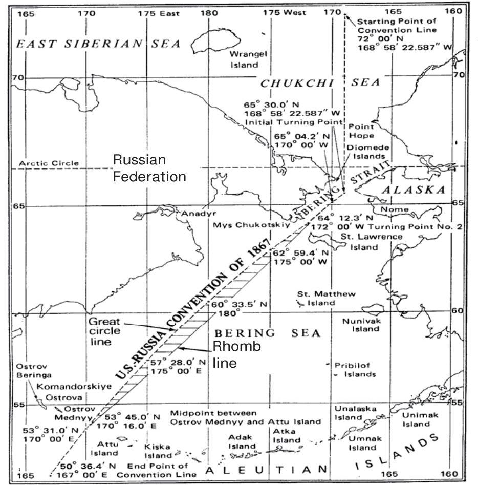
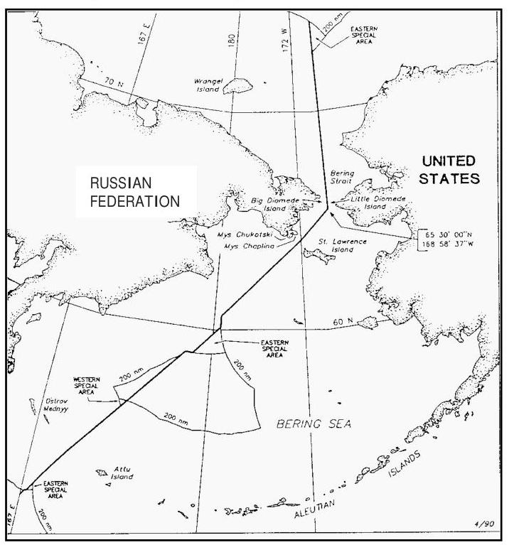

+++
author = "Yuichi Yazaki"
title = "地図の投影法が国境を変えた日 - 1990年の米ソ海洋境界協定と、地図投影法の解釈"
slug = "marine-border-dispute"
date = "2025-11-09"
categories = [
    "consume"
]
tags = [
]
image = "images/cover.png"
+++

地図の上の「まっすぐな線」は、地球の上でもまっすぐでしょうか? 必ずしもそうではありません。

1990年に署名された **米ソ海洋境界協定（U.S.–USSR Maritime Boundary Agreement）** では、まさにその「地図上の直線」をどう解釈するかが、両国の意見を分けました。アメリカとソ連は、同じ条約文を読みながら **異なる投影法（projection）** を用いたために、海の上で引かれた線が数万平方キロメートルもずれてしまったのです。

<!--more-->

## 1867年の「直線」はどんな線だったのか

きっかけは1867年、ロシア帝国がアラスカをアメリカに売却した「アラスカ購入条約」です。この条約では「北緯65度30分 N、西経168度58分37秒 W を通る直線」などの表現で海上境界を定めていました。しかし、どの地図投影法で描かれた「直線」かが明記されていませんでした。19世紀当時、地図投影の標準は国ごとに異なり「地球上の最短経路」と「地図上での直線」は必ずしも一致しなかったのです。その曖昧さが、のちに米ソ双方の解釈を食い違わせる火種となりました。

## 投影法が変える「まっすぐ」の意味

1970年代後半、各国が **200海里の排他的経済水域（EEZ）** を設定しはじめると、ベーリング海・北極海における境界線を再確認する必要が生じました。ここで、アメリカとソ連は異なる「地図上の直線」を採用します。

| 国 | 採用した地図投影法 | 「直線」の定義・種類 | 特徴と意図 |
|----|------------------|----------------------|-------------|
| **アメリカ合衆国** | **円錐図法（Conical projection）** | **測地線（Geodetic line）** 地球上の最短経路を結ぶ線。 | 地球の曲率を考慮した「測地的直線」。地理的距離に忠実で、測量や境界画定に適する。 |
| **ソ連（現ロシア）** | **メルカトル図法（Mercator projection）** | **航程線（Rhumb line）** 一定の方位角を保つ線。 | 航海図で広く用いられる「方位一定線」。地図上では直線に見えるが、実際の地球上では曲線を描く。 |

どちらも「条約に記された直線」を再現しようとした結果でした。しかし、投影法が違えば線の形も違う - 円錐図法ではやや北東方向に湾曲し、メルカトル図法では地図上でまっすぐに伸びます。両国の線は、地球上では約 **15,000 平方海里（約 39,000 km²）** も離れることになりました。

## 1990年の協定：二つの線のあいだで

1980年代に入ると、両国はこの不一致を解消するための協議を始めます。冷戦終結の流れのなかで、政治的妥協が模索されました。

1990年6月、ジェームズ・ベイカー米国務長官とエドゥアルド・シェヴァルナゼ・ソ連外相が署名した協定では、アメリカの測地線（円錐図法上の線）とソ連の航程線（メルカトル上の線）の中間をとる線が採用されました。

この「中間線」は、どちらか一方を否定するのではなく、地図投影の違いによるズレを調整する政治的・測地的折衷案だったのです。

協定には、両国がそれぞれのEEZ外で一定の活動権をもつ **「特別海域（special areas）」** の制度も盛り込まれました。

これにより、漁業・資源開発・航行の調整が図られています。

## 協定の行方：アメリカは批准、ロシアは未承認

アメリカはこの協定を1991年に批准し、同国の正式な海洋境界として運用しています。
一方、ソ連崩壊後のロシアでは議会が批准を見送り「シェヴァルナゼが国家利益を損ねた」との批判が高まりました。

とくに、失われた漁場・資源への懸念が根強く、「アラスカ側のポロック漁へのアクセスを失った」などの声が上がっています。

そのため、協定は現在もロシア側で未批准のままですが、アメリカは境界線の管理とEEZ保護を継続しており、この「1990年線」は事実上の運用線として存在しています。

## 地図の描き方が、世界の見え方を決める

この出来事は、地図投影法が単なる描き方ではなく、
国際政治や法的現実に直接関わる要素であることを教えてくれます。

- メルカトル図法では、航海に便利な「方位一定の線」が直線になる。
- 円錐図法では、地球上の最短経路「測地線」をほぼ直線で表せる。

どちらも合理的であり、どちらも「正しい」。

しかし、選ばれた投影法によって、見える世界 - ひいては国のかたちそのものが変わるのです。

## 学びのポイント：投影法が国境を動かす理由

| 観点 | 内容 |
|------|------|
| **投影法のちがい** | メルカトル図法では「方位一定線（ロムブ線）」が直線となり、航海に適する。一方、円錐図法では「測地線（最短経路）」が直線に近く表され、測地に適する。 |
| **線形の解釈** | Rhumb line ＝ 地図上で方位を一定に保つ線。 Geodetic line ＝ 地球上の最短距離を結ぶ線。 どちらを「直線」とみなすかで境界が変わる。 |
| **国際法への影響** | 同じ条約文でも、投影法・線形の違いで実際の海上位置がずれ、数万平方キロメートルの差が生じる。 |
| **地図学の教訓** | 投影法の選択は中立ではない。どの「地球の見方」を前提とするかが、国際関係の現実を左右する。 |

## 参考・出典

- [Vlad M. Kaczynski, “US–Russian Bering Sea Marine Border Dispute: Conflict over Strategic Assets, Fisheries and Energy Resources,” *Russian Analytical Digest*, No. 20, 2007, pp. 2–5. ](https://css.ethz.ch/content/dam/ethz/special-interest/gess/cis/center-for-securities-studies/pdfs/RAD-20-2-5.pdf)

